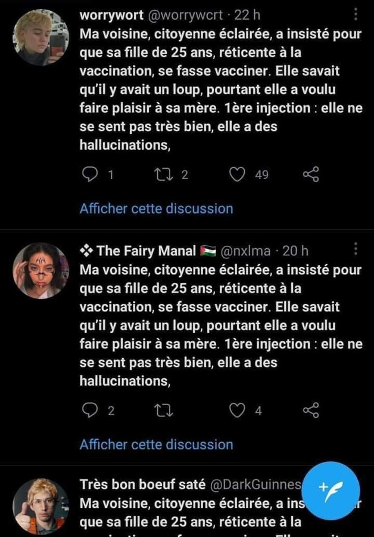

Technique [[marketing]] mise en place (à l'origine par un vendeur de gazon, d'où le nom) consistant à déguiser la promotion de son produit en retours de clients qui n'existent pas. Le recours aux clients fictifs est une tentative courante de biaiser les jugements des plateformes comme TripAdvisor. 

Une enquête portant sur 223 sites commerciaux européens a permis de découvrir en janvier 2022 que plus de la moitié (55%) manipulaient les listes de commentaires en créant de faux commentaires d'utilisateurs. Suite à ce rapport la commission européenne a déclaré envisager de prendre des sanctions contre les propriétaires de sites qui pratiquent de l'astroturfing[[@KarayanFauxavisInternet2022]]

Dans le scandale [[Cambridge Analytica]], certains font le rapprochement entre l'envoi de messages à caractères politiques ciblés vers une [[communauté]] formée à partir de métadonnées laissées sur les réseaux ([[Facebook]]). Ces communautés reçoivent comme provenant d'une multitude de comptes individuels (en réalité des faux comptes ou des [[bots]]) ces messages qui sont en réalité émis par une agence de communication au service d'une puissance. 

> En 2018 \[...\], la journaliste Marie Dupin révélait que l'agence de relations publiques Red Flag avait lancé de faux mouvements d'agriculteurs partout en Europe pour le compte de Monsanto. \[...\] Dans chacun de ces pays, ces faux groupes d'agriculteurs oeuvraient à la réautorisation du [[glyphosate]] en Europe.

Foucart, Horel, Laurens[[@Foucartgardiensraisonenquete2020]] p150

# propagande antivaxx

# astroturfing négatif

Créer des comptes twitter et les doter d'expressions outrancières mais désignant l'idéologie qu'on déteste pour discréditer cette idéologie. 

Cf. campagne Twitter faisant parler des pseudo-comptes tenants de l'idéologie [[culture Woke|woke]]

# impact sur les élections

D'après David Chavalarias, fondateur du Tweetoscope, la multiplication des faux comptes sur Twitter en période pré-electorale aurait un effet plus important que la circulation de fausses nouvelles entre des comptes authentiques([[@GiryPaniquemoraleElysee2022]]).

voir le rôle joué par le [[bots|bot]] aux 70 000 followers "Jane Abrams" pendant les élections US de 2016 

