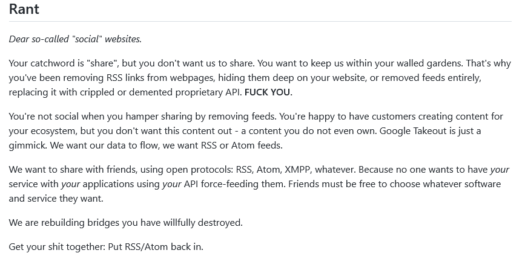

# flux RSS

# RSS et réseaux sociaux

https://github.com/RSS-Bridge/rss-bridge
# pipes

Beaucoup d'internautes sont restés orphelins du service de Yahoo qui leur permettait jusqu'en 2013 de fabriquer des flux RSS parfaitement adaptés à l'objet de leur veille. Yahoo a fermé ce service Yahoo Pipes, sans qu'aucune alternative ne soit disponible de façon gratuite. En avril 2020, Pipes CE a été publié en ligne. Cette application en ligne est limitée dans le nombre de traitements possibles à faire subir au flux. 
On peut s'affranchir de ces limites en téléchargeant la solution depuis github. Suivre les instructions indiquées [ici](https://github.com/pipes-digital/pipes) 
la commande `` bundle exec puma -e development `` lance le serveur. ouvrir le navigateur avec l'adresse 0.0.0.0:9292 pour accéder à la page servie et fabriquer les pipes. Ctrl+C pour arrêter le serveur. 

# bibliographie

