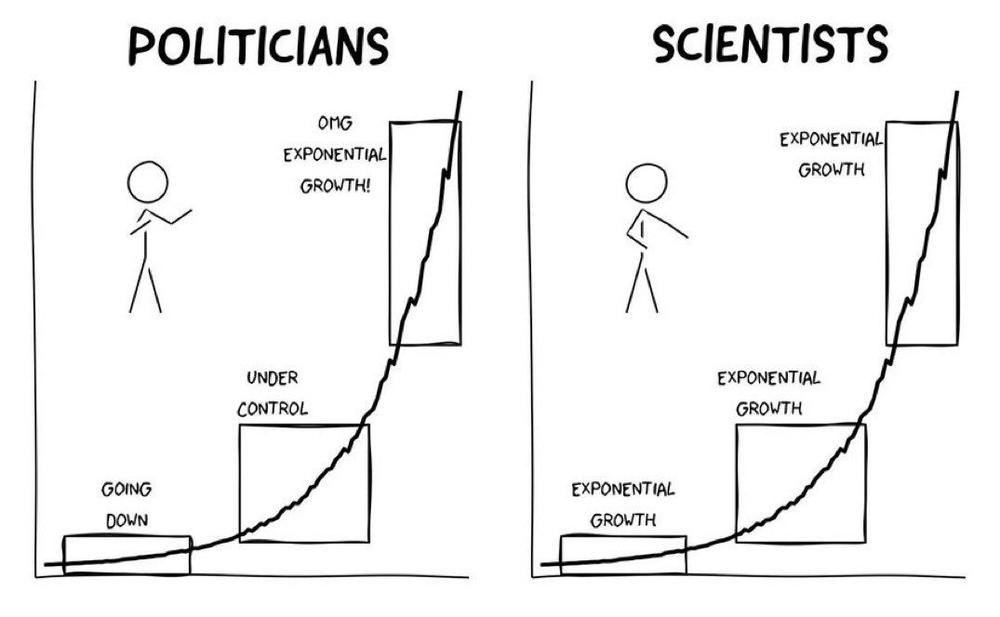

A relier avec l'expérience du nénuphar qui recouvre l'étang. 

Le biais de croissance exponentielle consiste pour un sujet à sous-estimer la montée du risque lors de son apparition et ne pas voir assez vite, la croissance exponentielle du risque. 

<iframe width="560" height="315" src="https://www.youtube.com/embed/H6IAOM3Ei2o?start=604" title="YouTube video player" frameborder="0" allow="accelerometer; autoplay; clipboard-write; encrypted-media; gyroscope; picture-in-picture" allowfullscreen></iframe>

Le biais de croissance exponentielle explique la raison pour laquelle dans la nouvelle de Tournier (Le [Médianoche amoureux](https://savoirs.usherbrooke.ca/bitstream/handle/11143/10999/Lepine_Article2.pdf?sequence=1&isAllowed=y)) le Vizir ne comprend pas de premier abord que la récompense demandée par l'inventeur du jeu d'échecs pour cette invention est faramineuse alors qu'elle se formule de manière humble : un grain de riz pour la première case, deux grains de riz pour la suivante, 4 pour celle d'après, etc. 
Le tout équivalent à un nombre de grains laissant vides les silos du royaume (2 puissance 64 -1)

