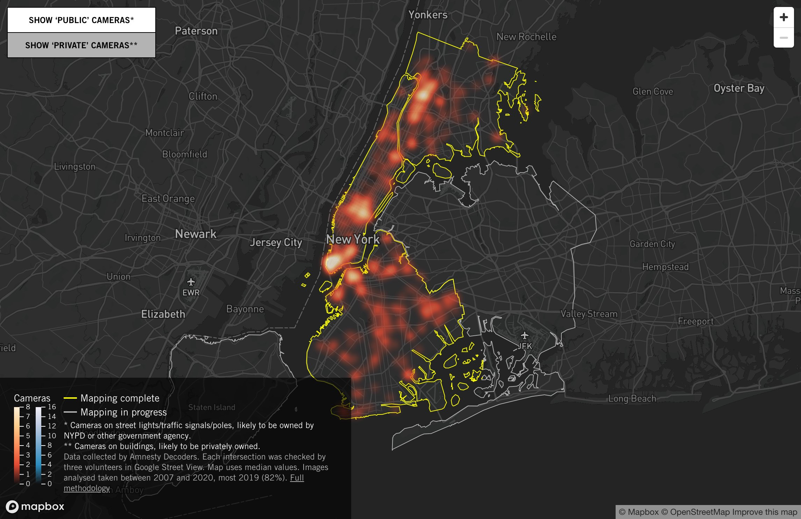
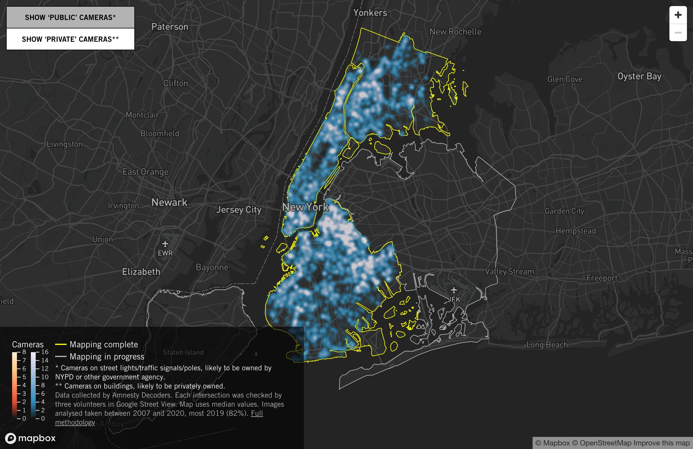

#vie_privée

Le premier enregistrement de passsants sur la voie publique date de 1973 à Times Square.
Aujourd'hui, le système de contrôle chinois dispose en 2020 de 200 millions de caméras de surveillance, soit 1 pour 6 individus, avec la promesse d'en tripler le nombre. 

Les caméras de surveillance font partie de l'arsenal technologique de la surveillance urbaine depuis les années 2000. 

Les caméras de surveillance sont également présentes au travail. Présentées par les employeurs comme des moyens de sécuriser la vie et le travail des salairés, elles sont régulièrement dénoncées à la CNIL comme des moyens pour ces derniers de leur mettre la pression et de les humilier[[@BieriQuanddonneespersonnelles2021]]. 
Si la surveillance est discontinue (les caméras ne fonctionnent pas toutes en même temps, et toutes ne fonctionnent pas), il suffit comme l'indiquait [[Michel Foucault]] en présentant le [[Panoptique de Bentham]], qu'une caméra soit présente, en fonction ou non, pour que le comportement de la personne dans cette même pièce soit modifié. 

# emblème du solutionnisme technologique

Elles se sont multipliées en France pour des raisons sécuritaires, sans qu'il soit possible de déterminer si elles ont contribué ne serait-ce qu'un peu à faire baisser la délinquance. Le sociologue [[Laurent Mucchielli]]  et le journaliste [[Jean-Marc Manach]] soutiennent depuis 2009 et 2010 que ce n'est pas le cas. 

En juillet 2016, lors des attentats de Nice, aucune des 1836 caméras alors installées à Nice, la "ville la plus surveillée de France", n'avait permis de prévenir les attentats. 

Une étude menée à la demande de la gendarmerie et parue dans Le Monde le 22 décembre 2021, montrait que dans la région de Grenoble sur 1939 affaires, seules 22 avaient été élucidées au moyen d'images captées par ces caméras. 
Les auteurs de l'enquête concluaient pour leurs commanditaires par ces mots : 

>L’exploitation des enregistrements de vidéoprotection constitue une ressource de preuves et d’indices peu rentable pour les enquêteurs.

Cette étude montre qu'au mieux, une enquête sur 20 est résolue en partie à l'aide d'une caméra de surveillance. 
Loin des fantasmes propagés dans la population par des politiques en quête de visibilité, la vidéosurveillance est peu rentable pour élucider des affaires parce qu'elle mobilise trop de personnel sur un temps trop long. 

>« Pour une grande commune de 200 000 habitants, ça serait des dizaines de milliers de caméras, ça n’est pas envisageable dans le cadre des finances publiques. Et même si cet argent est débloqué, il faut exploiter ces flux vidéos.

>Imaginons 50 caméras à exploiter dans une zone, sur une plage horaire d’une heure autour du moment d’une infraction. C’est 50 heures de visionnage pour une affaire de cambriolage par exemple. C’est difficilement envisageable pour un gendarme quand il a plusieurs enquêtes à traiter en simultané. »

(source : Jean-Marc Manach )

Leur contribution à l'élucidation des enquêtes serait quasiment nulle, d'après ces auteurs (de l'ordre de 3,5% sur le nombre total de réquisitions d'images, d'après Laurent Mucchielli [[@GuillaudVideosurveillanceparadigmetechnosolutionnisme2018]]).

Leur prolifération est donc du à un usage politique : en installant des caméras partout, les édiles municipaux veulent montrer qu'ils sont actifs face à un problème qu'en réalité ils ne contrôlent pas, la délinquance. 
La caméra de surveillance urbaine relève donc du [[solutionnisme technologique]] technologique.

# usage unilatéral des caméras de surveillance
Il est des cas pourtant où la présence de caméras permettent de mettre en évidence des violences policières et disqualifier des faux témoignages émanant des forces de l'ordre (cf. cas [Adnane Nassih](https://www.franceinter.fr/emissions/affaires-sensibles/affaires-sensibles-du-jeudi-06-janvier-2022), éborgné par un tir de LBD en février 2020 alors qu'il ne présentait aucune menace, bien que la légitime défense du tireur et de ses collègues ait été invoquée)
Le seul point positif est que cela pourrait permettre de manifester les violences policières comme dans ce cas, d'où l'enjeu pour les forces de l'ordre de maîtriser les flux de ces caméras et de pouvoir pré-empter des enregistrements ou bien de manière paradoxale de pouvoir compter sur certains espaces sans caméra pour agir impunément, comme le font valoir Sophie Simpere et Pierre Januel ([[@SimpereCommentEtatattaque2022]])

toutefois quand les images captées par la vidéosurveillance permettent de mettre en évidence un manquement des forces de l'ordre ou un abus de pouvoir on les laisse opportunément disparaître comme dans [le cas du fiasco des FDO au stade de France en mai 2022 (match Real vs Liverpool)](https://www.lefigaro.fr/faits-divers/stade-de-france-les-images-de-videosurveillance-ont-ete-detruites-car-elles-n-ont-pas-ete-reclamees-par-la-justice-20220609)

# La caméra de surveillance en tant qu'objet connecté.

En tant qu'objet connecté, les caméras de surveillance peuvent être facilement hackées. (cf site SHODAN permettant de voir les images des caméras très nombreuses dont le mot de passe et le nom d'adminstrateur n'ont pas été changés - admin / admin)

En tant qu'[[objects connectés]] facilement hackables, les caméras peuvent être des relais efficaces dans le cadre d'une attaque [[DDoS]] pour faire tomber certains serveurs cardinaux, comme ce fut le cas lors de l'attaque du virus Mirai en 2016 ([[@CadotToutceque2016]])

# caméras de surveillance et reconnaissance faciale

Si certaines villes comme San Francisco et Portland ont interdit les caméras à reconnaissance faciale dans les rues, certaines villes comme New York les ont implémentées de telle sorte qu'il est difficile de se trouver dans un endroit de cette ville qui ne soit pas équipée de caméra pouvant analyser son visage, d'après une enquête d'Amnesty International réalisée entre 2019 et 2021 avec 6000 volontaires.

([source](https://amnesty-crisis-evidence-lab.github.io/decode-surveillance-heatmap/))

Surveillance des [[Quartiers prioritaires de la politique de la ville|quartiers populaires]]

Surveillance des populations dissidentes (Charlie-Hebdo, n°1536, janvier 2022)

![[20220104_223232.jpg]]

