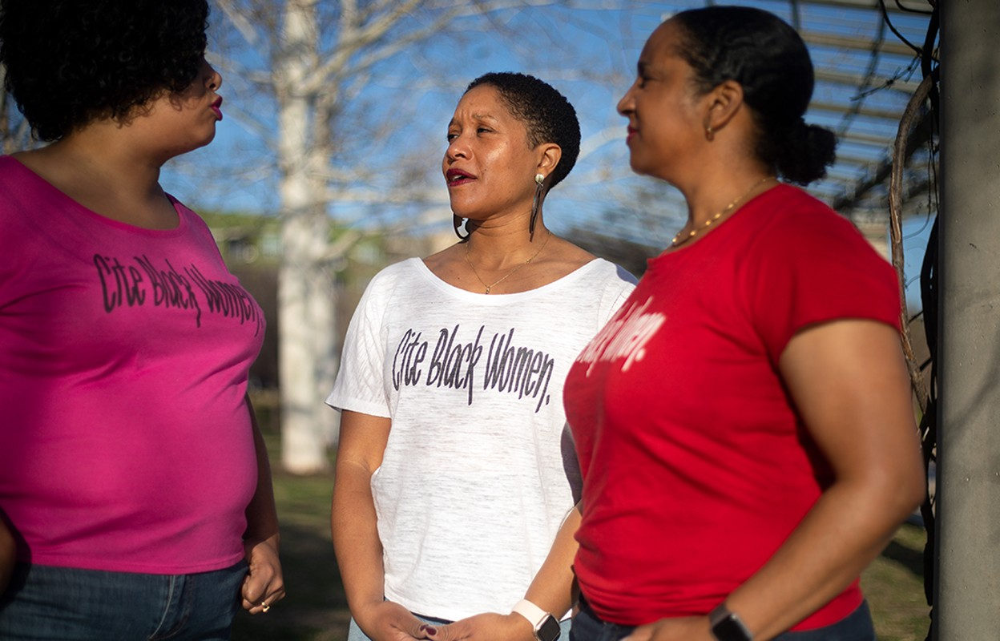

Référence dans un texte à un texte antérieur parfois accompagnée d'une transcription de ce texte antérieur. 

# hors contexte académique
Sur Facebook, une citation est une pensée (en général sans auteur identifié) destiné à apaiser ou faire réfléchir le public de ce post. Cette pensée s'inscrit souvent sur un fond lui-même conçu pour apaiser ou susciter le rêve. 
Ces contenus sont très partagés par les familles modestes qui utilisent Facebook (quand les familles plus aisées préfèrent partager des commentaires). 
Le fond varie en fonction du message

> les phrases sur la vie sont plus sobres [...], les phrases qui célèbrent l'amour familial et tout particulièrement le culte de la mère sont entourées de fleurs

La citation est très similaires aux chaînes de [[mails]] et veulent entraîner le partage 

# dans le contexte académique

une citation met en avant l'[[autorat]] d'un chercheur

## les fonctions de la citation dans un texte

Du point de vue de celui qui cite, la citation a trois fonctions : 
- donner au lecteur l'accès au texte qui soutient le propos (ou en tout cas lui permettre d'identifier ce texte)
- rendre hommage à l'auteur du texte antérieur (et respecter les règles de [[propriété intellectuelle]])
- permettre à cet auteur de réaliser un profil de citations et d'obtenir un score en la matière ([[bibliométrie]])

## conventions typographiques

guillemets (courte citation), indentation (citation d'un paragraphe), appel de citation, référence en note de bas de page ou en bibliographie (fin de document)

![Joshua Cohen, Les Nétanyahou, traduction de Stéphane Vanderhaeghe, Paris, Grasset, 2022 [2021], p. 34](guillemets.jpg)

## le rôle de la citation dans le système d'évaluation de la science

Ce système valorise les travaux les plus cités et cette omniprésence de la citation comporte quelques biais : 

1. La citation ne couvre pas toutes les réutilisations possibles d'un texte académique : 

le chirurgien qui ne publie pas mais s'inspire de publications dans sa pratique utilise la littérature scientifique sans la citer

2. La citation couvre de fausses réutilisations :

on peut citer des textes qu'on n'a pas lu pour complaire à un auteur ou au journal dans lequel on veut soumettre un article. ([[citations de complaisance]]).

3. La focalisation sur les citations empêche la publication d'études négatives ou non-concluantes. 

Ce sont les études concluantes qui drainent les citations, mais les études négatives et leur [[Negative data]] ont également de l'importance et peuvent faire gagner beaucoup de temps et de moyens à la communauté scientifique. Toutefois, comme personne ne les cite, elles ne sont pas publiées, comme elles ne sont pas publiées, elles sont ignorées. 

4. Le comptage des citations confond ne distingue pas entre les différents types de citation

On peut citer une étude pour pointer du doigt sa faiblesse ou son manque de méthode, cela compte tout de même au crédit de cette citation. C'est ainsi qu'en 2022, le Dr [[Didier Raoult]] était le chercheur le plus cité en France alors que les critiques se multipliaient à son encontre pour des manquements de méthode ou d'[[intégrité scientifique]]. On retrouve ici dans le monde académique quelque chose de comparable à ce qu'on observe dans les médias généralistes (voir [[agenda politique|agenda setting]]). Comme le dit Claire Sécail, "indépendamment de la façon dont on parle de la personne. Il n’y a pas de bad buzz". Il n'y a pas non plus (en 2022) de mauvaises citations, qu'elles soient nombreuses, c'est tout ce qui compte. 

Si le recours aux citations dans chaque texte est exigé de tous les chercheurs (un peu moins des plus anciens mais beaucoup plus des plus jeunes), les raisons pour lesquelles on cite ici et pas là restent obscure et échappent à la rationalisation autant qu'à la standardisation. 

>"The use of citations as a basis for value judgements implies that there is a universally recognized convention [on why to cite] among publishing scientists, but this convention is one which displays a marked resistance to standardization." 

>Metaphorically speaking, citations are frozen footprints in the landscape of scholarly achievement; footprints which bear witness to the passage of ideas. From footprints it is possible to deduce direction; from the configuration and depth of the imprint it should be possible to construct a picture of those who have passed by, whilst the distribution and variety furnish clues as to whether the advance was orderly and purposive

Source : Blaise Cronin, 1981  [[@CRONINNEEDTHEORYCITING1981]]

## aspects rhétoriques de la citation

Les personnes citées deviennent des alliés dans l'entreprise d'un auteur pour paraître compétente sur son sujet. 
Si on remet en cause le bien fondé d'une assertion, la citation induit le lecteur à penser qu'il faudra en plus remettre en cause les travaux de toutes les personnes citées : 

>Correct or not, an author can adopt a number of tactics to make her claims unassailable by her readers—who in turn strive not to be duped. For example, the author can line up a phalanx of allies by citing other writers who support her point, or whose work she builds upon. If you question me, she implies, you have to question all of us

(Carl Bertrom[[@BergstromCallingBullshitArt2020]] citant un travail de Bruno Latour)

## politiques de la citation

### biais de genre et diversité

Certaines études ont identifié un biais de genre et un biais ethnique dans les citations : les chercheurs sont plus souvent cités que les chercheuses comparés aux effectifs que compte le métier. 

Les prénoms (pour le genre), mais aussi les patronymes évoquent parfois l'origine et ces connotations seraient à l'origine d'un déficit de citations par rapport aux chercheurs masculins dont les noms sont à consonnance occidentale et qui écrivent ces mêmes articles.

l'autocitation a 56% de chances de plus d'être pratiquée par un homme (les femmes ont une moindre confiance en elles et dans leurs travaux antérieurs ou sont moins promptes à s'en servir pour se faire valoir)

### biais d'expérience

Les universitaires ont l'habitude de citer les chercheurs les mieux connus, les plus expérimentés, ceux dont la réputation n'est plus à faire, quand bien même leurs travaux pris individuellement peuvent être de qualité identique à des travaux émergents menés par des jeunes chercheurs, post-docs ou doctorants. 
Cela renforce les positions dominantes et désavantage les positions émergentes. 
(source : https://twitter.com/POchoaEspejo/status/1634299958030663680)

### vers une justice citationnelle

C'est pourquoi certaines chercheuses et chercheurs essaient de concevoir ce que pourrait être une justice citationnelle

## manipulation des citations

Différentes manipulations peuvent affecter les citations d'un texte scientifique [[@KaraSimpleGuideEthical2021]] : 

- **on se cite trop soi-même** pour gonfler le poids de ses citations. Selon John Ioannidis, 25% des citations de Didier Raoult sont des citations de ses propres travaux ou de ceux de ses co-auteurs[[@larousserieLancetgatePublierBeaucoup2020]].
- **on cite trop ses co-auteurs** en espérant un retour d'ascenceur (voir exemple plus haut)
- **on cite trop souvent des articles du journal dans lequel on souhaite être publié** en espérant que cela facilitera l'adoption du texte (voir plus haut)

Bien qu'on ne soit plus dans le domaine de la manipulation de la citation mais de la diversité des points de vue, il est important de citer des textes qui adoptent un autre point de vue ou une autre méthodologie que la sienne, afin que l'étude fasse preuve de diversité dans son approche. 

## obsolescence de la littérature scientifique

Un article obsolète est un article qui n'est plus cité, cela peut arriver plus ou moins vite selon la discipline. 
C'est en Histoire que l'obsolescence est la moins grande. Dans un corpus de 22599 articles publiés en 2019 dans toutes les disciplines, des chercheurs ont montré que 41% des références citées dans les articles en Histoire étaient parues il y a plus de 20 ans. Cette proportion se ramène à 25% pour les articles en Physique à 9% en Sciences Médicales et à 8% en Electronique et Sciences de l'Ingénieur. 
([[@dorta-gonzalezModelingObsolescenceResearch2022]])

# bibliographie

