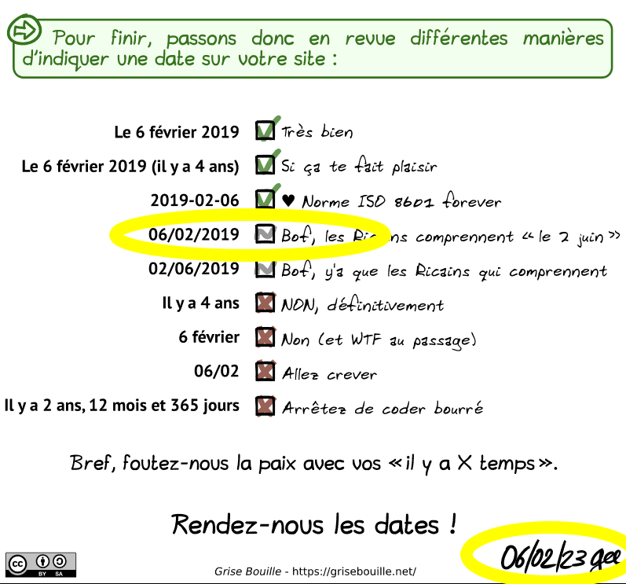

[[Zotero]] utilise la norme ISO 8601, norme généralement utilisée en informatique : 

2021-11-09T14:12:39.572Z
YYYY-MM-DD | T(ime)HHMMSS Z = Zulu time (UTC)

2021-11-09T14:12:39.572+04
+04 = UTC+4

