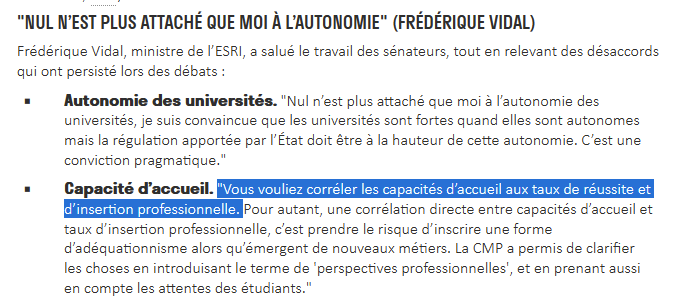

Née en  1971 d'une loi sur l'éducation permanente, la formation continue apparaît dans le droit français d'abord sous la forme d'une obligation faite au patronat de réserver une partie du chiffres d'affaire pour la formation de leurs employés. 

# externalisation de la formation continue

La formation permanence étant ressentie comme émancipatrice et le travail considéré comme aliénant, les syndicats s'accommodent de l'externalisation de la formation continue qui a lieu dans des organismes spécialisés en dehors de l'entreprise et sur des temps bien définis qui sont considérés comme n'étant pas dédiés au travail. 
Avec l'inflexion prise au milieu des années 2010 sur la formation tout au long de la vie, et les nouveaux modes de transmission de compétence (par exemple le tutorat ou coaching) cette frontière entre le travail et la formation va devenir moins rigide. 

# Portabilité des droits

Au départ, il était difficile de faire reconnaître dans une deuxième entreprise les formation suivies dans une première. La constitution d'un droit individuel à la formation (concrétisé par le [[Compte Personnel de Formation]] en 2014) permet d'assurer une portabilité des droits

# élargissement des publics bénéficiaires de la formation

Ceux-ci sont traditionnellement les employés disposant de CDI et les cadres. Les Précaires et les chômeurs ont jusqu'alors peu bénéficié de la formation continue. Avec le recul du salariat et la montée de nouvelles précarités, les carrières intermittentes, la formation tout au long de la vie s'est donnée pour objectif de cibler les travailleurs les plus exposés et les chômeurs afin de leur permettre de se réintégrer à l'emploi. Toutefois cet objectif est loin d'être atteint et on observe depuis la fin du XXème siècle une évolution plutôt contraire. 
Si le CPF permet à chaque salarié de disposer de crédits de formation, elle personnalise aussi le recours à la formation professionnelle. Les salariés sont invités à compléter ces crédits par des financements personnels et à se former sur leur temps libre. La formation tend à devenir un produit de consommation qui s'achète directement sur son smartphone sans l'intermédiation des institutions publiques et paritaires[[@formationprofessionnellepeutelle2021]].

# Nouvelles pédagogies (open badges et pédagogie par le faire)

L'accent est mis sur la pédagogie par le faire et les nouvelles technologies. A ce titre, les [[fablabs]] sont utilisés, par convention avec la puissance publique, pour permettre à des salariés ou des artisans de se former à la programmation de machines. Les lieux où [[hackers]] et [[makers]] se retrouvent sont aussi des lieux d'échange de savoir-faires et des lieux de formation.

L'acquisition de compétences dans le domaine numérique se fait par l'acquisition d'[[open badges]] par analogie avec le passage de différents niveaux dans les [[jeux vidéo]]. On voit ce système d'open badges arriver également dans les universités. Cela requiert cependant que ces badges soient reconnus dans le parcours professionnel, ce qui à ce jour est encore loin d'être le cas. 

Source : [[@Bureaumetamorphosesformationprofessionnelle2021]]

![[20210419_AOC formation professionnelle.pdf]]

# adéquationisme et court-termisme

Depuis la loi de 2018 (loi Pour la liberté de choisir son avenir professionnel) le gouvernement a ouvert un chantier de réfection de la formation professionnelle afin d'augmenter les embauches dans les secteurs sous-tension et de parvenir au plein emploi (passer de 9,5% de chômeurs à 7% et réduire surtout la part des chômeurs de longue durée). 
Au lieu de permettre aux travailleurs de se reconvertir dans les secteurs prometteurs sur le temps long (intelligence artificielle, numérique, emplois liés à la transition écologique, ré-industrialisation), ces dispositifs visent à servir les objectifs à court-terme du patronat qui manque de routiers, de serveurs et de démarcheurs par téléphonie, et donc soit à compenser la baisse d'attractivité de métiers sous-payés ou bien mal encadrés (heures supplémentaires non payées, peu de congés) ou bien des métiers socialement peu utiles, et par ailleurs pénibles, mais qui demandent peu de temps de formation [[@Gelotformationprofessionnellepeutelle2021]]

![[formation_professionnelle.pdf]]

L'ancien ministre de l'éducation Jean-Michel Blanquer plaide pour un retour à l'adéquationnisme en plaidant que cela contribuerait en même temps à adapter les emplois à la demande (filières en tension dans les métiers manuels) tout en faisant des économies sur la formation (études courtes au lieu d'études longues). 
C'était également l'objectif de Frédérique Vidal lors de son mandat : 

La Droite y voit l'occasion de recycler son leitmotiv "plus d'apprentissage et moins d'étudiants en socio". Or cette proposition ne résiste pas à l'épreuve des faits, puisque comme l'ont montré Julien Gossa et [[Camille Nous]] le taux d'insertion professionnelle des étudiants en psycho et en socio, filières très décriées chez les tenants de l'adéquationnisme, ont un taux d'insertion nettement supérieur aux personnes disposant d'un CAP, d'un bac pro ou d'un BTS. 

Par ailleurs, l'adéquationnisme consiste à adapter de futurs travailleurs à des métiers dont la forme aura beaucoup changé quand ils arriveront sur le marché du travail et à faire l'impasse sur la formation intellectuelle qui leur permettra de s'adapter à ces mutations permanentes.