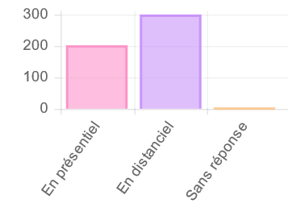
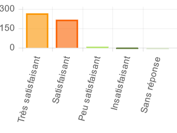
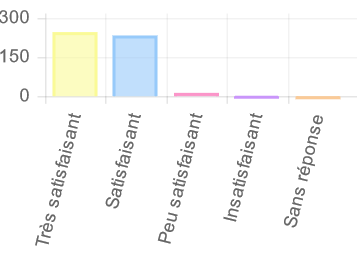
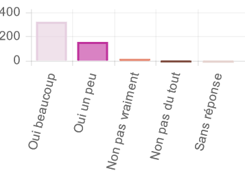
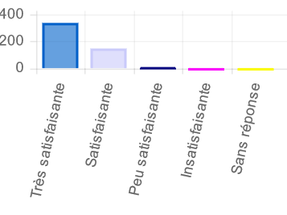
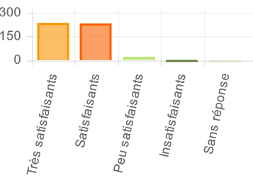

<!-- slide bg="[[images/thesis2.jpg]]" -->

<h2>

Bilan des formations doctorales

</h2>

<h3> 

année 2021-2022 
</h3>

<h4> 

	Damien Belvèze, Université de Rennes 1 
</h4>

---

<!-- slide bg="https://media.giphy.com/media/IiHtE9KJTiiu6XOsEP/giphy.gif" -->	
<grid drag="100 55" drop="bottom" flow="col" align="stretch">
<h1>

	Quelques chiffres 
</h1>
</grid>

	
--
<!-- slide bg="#fffcf0" -->

	
- 528 étudiants formés<!-- element class="fragment" data-fragment-index="1" -->
- 40 séances de formation<!-- element class="fragment" data-fragment-index="2" -->
- 89 heures de formation<!-- element class="fragment" data-fragment-index="3" -->
- 66% de places occupées<!-- element class="fragment" data-fragment-index="4" -->
- 25% d'absentéisme<!-- element class="fragment" data-fragment-index="5" -->
- 429 questionnaires de satisfaction remplis<!-- element class="fragment" data-fragment-index="6" -->
	
---

| Etablissement          | Somme - Nombre d'heures suivi par les présents |
| ---------------------- | ---------------------------------------------- |
| INSA Rennes            | 2                                              |
| Rennes 1               | 28                                             |
| Rennes 1 – INSA Rennes | 6                                              |
| Rennes 1 – Rennes 2    | 15,5                                           |
| Rennes 1 – URFIST      | 5,5                                            |
| Rennes 2               | 18                                             |
| Rennes 2 – URFIST      | 8                                              |
| URFIST                 | 6                                              |
^etablissement

---
<!-- slide bg="#fffcf0" -->
## partenariats

	
![[Chart Thu Jun 30 2022.png]]

---
<!-- slide bg="#fffcf0" -->
## saisonnalité
	
	![[Chart Wed Jul 06 2022.png]]

---

#### contenus et parcours
	

--

	
--

### Modalités

	
	
---
<!-- slide bg="https://media.giphy.com/media/3o6ZtkQBMHYV9Ncv72/giphy.gif" -->
<h1>

	Satisfaction 
</h1>
	
--
	
### Objectifs atteints ?

	
--
	
### globalement satisfaits ?

	
	
--
	
### Apports importants pour votre projet pro ?
	
	
	
--

### Qualités des formateurs
	

	
---
	
### échanges doctorants / formateurs ou doctorants / doctorants
	

---

<!-- slide bg="https://media.giphy.com/media/fuKheOnd8MwvdciqHP/giphy.gif" -->
	
---
<h2>
<grid drag="40 30">
paroles de doctorants
</grid>
</h2>

<!-- slide bg="#fffcf0" -->
<!--   text-align: justify;	-->

<grid drag="80 30" drop="bottom">

*Il serait intéressant que cette formation [RGPD] soit donnée en amont du doctorat (Master ou Licence) afin de toucher un plus grand public.*
<!-- element class="justify" -->

</grid>
--

	<h2>
<grid drag="40 30">
paroles de doctorants
</grid>
</h2>

<!-- slide bg="#fffcf0" -->
<!--   text-align: justify;	-->

<grid drag="80 30" drop="bottom">

*Bonne formation permettant de penser en dehors des "conventions" de publication.*
<!-- element class="justify" -->

</grid>
--

	<h2>
<grid drag="40 30">
paroles de doctorants
</grid>
</h2>

<!-- slide bg="#fffcf0" -->
<!--   text-align: justify;	-->

<grid drag="80 30" drop="center">

*Faire des dérivés plus orientées vers les différentes thématiques de thèse (science, informatique, biologie, ...). Car beaucoup de choses diffèrent dans les domaines et je ne me suis pas forcément senti concerné par la plupart des cas présentés.*
<!-- element class="justify" -->

</grid>
--

<h2>
<grid drag="40 30">
paroles de doctorants
</grid>
</h2>

<!-- slide bg="#fffcf0" -->
<!--   text-align: justify;	-->

<grid drag="80 30" drop="center">

*C'est une formation [..] qui reste trop générale dans son contenu. Elle manque d'exemples concrets dans son développement.  Il serait souhaitable qu'à la prochaine occasion qu'une  telle formation se déroule en présentiel pour permettre aux participants de travailler entre eux.s.*
<!-- element class="justify" -->

</grid>
	
--

<h2>
<grid drag="40 30">
paroles de doctorants
</grid>
</h2>

<!-- slide bg="#fffcf0" -->
<!--   text-align: justify;	-->

<grid drag="80 30" drop="bottom">

*Très bonne formation. L'aspect ludique en première partie permet d'être plus réceptif pour les notions théoriques abordées en seconde partie.*
<!-- element class="justify" -->

</grid>
	
--