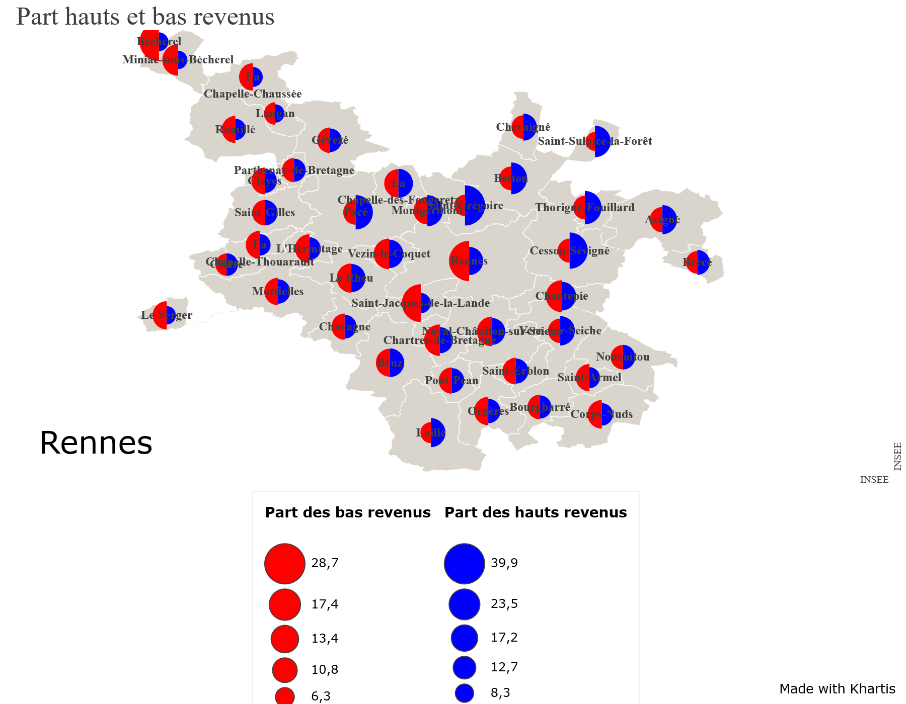

Outil du Medialab de Sciences-Po pour faire de la visualisation géographiques de données. 

Objectif : faire un diagramme présentant la proportion des hauts et bas revenus dans les communes de Rennes Métropole. 

1. trouver des fichiers shapefiles

Sur Google : filetype:shapefile Rennes Métropole
Résultat : https://www.data.gouv.fr/fr/datasets/communes-de-rennes-metropole/
Sur ce modèle, simplifier l'entête : POSTAL, INSEEE, NOM

3. trouver les chiffres de répartition des revenus sur les communes de Rennes  Métropole.

Sur Google : (filetype:csv OR filetype:xls OR filetype:xlsx OR filetype:ods) AND Rennes Métropole revenus
Résultat : https://www.insee.fr/fr/statistiques/fichier/6545224/br_ina_113.xlsx
Sur ce modèle renommer dans l'entête la variable code postal en POSTAL

C'est le code postal qui va permettre de lier les données au fonds de carte. Il faut que l'entête soit le même dans les deux cas. 

Saisir POSTAL comme variable pivot

Copier-coller les données du fichier INSEE dans l'espace prévu à cet effet. 

Créer une visualisation
Ajouter une visualisation > choisir une variable (choisir la variable hauts revenus)

Par exemple, pour montrer la proportion entre hauts et bas revenus (laissons les revenus intermédiaires de côté), choisir la visualisation "doubles symboles proportionnels"
Dans les préférences de visualisation, laisser cercle, laisser les couleurs.

Il faut choisir deux variables : choisissez dans le menu déroulant "part des bas revenus" et "part des hauts revenus"

Les valeurs s'affichent sur le fond de carte. 

[Sauvegarde du projet](Rennes_Metropole_revenus.kh)