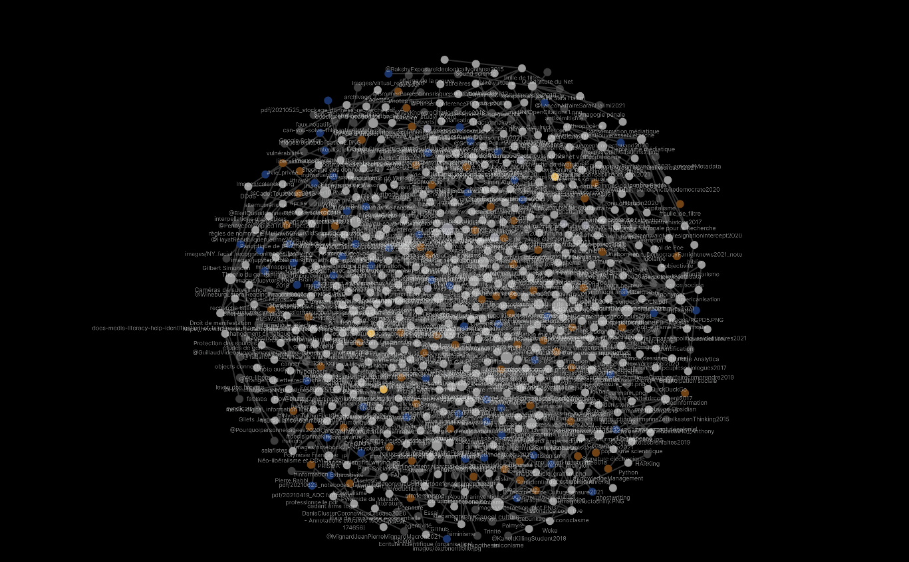
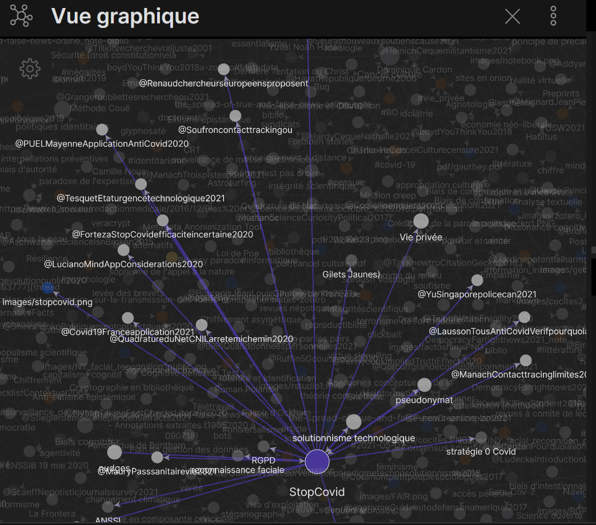
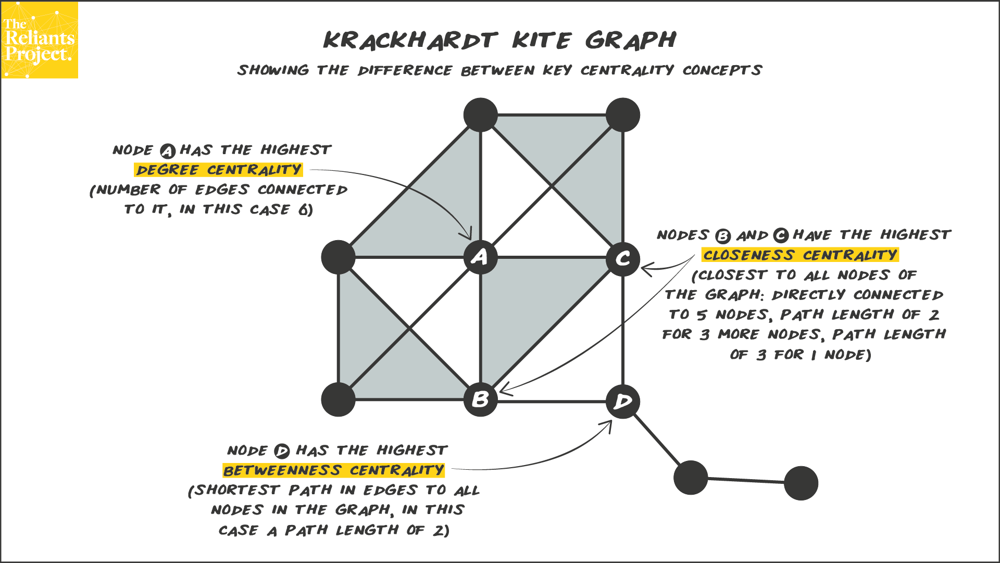
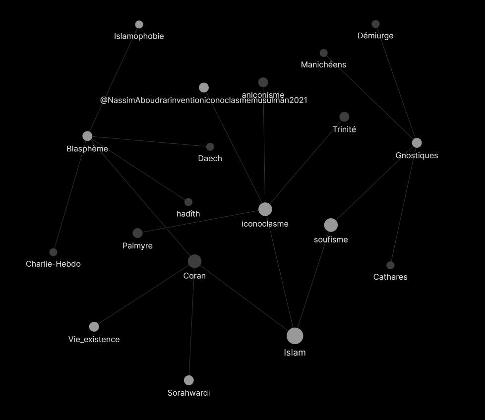

## 1. Les plugins par défaut

Les plugins par défaut font partie du coeur d'Obsidian. Pour les activer les utiliser, aller dans les paramètres (icone roue) et sélectionner les *plugins principaux*

Seuls deux plugins correspondent à une option payante d'Obsidian : la publication des notes sur le serveur d'Obsidian et leur synchronisation avec les notes hébergées en local.

Voici une revue de quelques plugins installés par défaut :

### explorateur de notes

Par défaut, trois plugins sont activés sur Obsidian pour faciliter la recherche : 

- l'explorateur de fichier (volet latéral gauche qui permet de naviguer dans une arborescence de fichiers)

- le plugin rechercher permet dans le même volet de rechercher par catégorie : file(), tag(), path()...

- le selecteur rapide : la commande Ctrl+O (commande par défaut) permet d'accéder directement à tous les fichiers en tapant un élément de leur nom dans un champ. 

### Explorateur de fichiers

L'explorateur de fichiers permet de naviguer dans les fichiers de votre coffre à l'endroit où celui-ci est hébergé. 

### Vue graphique globale

La vue graphique vous permet de visualiser l'ensemble de vos notes et des liens qui les unissent sous la forme d'un graphe.

D'après Arthur Perret[[@PerretWhatpointgraph2022]], le bénéfice de ces visualisations qui passent aux yeux de certains comme des gadgets dont on peut se passer n'est pourtant pas à négliger : 

- le graphe nous rappelle que notre mode d'écriture et de mémorisation est par défaut réticulaire. Ce que nous écrivons de nouveau s'ancre toujours dans un savoir déjà acquis et des notes déjà prises. Faire des liens avec ce savoir pré-existant permet de solidifier ses connaissances
- le graphe nous permet de prendre conscience de sujets émergents dans notre prise de notes et de liens qui pourraient être faits entre ces sujets et d'autres plus anciens. 
- le graphe nous permet de trouver de l'information reliée à la note que nous sommes en train d'écrire et que nous ne cherchions pas ([[sérendipité]]). Créer des liens entre des notes voisines permet de sortir la note de son isolement, cela empêche la pensée en silo :

> A graph is a memory aid that prevents siloed thinking.

Lorsque les notes ne sont pas liés à quelques projets, cette constellation devient vite illisible. 

Bien entendu, on peut zoomer sur telle ou telle partie, mais ça devient vite confus au bout d'un moment. 

pour visualiser les notes connexes à la note de son choix, il suffit de laisser la souris sur cette note 

Les points de couleur représentent le statut de la note : 

(couleurs par défaut)
bleu : images
marron : tags
gris clairs : notes avec texte
gris foncées : notes sans texte (seul le titre existe, créé dans une autre note par du texte mis entre accolades). Ces notes restent à rédiger. 
On peut assigner aux tags d'autres couleurs que la couleur marron qui est celle par défaut. 

Pour cela se positionner dans la vue graphique, cliquer sur la roue crantée et sélectionner nouveau groupe. Pour visualiser toutes les références (notes commençant par un \@), on peut par exemple fixer une couleur particulière au groupe **file:\@**

### prendre conscience de l'importance des notes au moyen de la vue graphique

On l'a vu, Obsidian propose une mise à plat des notes, sans structure hiérarchique (pas de dossiers, ni de sous-dossiers) et cela pour mimer la façon dont notre cerveau traite l'information (le concept orange peut être lié à des objets de couleur orange, un crépuscule, une marque de téléphone, un feu de signalisation, mais également à des fruits puisque l'orange est un fruit. Il n'y a pas de lien de hiérarchie possible entre des choses très différentes comme un feu de circulation et une pomme par exemple). Toutefois, le graphe nous permet d'observer que certaines notes occupent une plus grande centralité que d'autres (et peuvent donc passer pour plus importantes que d'autres pour l'esprit qui a collationné ces notes). Il existe trois types de centralité : 

la centralité de degré : la note qui a le plus de liens avec des notes qui ont elles-mêmes beaucoup de liens
la centralité de proximité : la note à partir de laquelle les chemins sont les plus courts vers l'ensemble des notes du graphe
la centralité d'intermédiarité : la note qui relie  entre elles le plus de pôles (ypiquement une note orange pourrait relier un pôle de notes fruits et un pôle de notes objets de couleur orange)

### vue graphique locale

Plus intéressante est la possibilité d'ouvrir un graphe local à partir de la note (aller dans les raccourcis clavier pour paramétrer la combinaison de touches qui vous conviendra pour faire apparaître ce graphe)

On peut régler la taille du graphe en choisissant le nombre de degrés à partir du noeud que constitue la note affichée (de 1 à 6 degrés - ci-dessus, le nombre de degrés est fixé à 3 : "démiurge" est distant de 3 degrés de "islam")

Comme dans les outils de visualisation sous forme de graphe (par exemple Gephi), on peut régler la force du graphe, la taille des noeuds, caractériser les liaisons au moyen de flèches (quelle note cite quelle autre note)...

### Les rétroliens

les rétroliens ou *backlinks* constituent la grande force des applications comme Roam, org-roam ou Obsidian. Quelque soit la note que vous affichez, si vous activez ce plugin, vous pourrez vous rendre facilement aux notes qui font référence à celle-ci au moyen des rétroliens en bas de page.

### Modèles

Activer ce plugin, vous permettre de constituer des templates (voir ci-dessous)

### Diapositives

Il est très simple grâce à ce plugin de constituer des diapositives et les présenter à la place d'un document impress ou powerpoint. 

chaque diapositive est séparée de la précédente par trois tirets (\-\-\-)

### Les plugins payants Sync et Publish

Ces plugins sont payants parce qu'ils supposent un hébergement des données sur les serveurs d'Obsidian et une synchronisation avec entre ces serveurs et l'ordinateur qu'on utilise pour modifier les fichiers. 
Exemple de publication d'un coffre Obsidian avec Publish : le carnet de notes de [Yann Houry](https://publish.obsidian.md/yannhoury)
Leur recours peut-être intéressant pour constituer des tutoriels accessibles en ligne à partir de ses notes (voir par exemple ces [50 leçons et exercices pour apprendre le HTML, le Javascript et le CSS](https://publish.obsidian.md/yannhoury/Documentation/HTML-CSS/Cours+HTML+CSS+JS/Index))