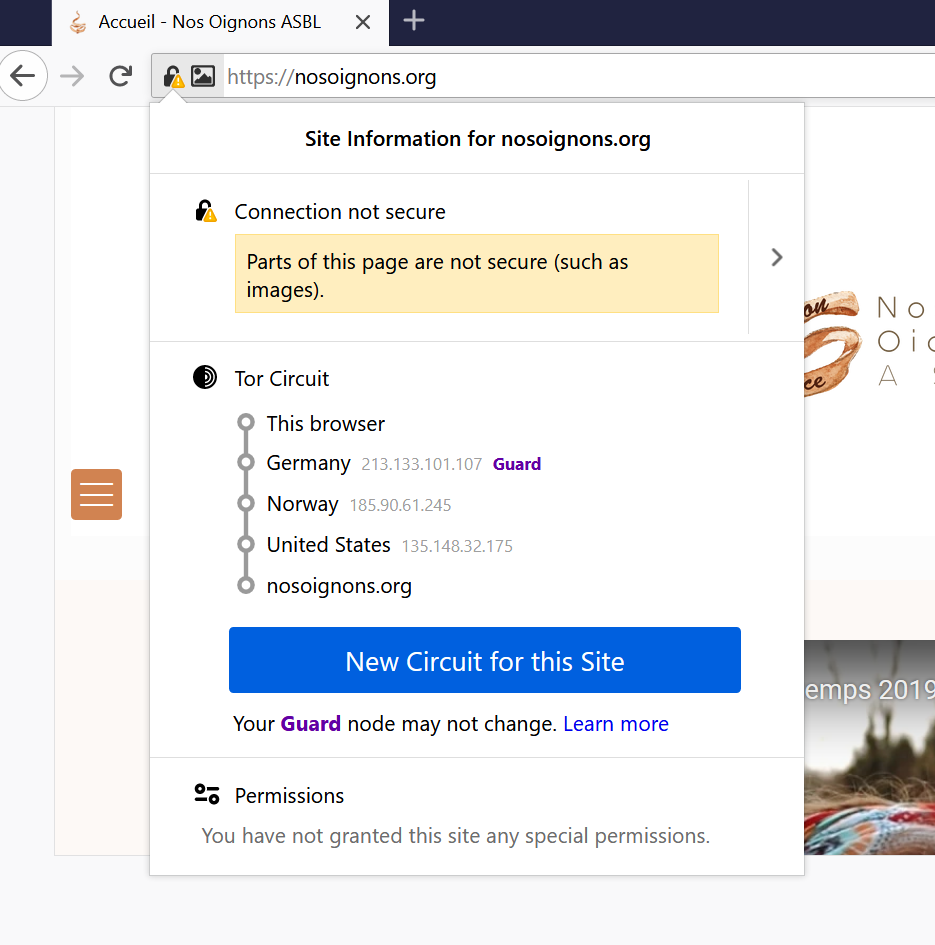

#cryptographie 

# Décharge

## cadre de l'intervention

Les contenus qui sont présentés lors de cet atelier ont été relus par le responsable de la sécurité informatique de l'Université mais ne représentent ni son point de vue, ni le point de vue global de l'Université pour qui l'usage de Tor sur le réseau Rennes 1 reste toléré mais comporte des risques pour la sécurité informatique de l'établissement. L’usage d’OnionShare contourne des protections appliquées à la navigation sur [[internet]] par blocage de sites réputés dangeureux.

C'est la raison pour laquelle, nous vous demandons dans le cadre de cette activité de ne pas utiliser le réseau de Rennes 1 mais celui de votre fournisseur d'accès à internet. Si vous êtes chez vous, vous n'avez rien à faire de particulier. Si vous êtes à l'Université, merci d'utiliser votre smartphone comme hotspot pour utiliser Internet et de ne pas utiliser le réseau local. 

La bibliothèque de l'Université de Rennes 1 propose cet atelier, en même temps qu'un autre sur la [[gestion des mots de passe]], dans la suite des ateliers du FDLN qui ont eu lieu entre 2018 et 2020.
Cette courte présentation de Tor a pour précédents à Rennes 1 les formations à cet outil d'étudiants qui se destinent au métier de journaliste, dans le cadre de la protection des sources. 
En vertu de la [déclaration de l'IFLA](https://www.ifla.org/publications/node/10056) (réunion internationale des organisations professionnelles de bibliothécaires) d'août 2015, les bibliothécaires doivent contribuer à protéger la [[vie privée]] de leurs utilisateurs en leur proposant d'une part un environnement autant que possible indemne de la surveillance de masse et d'autre part des formations aux outils qui leur permettront de protéger leur [[Vie privée|vie privée]]. C'est dans ce dernier cadre que nous intervenons aujourd'hui. 

## Utiliser son smartphone comme relais internet. 

Pour utiliser les données mobiles de son téléphone avec un ordinateur, voir le mode d'emploi :
- [Android](https://support.google.com/android/answer/9059108?hl=fr)
- [Iphone ou Ipad](https://support.apple.com/fr-fr/HT204023)

## Installer Tor browser

Windows, Mac : aller sur le [site officiel de Tor browser](https://www.torproject.org/), télécharger le logiciel. Sur Windows ou Linux le logiciel peut être téléchargé sur le bureau et ne nécessite pas de droit d'administrateur. 

Installer Tor avec un terminal sur Linux 

``
sudo apt install torbrowser-launcher
``
lancer Tor. 

# Le circuit Tor

## histoire du réseau

De 1995 à 2003, Tor était un projet à la fois universitaire (MIT) et militaire (laboratoire de l'US Navy). L'Electronic Frontier Foundation (EFF), organisation à but non lucratif pour la protection des libertés numériques, a financé le projet à partir de 2004, deux ans après que le réseau soit devenu accessible à tous les internautes. Toutefois à l'époque la connexion aux relais Tor demandait des compétences un peu plus poussées. Pour faciliter cet accès au réseau et en démocratiser l'usage, le navigateur Tor (Tor Browser) a été conçu en 2008 ce qui a rendu le réseau populaire notamment lors des printemps arabes. En 2013, les révélations de Snowden ont encore accru le nombre d'utilisateurs réguliers. 
Pour en savoir plus, voir [l'historique du projet](https://www.torproject.org/about/history/) sur le site du projet Tor. 

## principe d'un circuit tor (ou "routage en oignon")

Tor est donc le réseau, et nous allons vous présenter l'outil qui permet de le parcourir, le navigateur Tor.
Ce navigateur (à télécharger sur le site de [Tor Project]([https://www.torproject.org](https://www.torproject.org/))) permet de consulter des sites web en préservant le plus possible son anonymat. Le principe général est que le serveur auquel se connecte la machine client qui utilise le navigateur Tor ne retient pas l'[[IP]] de cette machine mais celui du dernier routeur par lequel passe la communication, autrement appelé noeud de sortie. 

Source: [[@anonymeGuideautodefensenumerique2017]]

Le circuit Tor est constitué de trois relais ou "noeuds" qui constituent trois couches [[Cryptographie|cryptographiques]] (d'où l'image de l'oignon). Ces différents noeuds ignorent l'IP de la machine qui le suit ou le précède. Seul le serveur peut conserver l'IP du noeud de sortie. Mais il lui est impossible de remonter à l'IP de la machine client.

Tor complète le https pour rendre votre navigation la plus confidentielle possible (voir à ce sujet l'[animation](https://www.eff.org/pages/tor-and-https) sur le site de l'EFF à ce sujet qui permet de visualiser ce que fait chaque protocole https et Tor)

## hébergement des noeuds de sortie

Du fait qu'en cas de trafic illicite, celui-ci peut être intercepté au niveau du noeud de sortie, ce sont plus souvent des associations loi 1901 qui en France maintiennent ces noeuds particuliers (par exemple l'association [Nos Oignons](https://nos-oignons.net/Association/)). On peut en revanche, héberger des noeuds intermédiaires avec une simple machine (le débit minimal requis est de 16 Mbits/seconde, voir les autres requisits sur le [site du Tor Project](https://community.torproject.org/relay/relays-requirements/))

## changer le circuit Tor

Cliquer sur le cadenas > 'new circuit for this site'
tous les circuits ne sont pas également rapides (certains relais ont plus de bande passante que d'autres). Il peut parfois être avantageux de changer le circuit pour cette raison. 
Le noeud d'entrée (guard) en revanche ne change que tous les deux ou trois mois et de manière automatisée [afin de réduire le risque de certaines attaques](https://blog.torproject.org/improving-tors-anonymity-changing-guard-parameters)

## Tor réduit la signature électronique de votre ordinateur. 

Le [[Fingerprinting]] consiste à repérer la singularité d'une machine connectée sur le réseau à partir de ses différents paramétrages, notamment la configuration du navigateur, des caractéristiques du système d'exploitation, les polices disponibles dans certains logiciels...
Pour se faire une idée de la manière dont votre machine est repérable sur le web, vous pouvez consulter avec profit le site [Am I Unique](https://amiunique.org) qui a été réalisé par Pierre Laperdrix, un ancien étudiant de l'IRISA (Rennes).

Tor depuis la version 10 permet de redimensionner la fenêtre de navigation à l'écran sans que cette information ne puisse être utilisée pour contribuer à identifier la machine. 
De même Tor complète renforce l'[[obfuscation]] de ses utilisateurs en chargeant des polices additionnelles

# Les services cachés

Tor on l'a vu permet d'assurer dans une large mesure l'anonymat de l'internaute. Le réseau permet également de se connecter à des **services cachés** (hidden services). Il s'agit de serveurs dont l'emplacement géographique est caché. Ces sites ne peuvent être atteints qu'avec le navigateur Tor. Les services cachés sont accessibles au moyen d'adresses en .onion

## des services peu utilisés par les internautes qui choisissent Tor

Les services cachés sur Tor ne génèrent d'après une étude récente que **6,7%** des usages du navigateur Tor[[@JardinepotentialharmsTor2020]]. Cela signifie que la plupart des utilisateurs de Tor utilisent le réseau pour accéder à des sites qui le sont depuis d'autres navigateurs mais en tirant profit de l'anonymat que leur confère le réseau en oignons et en sachant que les extensions pour navigateur du CleanNet sont contournées par la majorité des sites (cf. ce [billet sur Do Not Track](https://spreadprivacy.com/do-not-track/))

Bien sûr parmi ces sites en onion existent des sites non seulement illégaux mais criminels (pédopornographie, vente de drogue, virus informatiques, contenus haineux), mais plusieurs institutions de presse et de savoir ont aussi développé des sites cachés pour être lus dans les pays où leurs sites sont censurés. 

## Liste de sites utiles pour la presse, la communication et la sécurisation des données.

Voici une [liste de sites en .onion](https://github.com/mgoessen/tails-workshop/blob/master/dotOnion.md) (Mise à jour : Mathieu Goessens)

Activité : Ouvrir le navigateur Tor, aller sur [http://liqr2cbsjzxmpw6savgh274tuzl34x6cd56h7m7ceatnrokveffm66ad.onion/](http://liqr2cbsjzxmpw6savgh274tuzl34x6cd56h7m7ceatnrokveffm66ad.onion/) qui permet de supprimer les métadonnées rattachées à un document (une photo par exemple)

Télécharger [cette photo](https://focus.univ-rennes1.fr/ld.php?content_id=33448322) supprimer les métadonnées du fichier. 
Testez avec http://exif.regex.info/exif.cgi que ni la date ni les coordonnées géographiques ne sont plus visibles.

## Le partage de fichiers avec OnionShare

Logiciel mis au point par Micah Lee et une communauté de développeurs de Tor Project pour permettre de partager et de recevoir facilement des documents sur le réseau Tor. Onionshare est facile à utiliser: il suffit de lancer le logiciel qui se connecte immédiatement au réseau en onion, de glisser déposer les fichiers qu'on veut partager, de copier l'adresse générée par le logiciel (adresse en .onion) et de l'envoyer de manière sécurisée au destinataire (remise en main propre ou mail chiffré). Ce dernier n'aura qu'à utiliser cette adresse dans son navigateur Tor pour accéder au document partagé. Il est également possible d'utiliser Onionshare avec une adresse pérenne afin de publier un site sur le réseau Tor (cf. billet de Micah Lee sur le [blog de Tor Project](https://blog.torproject.org/new-release-onionshare-2)).

Activité : 

- charger OnionShare sur sa machine
- charger un document dans OnionShare (photo, poème, bout de code)
- obtenir le lien vers le document
- l'envoyer à un autre participant via le chat de Jitsi (préciser le @destinataire dans la conversation)
- Sur OnionShare, cliquer sur "recevoir des fichiers", envoyer le lien créé à un seul destinataire (un autre) en le nommant comme la première fois. Charge à ce participant de vous envoyer un document du même type que tout à l'heure. 

# Les limites de Tor

## Des éditeurs et des hébergeurs hostiles à Tor
Ce n'est pas à proprement parler une limite de l'outil lui-même mais un effet de la résistance qui lui opposent un certain nombre de fournisseurs d'information dont une partie du business repose sur la monétisation des données de navigation, ou bien des hébergeurs qui utilisent des produits de mitigation du traffic pour se protéger d'éventuelles attaques (par exemple [[DDoS]])

L'utilisateur de Tor doit s'attendre à remplir des [[captchas]] et dans certains cas à ne pas pouvoir accéder à l'information (cf. cas d'Elsevier)

## Le FAI sait qu'on utilise Tor

Le Fournisseur d'Accès à Internet ([[FAI]]) sait qu'on utilise Tor (il peut avoir l'IP du noeud de sortie, la liste des IP de ces noeuds est disponible sur le net)

Plus il y aura de personnes à utiliser Tor pour des raisons diverses (souvent bénines) et moins le fait d'utiliser Tor aura la valeur de vouloir cacher quelque chose de fondamentalement compromettant.

## Pas de confidentialité entre le noeud de sortie et le serveur visité

Les noeuds de sortie gérés par des personnes malveillantes (selon le principe de l'attaque par l'[[homme du milieu]]) peuvent leur permettre d'écouter des conversations : si les IP des expéditeurs ne sont pas décelés, le contenu peut parfois révéler d'où elles proviennent (à moins que ces communications ne soient chiffrées)

N'importe qui peut gérer un relais Tor, ce qui fait que beaucoup de relais Tor sont compromis. 

## Attaque par flux temporel

Les paquets d'information sont envoyés selon un certain rythme d'une machine client et sortent du noeud de sortie avec le même rythme. Le poids du signal envoyé au premier relais et celui qui sort du relais de sortie peut être mesuré (ainsi que le rythme de l'envoi). Si les quantités sont les mêmes, il est possible d'affirmer que l'ordinateur A a envoyé une requête au serveur B. 

Ainsi si on est capable de déterminer qu'une machine qu'un envoi de 102,8 Mbits a été fait à 22h03 sur un FAI et que la même quantité de bits a été reçue à la même heure sur un site qu'on surveille, on peut reconstituer le trajet de ce paquet d'information depuis l'ordinateur d'origine vers le serveur cible. 

ou comme l'exprime cet [internaute](https://www.nextinpact.com/article/45664/renseignement-perenniser-surveillance-algorithmique-pour-letendre-aux-url#comment/1873904) dans un commentaire à un article paru sur Nextinpact : 
>La méthode simple c'est de peser les paquets de poissons et de comparer le poids de la sardine (le flot IP de untel) avec le poids du thon déjà pêché (le flot IP de tel site pour tel type de machine).  
  Si ta sardine pèse comme le thon alors le Ric(h)ard pique moince et tu peux donner un pourcentage de plausibilité a l'inférence : sardine = thon.

# Bibliographie

