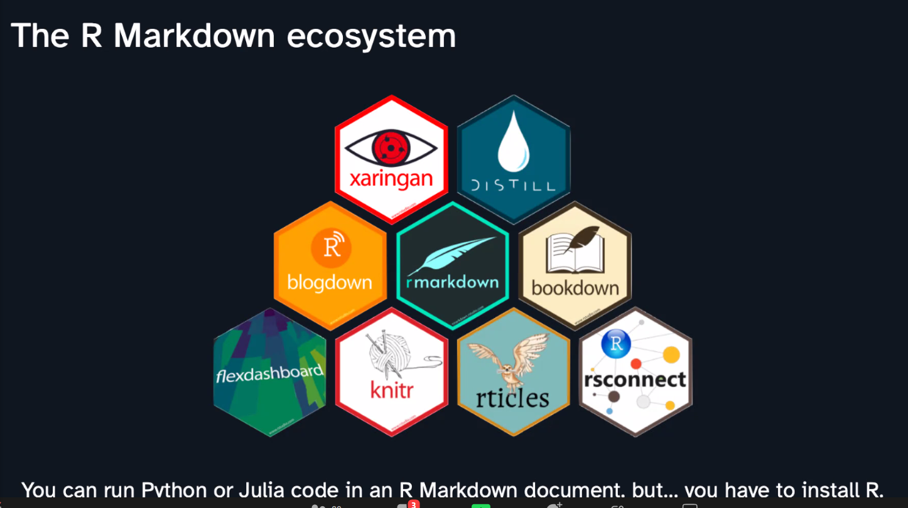
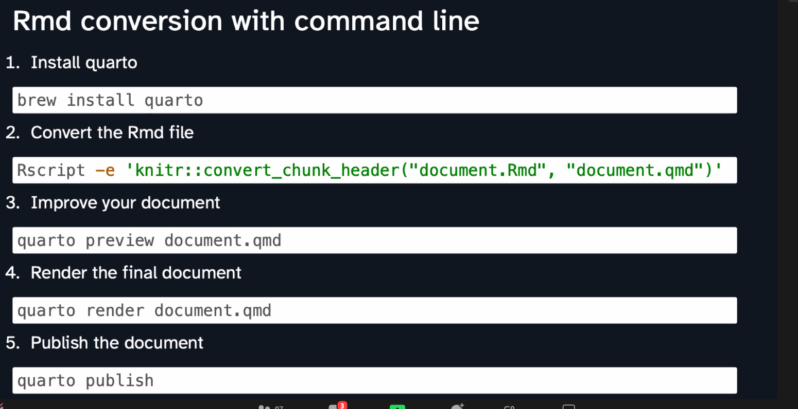
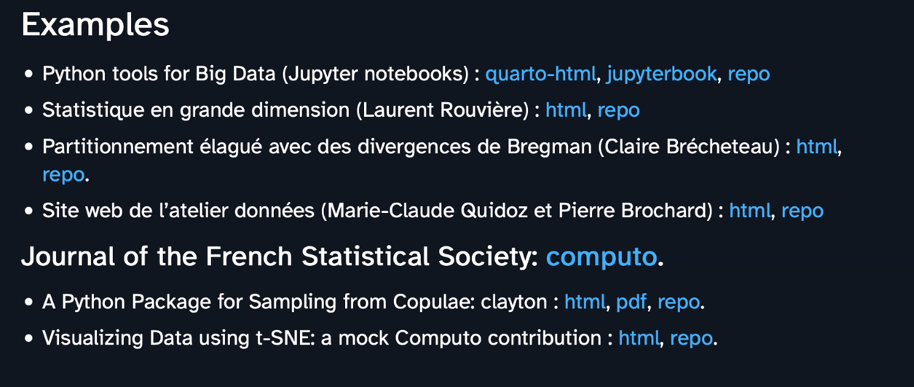

# de R à Quarto

source: https://pierre-navaro.quarto.pub/hello-quarto/#/hello-quarto-title

Quarto va permettre d'utiliser tous ces packages de R

R, python, Julia

on peut utiliser Quarto avec VScode

A partir du fichier md, ajouter un yaml en entête avec 

ajouter \_quarto.yml

publication sur le site de Quarto mais on peut le mettre sur Netlify ou Github Pages (pas encore de possibilités d'utiliser Gitlab pages)

on peut insérer des maths comme d'habitude avec \$\$

on peut insérer des chunks R ou du code Julia. Possibilité de mettre en lumière des parties du code. Possibilité d'ajouter des explications sur ce code sous forme d'annotations.

technologie pérenne ? Quarto est maintenu par Posit (anciennement Rstudio). Toutes les nouvelles fonctionnalités développées par Rstudio vont être appliquées à Quarto. 

En matière de reproductibilité, le vieux code markdown est-il toujours actuel ? Réponse : oui.
