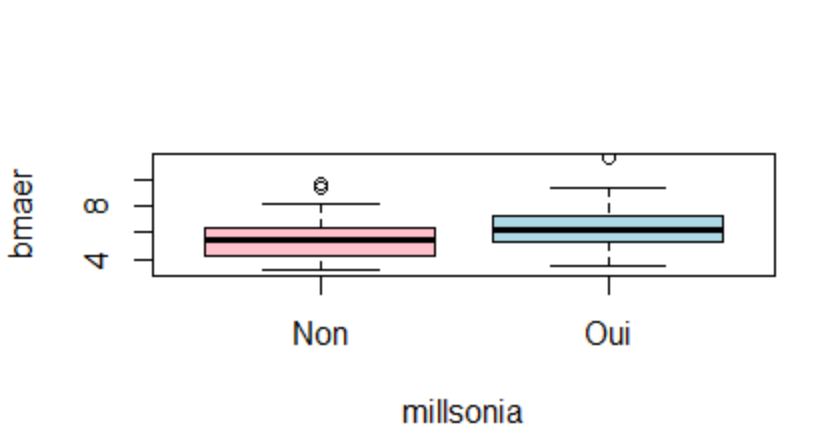
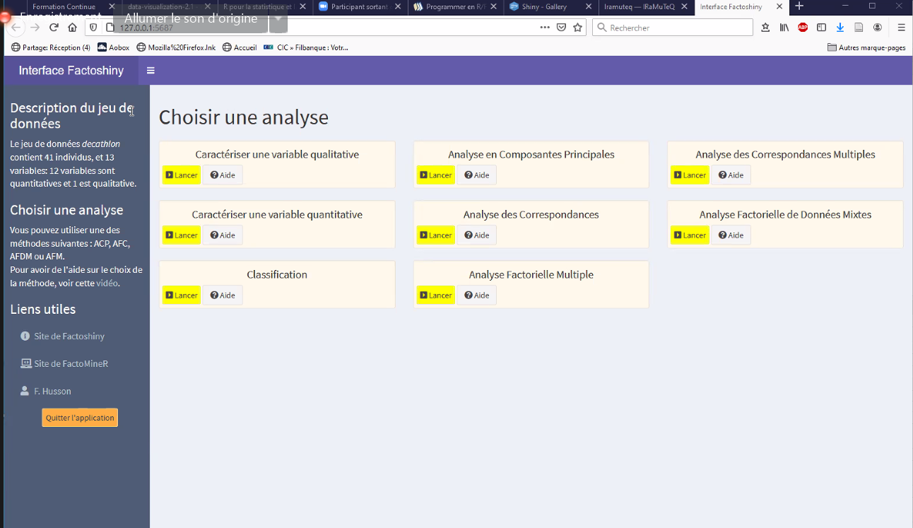

# Philosophie du logiciel R


## interface et environnement de travail

Rstudio IDE de R

[support du cours](http://emily.perso.math.cnrs.fr/FormationContinue/FormationContinue/Formation_Continue.html)

R et Rstudio

télécharger sur Ubuntu https://linuxize.com/post/how-to-install-r-on-ubuntu-20-04/

utilisation de la console comme calculatrice

variable = objet dans R

création d'une variable c : 

c <-154*36

enregistrer un fichier de script (avec extension )
possibilité de sauvegarder l'environnement complet de travail (script + console + variables) : enregister avec une extension Rdata

Projet dans Rstudio : réunir tous les fichiers (données, scripts relatifs à un même projet)

file>project
possibilité de faire un lien avec un répertoire [[Github]]
Rccp : permet de faire du C++ dans R

Possibilité d'envoyer le projet au collaborateur avec ou sans les données pour qu'il puisse y travailler. 

## Packages

faire attention à l'arborescence des fichiers dans le projet. Prévoir un dossier pour les principaux scripts est recommandé.

`data <- data.frame(x1=rnorm(100), x2=rnorm(100), x3=rnorm(100))`

fonction data : génère un tableau avec trois colonnes 

`PCA(data)`

pour préciser que la fonction fait référence à un package donné : 

`FactominR::PCA(data)`

nécessité le package FactoMineR
Installer le package depuis le site du CRAN
installer > charger le package (en cochant dans la liste des packages le package nouvellement installé)

pour faire du code [[reproductibilité|reproductible]] dans R entrer la commande library : 

`library(FactoMiner)`

principal défaut de R : les mises à jour sont très régulières et du coup la mise à jour des packages ne suit pas forcément puisque les packages sont créés en général par des chercheurs. Cette instabilité est la principale limite de R. Actuellement on est à une version 4 de R. Les packages de la version 3 sont assez souvent obsolètes.

le bouton update permet de mettre à jour un package

les packages sont disponibles sur https://cran.r-project.org
cliquer sur Packages (actuellement 17000 packages)

## Rmarkdown

permet d'embarquer du langage R dans le langage [[markdown]]. 
pour générer le fichier de sortie : knit

le chunk encapsule du code R

supprimer le code de la publication finale : 

`echo=FALSE` (dans la déclaration de chunck)

```{r,echo=FALSE}
print("bonjour")
```


simulation d'un jeu de données

```{r, echo=FALSE}

data<-data.frame(x1=rnorm(100), x2=rnorm(100), x3=rnorm(100))

```

### Faire une présentation avec Rmarkdown

avec le package [Xaringan](https://bookdown.org/yihui/rmarkdown/xaringan-format.html#slides-and-properties)
Installer le package depuis le site du CRAN

#### YAML : 

````yaml
title: "gérer, diffuser et partager ses données de recherche"
subtitle: 
author: "Damien Belvèze"
date: "13/04/2022"
output: 
  xaringan::moon_reader:
    lib_dir: libs
    nature:
      ratio : "16:9"
      highlightStyle: github
      highlightLines: true
      countIncrementalSlides: false
	  
````

#### diapositives

les diapositives se succèdent avec un titre de niveau 2 (h2) ou \#\# et séparées par des \-\-\-

sauf la diapositive de titre (titre 1)


avant le titre de la diapositive, possibilité de changer la couleur de fond ou la classe

````
background-color: #bebebe
class: middle
````

par exemple pour les diapos de titres ou titres intermédiaires : 

````
class: center, inverse, middle
````

Notes de la diapo, 

elles peuvent être placées sous ??? et apparaître dans la présentation en tapant sur la touche p


#### ajout d'une image

##### taille de l'image

`````r 
.center[
```{r echo=FALSE, out.height=300, out.width=600}
knitr::include_graphics("img/types-donnees.png")
```
]
``````

si pas nécessaire de retailler les images, pas besoin de mentionner les images dans un chunk : 

````r
.center[]
````

##### emplacement des images

image à gauche, légende à droite

````r
.pull-left[
```{r echo=FALSE, out.height=400, out.width=300}
knitr::include_graphics("img/ocde.png")
```
]

.pull-right[
2007 : Parution du rapport de l’OCDE, « Principes et lignes directrices de l’OCDE pour l’accès aux données de la recherche financée sur fonds publics ». http://www.oecd.org/fr/science/inno/38500823.pdf 
]
````


#### polices

petits caractères entre balises \<small>\</small>


#### bibliographie

insérer un appel au package knitrcitations. Si knitr ne donne pas le résultat escompté, cela permettra à l'utilisateur de le charger en tapant dans la console : 
````
install.packages(knitrcitations)
````

A l'endroit où on mobilise les packages nécessaires, appeler knitrcitations

```{r, echo = FALSE}
library(knitcitations)
```

A l'endroit où on insère l'appel de citation :

`r citep("https://www.oecd.org/fr/science/inno/38500823.pdf")`


## Base de programmation en R/Rstudio

Tous les objets de r sont des vecteurs (valeurs qui ont un identifiant)

numeric = vecteur quantitatif (par exemple la taille de plusieurs individus)

Comment créer un vecteur ? 
- import d'un jeu de données
- création d'un vecteur dans r

` x <- c(1,2,3,4)`

`x[2]` extrait la valeur qui est en position 2 (contrairement à [[Python]] la première valeur n'est pas 0 mais 1)

`x[1:3]` génère les trois premières valeurs de x

Une valeur seule est un vecteur de taille 1, un réel est un vecteur qui a une seule chaîne de caractères.

Les nombres entre crochets en début de ligne donnent le numéro de l'indice de la valeur dans la suite. 


vecteurs rfactor = variable qualitatives

vecteur character # vecteur factor

matrix : faire un tableau à deux dimensions

`M <- matrix(1:6), ncol=2)`

summarise : résume un jeu de données

`summarise(jeu de données)`

Faire la moyenne d'une variable quantitative en supprimant les données manquantes : 

`summarise(jeu de données, moyennedelavariableA = mean(variable A, na.rm=TRUE)`

crée un tableau avec des valeurs de 1 à 6 réparties sur deux colonnes (et donc 3 lignes)

## cas pratique (artériosclérose)

importer le jeu de données Intima_media.txt (placé dans le bureau)

`data.alcool <- read.table(file="C:\\Users\\dbelveze\\desktop\\Intima_Media.txt", header=TRUE, sep = " ", dec = ",")`

factoriser SEXE (1 -> homme, 2 -> femme)

`data.alcool$SEXE <- as.factor(data.alcool$SEXE)
levels(data.alcool) <- c("homme","femme")`

factoriser tabac (0 -> jamais, 1 -> parfois, 2 -> souvent)

`data.alcool$tabac <- as.factor(data.alcool$tabac)
levels(data.alcool$tabac) <- c("jamais", "parfois" "souvent")`

faire le résumé d'un groupe de variables dans un jeu de données : 

`summarise(group_by(jeu de données, variable A), variable C = mean(variable B))`

mesure de l'arthériosclérose par groupe de personnes (fume, fait du sport, sexe)

`summarise(group_by(data.alcool, SEXE, tabac, SPORT), mesure = mean(mesure))`


Pour extraire la première ligne : 
`M[1,]`
Pour extraire la deuxième colonne :
`M[,2]`
Extraire tout le tableau
`M[,]`

booléens 
is.na : est manquant
!is.na : n'est pas manquant
!= : différent de
== : égal à 

Listes avec r

`list (a=c(1,2), b=c("bleu", "vert", "rouge", f=list(a=c(1,4))`

$ permet de récupérer un élément à partir de son nom et pas à partir de son emplacement dans la liste. 

classe data.frame = tableau de données, c'est à dire tableau individu/variable

un individu = 1 ligne qui comporte plusieurs variables (parexemple : nom, prénom, âge)

data.frame : chaque élément de la liste est un vecteur de même taille. 

`tableau <- data.frame(Id=factor(paste("id",1:100), sep"-")), X-runif(100), Y=rnorm(100))`

conditionnement et boucles

boucles for et boucles while comme pour [[Python]]

[lexique des commandes](https://fr.wikibooks.org/wiki/Programmer_en_R)

Eviter l'import en format xls préférer l'import en CSV

dans l'import sélectionner le bon séparateur (, ou ; ou encore | cela peut varier)

importer en ligne de commande avec read.table

`data.nom <- read.table(file="path/dataset.csv")`

Pour importer un fichier txt (data.alcool) comme [celui-ci](Intima_Media.txt)

`data.alcool <- read.table(file="C:\\Users\\dbelveze\\desktop\\Intima_Media.txt", header=TRUE, sep = " ", dec = ",")
`

\\\\ permet d'échapper le backslash - on peut aussi suivre le chemin suivant : 

C:/users/dbelveze/desktop/intima_Media.txt

si nécessaire définir l'emplacement du fichier : 
setwd("~/path")

obtenir de l'aide sur une fonction (par exemple read.table) : 

`?read.table`

on obtient la liste des arguments nécessaires. 3 sont particulièrement importants. 

- **header** : première ligne = entête ou pas
header=true : préciser que la première ligne est un entête

- **séparateur**: sep=";" le séparateur est un semi-colon

- **decimal**: dec="." le caractère qui sépare les entiers et les décimaux est un point


Transformation de variables quantitatives en variables qualitatives (1: présent, 0: absent)

jeu de données où on doit récupérer l'élément $ élément à récupérer

transformer la variable en facteur pour qu'elle soit interprétée en variable qualitative

dans l'environnement global, on peut attacher tous les traitements à un seul jeu de données:

`attach(jeu de données)`

fonctions select et mutate

ajouter une colonne : mutate
nécessité de télécharger le package **deplyr** 
dans le package de base de R, il existe une fonction intersect,  deplyr va masquer la fonction intersect de base pour imposer la sienne. 

la fonction select permet de conserver certaines variables. 

`jeu de données <- select(jeu de données, -variable à enlever)`

= jeu de données 

t.test : comparer les moyennes de deux variables. 

# Faire des statistiques avec R

Filtrer 
`filter(jeu de données, variable=="attribut")`

obtenir les entêtes et les quatre premiers résultats : 

`head(filter(jeu de données, variable=="attribut"), n=4`

sélectionner les résultats en fonction de la taille d'un attribut : 

`filter(filter(jeu de données, variable A=="attribut", variable B> valeur C & variable B <valeur D)`

sélectionne les résultats dont la variable A a tel attribut et la varaible B a une valeur comprise entre C et D

S'il y a des échecs répétés sur une fonction, regarder si l'objet sur lequel on essaie de faire ce traitement est de la bonne classe. 
passer la souris sur l'objet dans le frame environnement

vérifier la classe d'un objet dans la console :
`class(objet)`
df = dataframe. 

## Graphiques avec plot

ggplot2: graphiques plus élégants mais plus difficiles à appréhender. (graphiques fonctionnant avec des calques successifs)

voir l'[aide-mémoire de googplot2](https://rstudio.com/wp-content/uploads/2015/03/ggplot2-cheatsheet.pdf)

plot est de base dans R

plot(variableA~variableB, data=jeu de données)


représenter deux courbes de variable

with(jeu de données, interaction.plot(variable A, variable B, variable C))


la variable A (axe Y) en fonction de (axe X)

## Analyse de la variance

voir 


## Régression simple et multiple

boxplot

`boxplot(variableA~variableB, data=jeudedonnées,col=c("pink","lightblue"))`



lm(variableA~variableB, data=jeudedonnées)


Fonction LM (Linear model)

## Analyse en composante principale

ACP = [[analyse en composante principale]]

Faire une activité [ACP](https://fr.wikipedia.org/wiki/Analyse_en_composantes_principales) avec le package Factoshiny



sélectionner le bouton ACP pour comparer les performances de différents athlètes : 


Autres applications de R à travers Shiny qui offre une interface graphique plus "clic-bouton" que Rstudio : [gallerie des applications Shiny](https://shiny.rstudio.com/gallery/)

shiny met à disposition ses serveurs pour 5 applications gratuites sur son serveur.


# Utiliser le thème xarringan pour une présentation


https://zenodo.org/record/6555791

````yaml
title: "gérer, diffuser et partager ses données de recherche"
subtitle: ""
author: "Damien Belvèze"
institute: "Université de Rennes 1"
date: "13/04/2022"
bibliography: "data_presentation.bib"
csl: "nature.csl"
output: 
  xaringan::moon_reader:
    css: ["default", "monstyle.css"]
    seal: false
    lib_dir: libs
    nature:
      ratio : "16:9"
      highlightStyle: github
      highlightLines: true
      countIncrementalSlides: false
`````

conformément aux usages sur R, ne pas entrer de commande pour le chargement automatique des paquets utilisés (install.packages), se limiter à charger ces packages. S'ils sont manquants dans la configuration de l'utilisateur, celui-ci sera seulement incité à les installer. 
Les packages demandés sont Xaringan, Xaringanbuilder, pagedown. 
Commenter les packages et les commandes qui permettent de créer des citations dans les slides à partir d'un fichier de références en format bibtex

````r
background-color: #bebebe
class: middle, center

# De quoi parle t-on ?

### Quelques définitions concernant les données de la recherche

```{r warning=FALSE, echo=FALSE, message=FALSE}
# library(devtools)
# library(bibtex)
library(xaringan)
# library(knitcitations)
# write.bib(c('bibtex', 'knitr', 'knitcitations'), 
# file="data_presentation.bib")
```

???

Pour afficher les notes des diapositives, cliquer sur la touche p
`````


# Faire son CV avec R

utiliser le package Pagedown([[@DellaVedovaCommentfaireCV2020]])


L'impression du document se fait avec la commande 

``knit: pagedown::chrome_print``

Il n'a pas été possible d'obtenir le PDF sans mettre à jour Rstudio (passage à la version 2021) et Rcpp (désinstaller Rcpp 1.06 et installer Rcpp 1.07)

code  : ![[CV_Damien]]
Résultat : ![[CV_Damien.pdf]]
