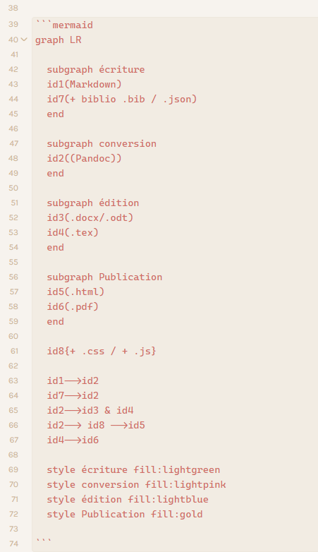
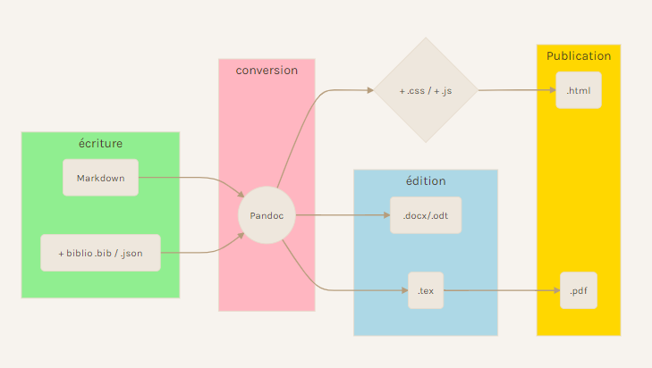

## 1. Qu'est-ce que le [[markdown]] ?

### une syntaxe très représentée dans l'écriture web

Markdown (avec une majuscule) est une syntaxe mise au point par John Gruber en 2004 et qui devait simplifier l'écriture web. Les développeurs l'utilisaient (et l'utilisent toujours) pour rédiger plus simplement du HTML en ayant recours à une syntaxe simplifiée par rapport au balisage du HTML. 
L'usage du Markdown a fini par se répandre au delà du cercle des développeurs web, et des auteurs, notamment académiques, s'en sont emparés pour écrire des textes convertibles non seulement en HTML mais également dans d'autres formats comme LaTeX ou PDF. 
Markdown permet d'utiliser des éditeurs de texte simple compatibles avec un nombre grandissant d'applications (Obsidian en fait partie). L'écriture en texte simple (plain text) a pour intérêt de pouvoir mêler du texte et du code et de se passer de formats propriétaires (par exemple word). 

### différentes saveurs de Markdown

John Gruber a fait en sorte de ne pas limiter l'usage de sa syntaxe, ce qui fait que beaucoup d'éditeurs se la sont appropriée pour monter leur propre éditeur Markdown. C'est pour cela que d'un outil à l'autre, on peut être confronté à des saveurs (flavors) différentes de Markdown. Par exemple, un lien ne se formate par exactement de la même manière sur Slackmarkdown et sur Atom. 

Le principe de Gruber était d'inciter l'utilisateur à avoir recours directement au HTML chaque fois que rien n'était prévu dans Markdown pour éditer tel ou tel élément du texte (par exemple les notes de bas de page ou les tableaux): 

>For any markup that is not covered by Markdown’s syntax, you simply use HTML itself. There’s no need to preface it or delimit it to indicate that you’re switching from Markdown to HTML; you just use the tags.

([John Gruber](https://daringfireball.net/projects/markdown/syntax#html))

Pourtant, comme le rappelle Knut Malvaer, les éditeurs ont eu tendance à adapter Markdown et à augmenter ses capacités pour satisfaire leurs usagers parmi lesquels la proportion des auteurs non développeurs n'a cessé de croître, ce qui fait que la syntaxe Markdown n'est plus entièrement unifiée d'un éditeur à l'autre[[@MelvaerThoughtsMarkdown2022]]. 
[Commonmark](https://commonmark.org/) a été créé pour fixer une syntaxe en markdown minimale, transposable d'un outil à l'autre, ce qui aide dans une certaine mesure les développeurs à gérer cette hétérogénéité dans le formatage en markdown (car le markdown est devenu depuis 2004 la *lingua franca* de l'écriture web). Cela n'empêche toujours pas un éditeur d'ajouter les fonctionnalités qu'il souhaite à cette base que constitue Commonmark. Ainsi Rmarkdown continue d'avoir une syntaxe markdown un peu différente de github sur des fonctions spécifiques même si à la base ces deux services utilisent Commonmark.

## 2. niveaux de titre, listes à puces

### niveaux de titre

Le titre de la note est distinct du nom du fichier. Le nom du fichier est la première chose qui est créée de la note. 
Dans une note, entourer un mot avec un double crochet (\[\[mot\]\]) crée automatiquement une note comportant mot.md dans le coffre. 
Une option des paramètres intitulée "toujours mettre à jour les liens internes" permet de maintenir le lien entre la note 1 comportant \\\[mot\]\] et la note rebaptisée par exemple word.md

Si on configure un titre dans le pavé Yaml, celui-ci apparaîtra comme titre du document exporté (par exemple en PDF). Voir la partie concernant [[Mode d'emploi d'Obsidian#5 2 YAML|YAML]]

| MD | niveau de titre | HTML |
|:---:|:---:|:---:|
| \# titre 1 | titre de niveau 1 | \<h1\> |
| \#\# titre 2 | titre de niveau 2 | \<h2\> |
| \#\#\# titre 3 | titre de niveau 3 | \<h3\> |
| \#\#\#\# titre 4 | titre de niveau 4 | \<h4\> |

### liste à puces

le tiret ( - ) en début de phrase permet de faire une liste à puces : 

\- pommes  
\- poires  
\- bananes  

permet d'éditer

- pommes  
- poires  
- bananes  

Attention : la conversion de la note en markdown vers un autre format (ODT ou PDF notamment) peut mettre à mal les listes à puces si chaque élément qui les constitue n'est pas suivi de deux espaces en fin de ligne. 

Pour éviter d'obtenir :

\- pommes \- poires \- bananes

dans le texte convertir en open document ou en PDF, ajouter systématiquement deux espaces dans le texte en markdown après pommes, poires et bananes.

## 3. tableaux, indentation, épigraphes


### éditer un tableau

**Code :** 

\| colonne A \| colonne B \| colonne C \|
\|\:\-\-\-\:\|\:\-\-\-\|\-\-\-\:\|
\|centre\|aligné gauche \|aligné droite 

**résultat :**

| colonne A | colonne B | colonne C |
|:---:|:---|---:|
| centre | aligné gauche | aligné droite |


Pour fusionner des cellules, il est actuellement nécessaire de recourir au HTML, car le markdown ne gère que des cellules équivalentes en taille (voir [[Mode d'emploi d'Obsidian#utilisation du HTML#pour faire des tableaux avec des colonnes ou des lignes fusionnées]])

````
|             |          Grouping           ||
First Header  | Second Header | Third Header |
 ------------ | :-----------: | -----------: |
Content       |          *Long Cell*        ||
Content       |   **Cell**    |         Cell |
 section   |     More      |         Data |
And more      | With an escaped '\|'         ||  
[Prototype table]
````


i on dispose d'un tableau en format exel ou calc et qu'on veut le transposer en format markdown, on peut utiliser des ressources en ligne pour cela comme [*Table to Markdown*](https://tabletomarkdown.com/convert-spreadsheet-to-markdown/)

Le *pipe* (\|) qui sert à faire des tableaux peut aussi permettre de prendre en compte les espaces en début de phrase (pour une conversion en pdf avec Pandoc)

**code :** 


**résultat : **

| Crépuscule
|     La nature est en extase de crépuscule
| Et son ode, 
|                              mon sang, 
| Un océan brûlant s'enroule, recommençant ses vagues
|                  jusqu'à moi

|                         (Adonis, *Ismaël*)


## 4. caractères

| MD | niveau de titre | HTML |
|:---:|:---:|:---:|
| \* | *italiques* | \<i\> |
| \*\*| **gras** | \<b\> |
| \~\~ | ~~barré~~ | \<s\> |
| \` | `code` | \<code\> |
| \=\= | ==surlignage== | \<mark> |

Pour "échapper" un caractère qui fait partie de la syntaxe du markdown (\*,\#, \~ par exemple), il faut faire précéder le caractère en question d'un antislash (\\) 


## 5.  Liens, images, tags

### liens internes

Comme on l'a vu plus haut, pour faire un lien interne vers une note existante ou bien en créer une, il suffit de mettre entre double-crochets le mot ou l'expression qui correspond au nom de la note en question. 

Si l'on veut pointer vers une section de cette note, rajouter un dièze et sélectionner la partie de la note vers laquelle on veut pointer. 

Voici comment se formate par exemple un lien direct vers la partie de ce guide correspondant aux [[Mode d'emploi d'Obsidian#Les rétroliens|rétroliens]] :

Voici comment se formate par exemple un lien direct vers la partie de ce guide correspondant aux **\[\[Mode d'emploi d'Obsidian\#Les rétroliens\|rétroliens\]\]**

syntaxe du lien : 
\[\[nom de la note\#nom du header|texte du lien\]\]

Si on veut lier sur un bloc plutôt qu'un header, remplacer le \# par un \^ 

### notes de bas de page

\[\^\1\] permet de créer une note de bas de page portant le numéro 1. Exemple: 
première note de bas de page[^1]

[^1]: cette note de bas de page peut être placée n'importe où, elle apparaîtra forcément à la fin du document. Attention : dans la note de bas de page, ne pas utiliser les deux points (:) après les crochets.

### transclusion

Avec Obsidian, on la possibilité de faire un lien vers un document de la base de notes (une image, un PDF) de telle sorte qu'en mode lecture, si on passe la souris sur le lien, une prévisualisation du document s'affiche (pour y accéder, il suffit de cliquer) ou bien on peut aussi inclure le document dans la note, de telle sorte que celui-ci soit visible et déroulable. 
On peut le faire notamment pour un PDF : 

!\[\[document.pdf\]\]

pour afficher une version ancienne de ce guides en PDF à l'intérieur de la présente note : 

\!\[\[mode_emploi_obsidian.pdf\]\]


### liens externes

\[bibliothèque\]\(https://bibliotheques.univ-rennes1.fr \)

 [bibliothèque](https://bibliotheques.univ-rennes1.fr)

\!\[bibliothèque\](https://bibliotheques.univ-rennes1.fr/sites/bibliotheques.univ-rennes1.fr/files/styles/max_2600x2600/public/medias/images/Sante-web.jpg?itok=S0Ax1GSa)

ou 

\!\[bibliothèque\]\(images/BUVS.jpg\)

 

possibilité, comme pour un PDF de faire un glisser déposer du document dans la note. 

### les tags

Avec les rétroliens, les marqueurs sont une grande richesse de ces outils de gestion de notes. 
Comme ailleurs, le tag peut apparaître dans le texte précédé (sans espace) d'un dièze ou hashtag (\#) ou bien dans l'entête YAML après (ce qui a l'avantage de ne pas les laisser apparaître dans le document quand celui-ci est exporté dans un format de publication comme wiki, html, pdf, etc. ) : 

````yaml
tags: [tag1, tag2, tag3/tag4]
````

ici le tag4 est un tag fils de tag3. On peut donc prévoir dans Obsidian, une arborescence de tags.

Attention si on laisse un espace entre le dièze et le mot-clé qui constitue le tag, Obsidian va l'interpréter comme un titre 1 selon la syntaxe Markdown.

Il ne peut y avoir d'espaces dans les tags : 

````yaml
tags: [sciences politiques]
````
va générer deux tags : \#sciences et \#politiques
il faut veiller à prévoir des liaisons entre les mots constitutifs d'un tag, par exemple l'underscore : 

````yaml
tags: [sciences_politiques]
````

On peut mener une recherche sur les tags uniquement.
Dans les plugins standards, il est intéressant d'autoriser l'apparition du volet des tags (tag pane) à droite. Les tags y apparaissent par défaut rangés par ordre de fréquence d'apparition dans les notes)

Si on charge et active le plugin communautaire [Tag Wrangler](https://github.com/pjeby/tag-wrangler) et que le plugin standard "volet des tags" est également activé, il est possible de renommer des tags : toutes les notes où ce tag apparaît arboreront le tag avec son nouveau nom. 
Ce plugin permet aussi d'affiner la recheche en incluant ou excluant certains tags. 

## 6.  Autres langages (html, LaTeX)

Le markdown est une syntaxe très simple à apprendre et très versatile. Toutefois, il n'a pas été conçu comme une syntaxe universelle permettant d'éditer intégralement un ouvrage ou un diaporama. Comme l'indiquait John Gruber (voir plus haut [[Mode d'emploi d'Obsidian#différentes saveurs de Markdown]] pour obtenir la présentation souhaitée pour certains contenus, on aura besoin parfois de faire appel à d'autres langages dans son document, notamment le HTML ou LaTeX (si vous avez téléchargé un éditeur LaTeX vous pourrez constater que le LaTeX et le Markdown font plutôt bon ménage dans Obsidian)

### utilisation du LaTeX
Obsidian n'est pas un éditeur en LaTeX et ne se substitue pas à ce genre d'éditeur. 
Toutefois, il est possible de rédiger des formules mathématiques et chimiques directement dans Obsidian, comme on le ferait dans un document en LaTeX, grâce à la bibliothèque Mathjax qui a été intégrée aux dernières versions d'Obsidian. 

#### formules mathématiques

Le package mathjax a été chargé dans le code d'Obsidian [en septembre 2021](https://forum.obsidian.md/t/support-for-additional-latex-packages/878/7). Ce package permet d'utiliser les fonctionnalités de la bibliothèque mathjax sur un document en markdown. Parmi ces fonctionnalités, on trouve également la [syntaxe de base du mhchem](https://mhchem.github.io/MathJax-mhchem/) pour les formules chimiques.  
Une version étendue de mathjax est disponible [sous la forme d'un plugin](https://github.com/xldenis/obsidian-latex)

Grâce à cela on peut encapsuler des équations lisibles en LaTeX en les encadrant par le signe **\$**

$\pi$ s'écrit ainsi \$\pi\$

\$67\\sqrt{\\prod_{67}^{4}}\\Rightarrow \\mathrm{C}_{56}^{'}\$

donne :

$67\sqrt{\prod_{67}^{4}}\Rightarrow \mathrm{C}_{56}^{'}$

Cette formule ne correspond à rien, elle a été créée à partir d'un [éditeur de formules en LaTeX](https://latexeditor.lagrida.com/) disponible en ligne. 

Pour centrer l'équation (au lieu de l'insérer dans le texte, redoubler le $)

\$\$67\\sqrt{\\prod_{67}^{4}}\\Rightarrow \\mathrm{C}_{56}^{'}\$\$

donne : 

$$67\sqrt{\prod_{67}^{4}}\Rightarrow \mathrm{C}_{56}^{'}$$

Par rapport à la taille de défaut, les caractères présents dans ces formules issues de MathJax ont une taille augmentée. Cela a été réglé en ajoutant une instruction concernant tous les caractères édités avec MathJax dans le CSS de base ( pour les questions relatives au CSS, [[Mode d'emploi d'Obsidian#9 changer le CSS|voir plus bas]])
Voici ce qui a été ajouté en l'occurrence :

``````css
.MJX-TEX {
   font-size: 180%;
}

``````

[source](https://www.reddit.com/r/ObsidianMD/comments/l4qdga/comprehensive_overview_latex_mathjax_equation_in/?utm_source=share&utm_medium=web2x&context=3)

Utiliser LaTeX pour réaliser les exposants : 

- le mebioctet ou Mi parfois écrit Mio correspond à \$2\^\{20\}\$ octets 
- le gibioctets ou Gi parfois écrit Gio correspond à   \$2\^\{30\}\$ octets

donne :

- le mebioctet ou Mi parfois écrit Mio correspond à $2^{20}$ octets 
- le gibioctets ou Gi parfois écrit Gio correspond à   $2^{30}$ octets

#### formules chimiques

La formule de l'eau peut-être notée de la manière suivante : \$\ce\{H2O}\$ cela donne $\ce{H2O}$

Etat d'oxidation :  \$\ce{Fe^{II}Fe^{III}2O4}\$ donne : $\ce{Fe^{II}Fe^{III}2O4}$

([source](https://mhchem.github.io/MathJax-mhchem/))

#### Mise en page

Le markdown ne donne pas vraiment de solution lorsqu'on veut mettre deux images en regard (on ne peut pas encapsuler ces images dans un tableau). On est obligé pour réaliser cela de recourir au package graphicx de LaTeX. 
````latex

\begin{figure}
\begin{minipage}[t]{.4\linewidth}
    \begin{center}
       \includegraphics[width=6cm]{drake1.png}
       \caption{pyramide ideale}
    \end{center}
\end{minipage}
\hfill
\begin{minipage}[t]{.4\linewidth}
    \begin{center}
       \includegraphics[width=6cm]{drake2.png}
       \caption{pyramide effective}
    \end{center}
\end{minipage}
\end{figure}
````

### utilisation du HTML

Lorsqu'on copie-colle du html dans Obsdian, généralement ce html est copié avec des balises supplémentaires (\`\`). 
Pour copier-coller du HTML qui fonctionne correctement, préférer Ctrl+shift+V à Ctrl+V

### faire un épigraphe

Cela fonctionne en vue d'une conversion avec [[Mode d'emploi d'Obsidian#10 2 Directement avec Pandoc|pandoc]]

### créer un épigraphe

``````html
<div class='epigraph'>

*"All human things are subject to decay, and when fate summons, Monarchs
must obey."* --- John Dryden.

</div>
``````

#### pour faire des tableaux avec des colonnes ou des lignes fusionnées

**code**

````html
<table>
    <thead>
        <tr>
            <th>entête 1</th>
            <th>entête 2</th>
            <th>entête 3</th>
        </tr>
    </thead>
    <tbody>
        <tr>
            <td rowspan=4>valeur 1 (4 cellules verticales)</td>
            <td rowspan=2>valeur 2 (2 cellules verticales)</td>
            <td>valeur 4</td>
        </tr>
        <tr>
            <td>valeur 5</td>
        </tr>
        <tr>
            <td rowspan=2>valeur 3 (2 cellules verticales)</td>
            <td>valeur 6</td>
        </tr>
        <tr>
            <td>valeur 7</td>
        </tr>
    </tbody>
</table>

````

**Résultat**

<table>
    <thead>
        <tr>
            <th>entête 1</th>
            <th>entête 2</th>
            <th>entête 3</th>
        </tr>
    </thead>
    <tbody>
        <tr>
            <td rowspan=4>valeur 1 (4 cellules verticales)</td>
            <td rowspan=2>valeur 2 (2 cellules verticales)</td>
            <td>valeur 4</td>
        </tr>
        <tr>
            <td>valeur 5</td>
        </tr>
        <tr>
            <td rowspan=2>valeur 3 (2 cellules verticales)</td>
            <td>valeur 6</td>
        </tr>
        <tr>
            <td>valeur 7</td>
        </tr>
    </tbody>
</table>

Si on veut fusionner des cellules sur plusieurs colonnes, plutôt que sur plusieurs lignes, utiliser l'attribut *collspan* comme dans [cet exemple](https://www.w3schools.com/TAGS/att_td_colspan.asp)


<table>  
  <tr>  
    <th>Mois</th>  
    <th>Economie</th>  
  </tr>  
  <tr>  
    <td>Janvier</td>  
    <td>100€</td>  
  </tr>  
  <tr>  
    <td>Février</td>  
    <td>80€</td>  
  </tr>  
  <tr>  
    <td colspan="2">Somme: 180€</td>  
  </tr>  
</table>

Pour changer la couleur du texte, on peut recourir à du html, par exemple : 

````html
<font color="#cc241d">Texte en couleur</font>
````

donne : 

<font color="#cc241d"> Texte en couleur</font>

faire un [[saut de page]] nécessité l'inclusion de html

````html
<div style="page-break-after: always visibility: hidden">
\pagebreak
</div>
````

Le contenu qui suit se trouvera sur la page suivante.

<div style="page-break-after: always visibility: hidden">
\pagebreak
</div>


<span>

</span>

#### commenter un document

Supposons que l'on souhaite laisser des commentaires pour orienter le sens de l'édition d'une note, sans que ce commentaire apparaisse dans la version finale. Bien qu'Obsidian ne soit pas d'abord un éditeur de texte, on peut utiliser la fonction *comment block code* présente dans les principaux éditeurs de texte pour commenter du code mais aussi du texte en markdown

voici le texte à commenter \<\!\-\- commentaire de ce texte \-\-\>

### inclure des graphiques dans les notes

la bibliothèque en javascript mermaid.js permet d'inclure des graphiques (camemberts, diagrammes, flow charts, etc) dans une note. 
Il existe de nombreux tutos consacrés à cet outil qu'il n'est pas nécessaire d'installer dans Obsidian. Voir ce [guide](https://www.mishacreatrix.com/knowledge-management-flow-diagram-in-obsidian) entre autres. Pour s'essayer à la construction de ces graphiques, on peut utiliser [le site https://mermaid.live](https://mermaid.live)

exemple : [worklfow éditorial réalisé par UjuBib](https://twitter.com/UjuBib/status/1480519081820397572) : 



## 7. importer des notes écrites dans un autre format que Markdown

Supposons que j'aie déjà accumulé avant de connaître Obsidian des notes en texte simple (format TXT) ou en format Word (traitement de texte LibreOffice ou Word), comment faire pour les convertir en masse depuis le répertoire où elles se trouvent. Les notes à importer dans Obsidian doivent être en markdown. Comment réaliser cette conversion de mes notes en TXT vers ce format markdown ?

Il existe plusieurs manières de convertir  un ensemble de documents documents d'un format à l'autre. On peut utiliser un terminal de commandes (bash) pour ce faire. Par exemple sous Linux, si on ouvre un terminal dans le répertoire où se trouvent les notes à convertir, on entrera la commande suivante : 

Sur Windows, on peut utiliser le terminal de commande Powershell pour réaliser cette conversion directement en bash, ou bien en combinant cette commande avec le convertisseur [Pandoc](https://pandoc.org/installing.html. La seconde option est détaillée ci-dessous:

````bash
for /r %i in (*.txt) do multimarkdown -b %i
````

Pour MacOs, on peut se contenter de [changer les extensions des fichiers](https://osxdaily.com/2016/11/08/batch-change-file-extensions-mac/)

Il est toujours pratique d'avoir installé sur sa machine lorsqu'on utilise des documents en markdown qui peuvent être convertis dans une multitude de formats différents. Nous supposons que Pandoc est installé. Ouvrir un terminal Powershell dans le répertoire où se trouvent les notes et entrer la commande suivante : 

````powershell
Get-ChildItem . -Filter *.txt |
 Foreach-Object {
     pandoc $_ -o $_.Name.Replace('.txt', '.md')
 }

````
Puis exporter toutes les notes en markdown dans le répertoire des notes sous Obsidian. 
Les noms de fichiers deviendront les titres des notes (voir [cette vidéo](https://www.youtube.com/embed/lGe9Hm-3YUk) sur Youtube. 

Reste à faire les liens entre les différentes notes ce qui est un travail bien plus long que la simple conversion que nous venons de faire. 