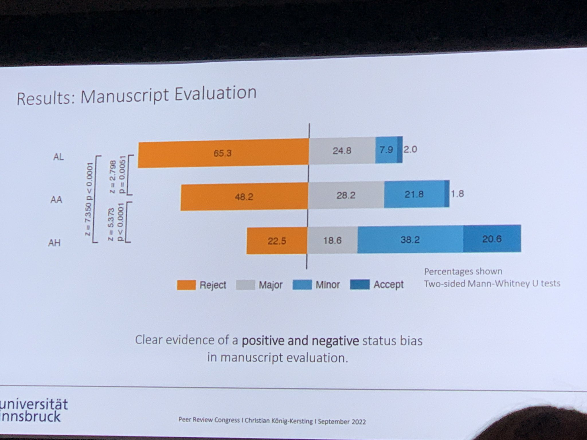

La révision par les pairs fait partie des méthodes scientifiques qui permettent de réduire les erreurs présents dans une communication scientifique notamment en soustrayant l'écrit scientifique à la subjectivité de celui, celle ou ceux qui l'ont écrit. 

>Si les scientifiques parviennent à se défaire de certains préjugés dans leur domaine de compétence, ce n’est donc pas en se purifiant l’esprit par une cure de désintéressement. C’est plutôt en adoptant une méthode critique qui permet de résoudre les problèmes grâce à de multiples conjectures et tentatives de réfutation, au sein d’un environnement institutionnel qui favorise ce que Karl Popper appelait « la coopération amicalement hostile des citoyens de la communauté du savoir »

(Etienne Klein [[@KleinFautilcroirescience2013]] et [[@Kleingoutvrai2020]], p43)

La coopération amicalement hostile de la communauté du savoir s'exprime d'abord sous la forme d'une révision par les pairs (peer-reviewing)

# temps de révision par les pairs

traditionnellement il faut plusieurs semaines à quelques mois pour faire réviser un article. 
la pandémie de COVID a suscité un rythme de révision inédit sur les articles soumis et qui avaient pour objet le COVID-19. 

Ces articles ont été revus en moyenne en 6 jours seulement d'après un article paru dans Nature en juin 2020 ([[@PalayewPandemicpublishingposes2020]])

Cette [[communication scientifique]] de crise nécessite de la part des éditeurs la mise en place de mesures particulières : 

- prévoir un circuit de publication d'urgence en cas d'urgence de santé (avec des listes de vérification spécifiques)
- confier les révisions à des chercheurs qui sont déjà entraînés et expérimentés
- encourager la libre-diffusion des savoirs sur les sujets connexes (plus les textes seront accessibles et plus facilement les pairs auront des éléments de comparaison ou une connaissance contextuelle du sujet)
- constituer des bases spécifiques sur un sujet (par exemple LitCov pour le coronavirus) qui feront l'objet de révisions par des chercheurs tiers
- financer davantage de revues de littérature sur les articles parus sur le sujet pour évaluer les résultats

# Biais présents chez les reviewers

De récents travaux de recherche montrent que des articles mettant en cause les failles de certaines institutions financières, en dépit de leur qualité intrinsèque, auront des difficultés à être publiées dans la mesure où les reviewers sont souvent rattachés à ces institutiions par des [[conflit  d'intérêt|conflits d'intérêt]]. 
(cf. par exemple [[@BeckConflictsinterestmay2021]])

# Opportunités et limites de la révision par les pairs ouverte

## définition

L'Open Peer Reviewing est une pratique mise en avant par les instances scientifiques qui souhaitent avancer sur le chemin de la [[Science Ouverte]]. 
Dans ce scénario, les reviewers échangent et discutent avec les auteurs en toute transparence. 

caractéristiques de l'open review : 

- **identités ouvertes** : (qui reviewe qui, qui est reviewé par qui : les uns et les autres savent le rôle qu'ils tiennent)
- **rapports ouverts** : les travaux des reviewers sont publiés en même temps que la publication. cela rend plus visible et valorise le travail bénévole de révision par les pairs qui prend tant de temps aux chercheurs. les chercheurs sont aussi encouragés à rendre un meilleur travail de révision par les pairs car ils pourront être jugés sur la qualité de cet travail (voir [Foster Open Science](https://www.fosteropenscience.eu/learning/open-peer-review/#/id/5a17e150c2af651d1e3b1bce.
- **participation ouverte**

## implémentation

La révision par les pairs est implémentée de différentes façons chez un certain nombre d'éditeurs : 

## intérêts

Les intérêts poursuivis sont les suivants : 
- **transparence**
 réduction des biais liés à des conflits d'intérêt. 
travail de reviewing accessible à tous
 
- **responsabilité des acteurs et qualité du travail**
  les travaux des reviewers sont publiés en même temps que la publication. cela rend plus visible et valorise le travail bénévole de révision par les pairs qui prend tant de temps aux chercheurs. les chercheurs sont aussi encouragés à rendre un meilleur travail de révision par les pairs car ils pourront être jugés sur la qualité de cet travail (voir [Foster Open Science](https://www.fosteropenscience.eu/learning/open-peer-review/#/id/5a17e150c2af651d1e3b1bce
- **ouverture et d'inclusivité**
participation d'un public plus vaste (voir selon quelles modalités ?)

## limites

Comme l'indique Olivier Le Deuff, un reviewer moins expérimenté que l'auteur du papier soumis peut rencontrer un problème de légitimité dans un processus ouvert. Olivier Le Deuff propose de n'ouvrir le peer-reviewing qu'après que l'article ait reçu une première validation ([source](https://twitter.com/neuromancien/status/1489510047596138496))

Propos corroboré par une étude déposée le 16 août sur le serveur de preprints SSRN
L'étude montre un fort biais de rejet ou acceptation d'un même article signé par deux chercheurs selon le nom de l'auteur de la paire qui est dévoilé : auteur très renommé : fort taux d'acceptation / auteur débutant : faible taux d'acceptation[[@huberNobelNoviceAuthor2022]]

