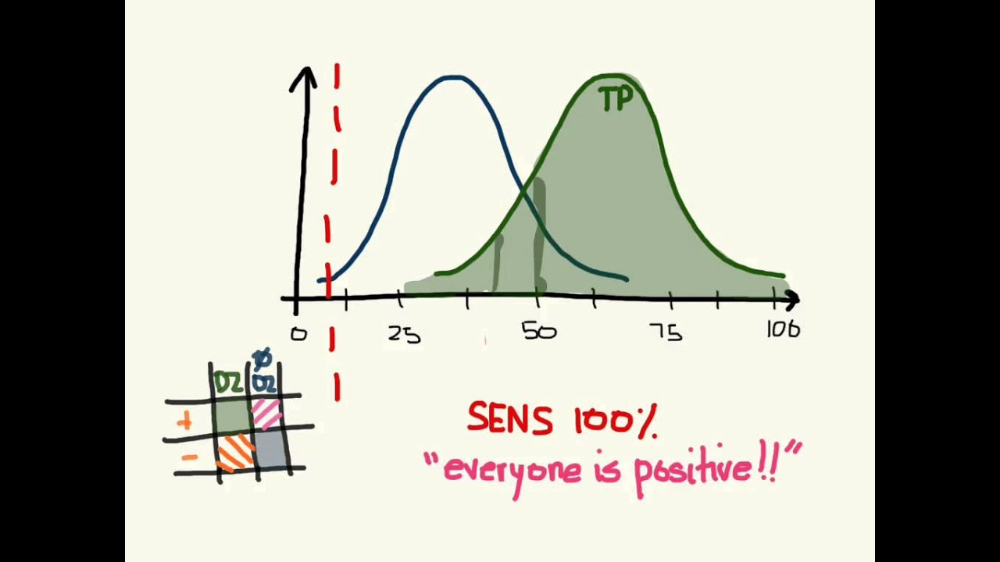
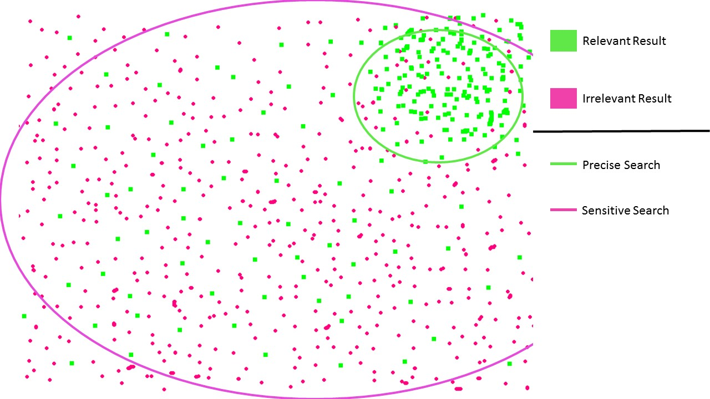

# Dans le champ médical

sensibilité : proportion de positifs correctement identifiés sur l'ensemble de la population présentant la condition

spécificité : proportion des négatifs correctement identifiés sur l'ensemble de la population ne présentant pas la condition.

Faire croître la sensibilité fait décroître la spécificité.

un test diagnostic plus sensible que spécifique permettra de repérer tous les cas de personnes malades, mais aussi un grand nombre de [[faux positifs]] (personnes saines)

Un test diagnostic plus spécifique que sensible permettra de ne repérer que des personnes vraiment malades, mais en revanche ne repèrera pas toutes les personnes malades dans un [[échantillon vs population|échantillon]] ([[faux négatifs]])

# dans le champ de la recherche d'information

Dans cette dualité, quand il est question de [[stratégies de recherche]], on associe précision et spécificité d'une part, sensibilité et caractère compréhensif ou exhaustif de la recherche d'autre part. 

L'idée est qu'un outil de recherche extensif ne permettra pas d'obtenir une grande sensibilité (les résultats très pertinents sont tous présents mais pour la plupart noyés dans la grande masse des résultats moins ou non pertinents). C'est le cas par exemple de [[Google Scholar]]
Inversement, un outil de recherche spécialisé comme [[Pubmed]] permettra d'obtenir une sensibilité des résultats (les résultats très pertinents seront bien identifiables) mais il en manquera certains par manque d'exhaustivité de la base. 

La revue de littérature consiste à manier tour à tour et en complémentarité des outils qui permettent une grande sensibilité mais une spécificité des résultats médiocre et des outils qui sont spécifiques mais pas suffisamment compréhensifs. 

Le schéma ci-dessous illustre assez bien le rapport entre sensibilité et spécificité dans le domaine de la recherche d'informations : 

La stratégie de recherche doit tenir compte de cette tension : 

## Mener une recherche *précise* (ou spécifique):

outil idéal : Pubmed

-   avantage: permet de réunir une partie de la littérature pertinente
    
-   avantage: apporte peu de résultats non pertinents, fait gagner du temps en lecture et sélection de l'information
    
-   inconvénient: risque important de passer à côté d'une partie de la littérature qui serait pertinente
    

## Mener une recherche *sensible* (ou exhaustive): 

outil idéal : Google Scholar

-  avantage: permet d'accéder à la plus grande part de la littérature
- avantage : le risque de passer à côté d'une partie de la littérature qui serait pertinente est faible
-  inconvénient : apporte beaucoup de résultats non pertinents, demande beaucoup de temps en lecture et sélection

Source : https://guides.library.utoronto.ca/c.php?g=577919&p=4304403

## Débat sur l'utilité de Google Scholar pour faire une revue de littérature. 

[[Google Scholar]] se positionne au départ non comme une base de données scientifique (disposant de son propre set de références scientifiques comme Medline pour Pubmed), mais comme un moteur de recherche scientifique. 
Dans le cas de Google Scholar et contrairement à Pubmed, la réalisation de l'[[index]] est entièrement prise en charge un [[algorithme]], tandis que dans le cas de Pubmed, la constitution de l'index des références est supervisée par des humains.

Entre 2008 et 2013, en partant de revues de littérature sur des sujets cliniques constituées avec des bases reconnues pour leur utilité dans la réalisation de revues de littérature dans ce domaine (Cochrane, [[Web of Science]], Embase), plusieurs études ont montré que Google Scholar avait une converture égale ou très proche à 100% ([[@Gehannocoveragegooglescholar2013]]) : toutes les études citées dans ces revues pouvaient être trouvées en interrogeant Google Scholar. 

Pour autant, les chercheurs (en particulier Boeket et Vach [[@BoekerGoogleScholarreplacement2013]]) ont montré que le fait d'interroger Google Scholar avec des requêtes reflétant correctement et précisément une problématique clinique (un peu à la manière dont on le fait avec le langage MeSH) ne permettait pas de retrouver ces mêmes études. 

Retrouver une étude dont on connaît la pertinence dans un index comme celui de Google Scholar et découvrir des études pertinentes à partir d'une problématique précise sont deux choses entièrement différentes. 

Dans le deuxième cas, Google Scholar manque de certaines caractéristiques qui dans d'autres outils (WOS, Embase, Pubmed) permettent de mener des revues de littérature efficaces, compréhensives et transparentes. 
Ces lacunes peuvent être résumées de la manière suivante : 

- manque de stabilité des résultats. L'algorithme de Google Scholar et le fait que le moteur de recherche ne dispose pas d'une base de références distinctes des informations que lui envoient les éditeurs et les sites crawlés ne permet pas de reproduire facilement les résultats.
- absence d'un historique permettant de perfectionner une requête
- fonctions d'export très limitées ([[Zotero]] importe seulement page après page. Il faut utiliser des logiciels tiers pour extraire des corpus de référence de google scholar (comme [PublishOrPerish](https://harzing.com/resources/publish-or-perish)) et core ces extractions sont limitées à des paquets de 1000.
-  absence d'une documentation assez précise pour permettre aux chercheurs d'améliorer leurs stratégies de recherche dans l'index. Ces informations sont assez réduites, la doc est plutôt orientée vers les fournisseurs de données sur la manière dont ils peuvent mieux rendre leurs réservoirs de textes crawlables par les robots de Google Scholar.
- manque d'une interface permettant de mener des requêtes avec des filtres. Google Scholar manque par exemple d'une troncature explicite : quand on inscrit *child* dans la requête, le moteur de recherche va sélectionner des titres comportant également *children*, *childhood*, etc (*child* dans Google Sholar est équivalent à *child\** dans une requête de Pubmed). Si GS reconnaît les [[opérateurs booléens]] (AND, OR, NOT) ils sont moins facilement articulables entre eux que dans d'autres bases spécialisées. La syntaxe de ces requêtes ne peut pas être aussi complexe et précise dans GS que dans Pubmed par exemple. 

Ces liimitations de Google Scholar expliquent pourquoi il n'est pas à l'ordre du jour, en dépit d'une couverture presque totale des résultats obtenus avec des bases de données scientifiques, de ne conserver que Scholar dans l'exécution de ses travaux e revues de littérature. Google Scholar peut éventuellement compléter l'usage de ces bases, mais ne peut pas s'y substituer. Google Scholar est idéal pour mener une recherche sensible, mais pas pour mener une recherche spécifique.

