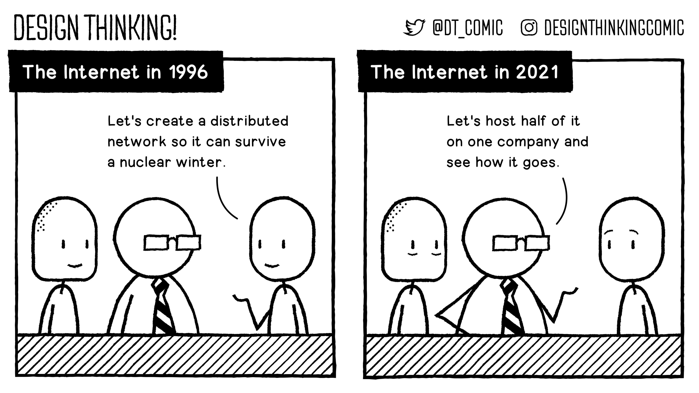

Google Amazon [[Facebook]] Apple Microsoft, les "serveurs sirènes" du Net à qui on est en train de confier 50% du trafic internet. 
VLOPs (Very Large Online Platforms), la terminologie retenue par l'Union Européenne ("[Digital Service Act](https://ec.europa.eu/info/strategy/priorities-2019-2024/europe-fit-digital-age/digital-services-act-ensuring-safe-and-accountable-online-environment_en)") a le mérite de ne pas se focaliser sur seulement quelques firmes (en laissant d'autres firmes démesurées dans l'ombre) et de ne pas avoir à gérer le rebranding de certaines (comme Facebook qui devient Meta le 29/10/2021)

GAFAM - [MAGMA](https://people.well.com/conf/inkwell.vue/topics/516/State-of-the-World-2022-page02.html#post30) (du fait du renommage de Facebook en Meta)

Du coup en cas de panne touchant ces acteurs, c'est toute une partie du web qui tombe en carafe (juin 2021, panne Fastly)

