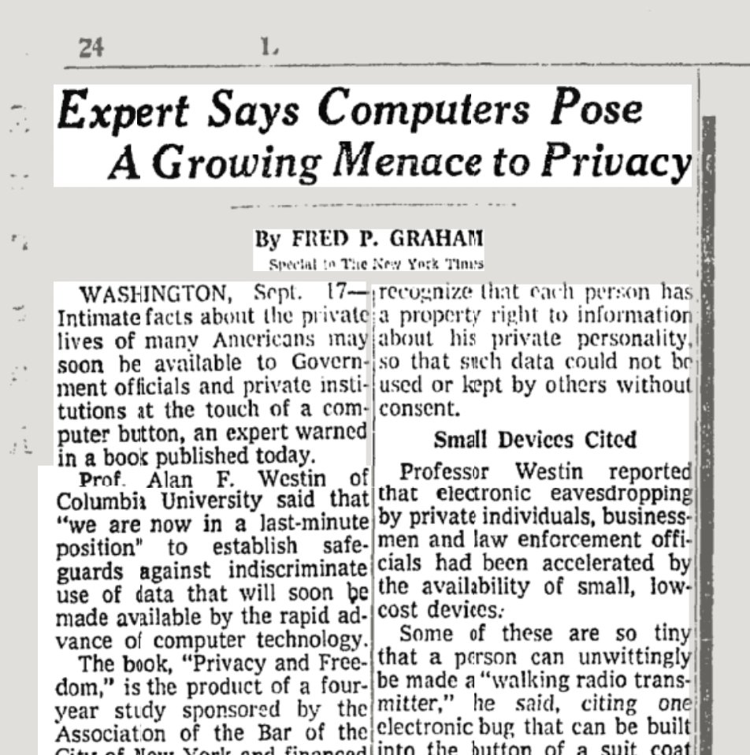

* the right to be left alone* (Warren & Brandeis, 1890 [[@WarrenRightPrivacy1890]])

Le respect de la vie privée est un droit garanti par la constitution, menacé aujourd'hui par la [[surveillance de masse électronique]] perpétrée par les grands opérateurs d'internet et les Etats dont les services de renseignement captent les données de navigation et de communication récupérés par les premiers à des fins de contrôle de la population et au prétexte de la lutte contre le [[terrorisme]]

# L'argument du rien à cacher (nothing to hide)

>Privacy isn't about having something to hide. Privacy is about protecting who we are as human beings: our fears, our relationships, and our vulnerabilities from manipulation and exploitation. We all deserve privacy.

(tweet du TorProject)

>Arguing that you don't care about the right to privacy because you have nothing to hide is no different than saying you don't care about free speech because you have nothing to say.

(Edward Snowden)

# Protéger sa vie privée dans l'usage de terminaux électroniques

(source: https://twitter.com/DPL_rewind/status/1571352564083269632)

## Le smartphone : le rêve de Staline (Richard M. Stallman)

Voir note [[vie privée et smartphone]]

# La vie privée : plus une question de contexte que de frontière

Avec la multiplication des [[réseaux sociaux]] numériques, qui pratiquent plusieurs types de dévoilement (entre le "clair-obscur" et le "phare"), les utilisateurs sont amenés à s'exposer de façon variable en fonction du contexte d'expression. 
La définition de ce qui ressort de la vie privée devient donc très liée à un contexte d'expression. 
Ce qui semble répréhensible à maints utilisateurs de ces réseaux sociaux est le fait de prendre un élément de la vie privée exprimé dans un contexte moins exposé pour le reproduire dans un contexte très exposé (réseau social à forte visibilité).
Ce lien entre vie privée et contexte numérique est mis en avance par Helen Nissenbaum (Cornell Tech)[[@nissenbaumPrivacyContextTechnology2010]]

A ce sujet, se référer à [[Dominique Cardon]], Culture Numérique (p185)