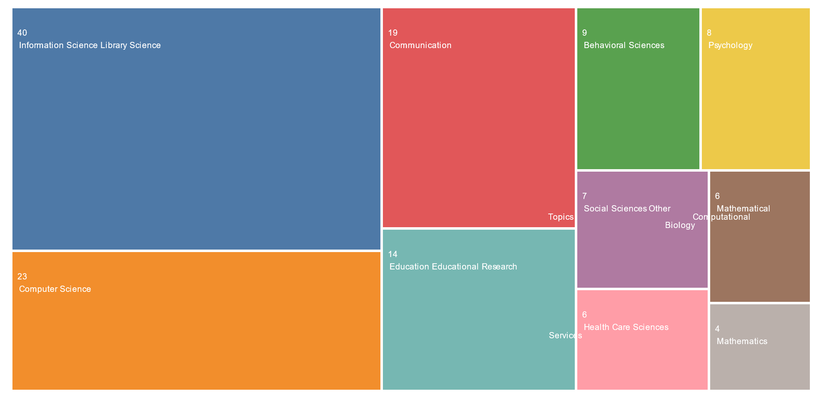

[[base de données]] [[bibliométrie|bibliométrique]] mise en place par l'ISI (institut créé par Eugène Garfield, le "père de la bibliométrie" en 1956)

# recherche par auteur

Combien de publications de Gérald Bronner ont été indexées dans le WOS ? 

Résultats : 24 publications

Quels sont les travaux de Gérald Bronner qui ont fait l'objet de citations ?

Combien de publications de Gérald Bronner ont-elles été citées d'après le web of science

24 références qui 

chercher par nom et initiale (BRONNER G.)

Recherche par auteur

recherche avec [[ORCID]]

Comment trouver toutes les publications recensées par un certain M. Brummer (chercheur dans le domaine de l'agroalimentaire)

[ORCID](https://orcid.org/0000-0001-5179-6414)

# recherche par structure

chercher par structure moléculaire
Faire une recherche sur la [digitaline](http://www.chemspider.com/Chemical-Structure.389987.html?rid=d130cb97-f3a3-48b3-84e8-147b4774caab)

exporter le fichier .mol, l'importer dans Web of science

cela permet d'obtenir des articles qui mentionnent spécifiquement des réactions à partir de ce composant. 

# recherche par sujet

pas de thésaurus, réduire la recherche aux topics (titre, résumé, nom d'auteur, descripteurs) : "Searches title, abstract, author keywords, and Keywords Plus"

Rechercher des articles sur les effets (ou non effets) de l'ivermectine sur le COVID-19 et les classer par nombre de citations.

Possibilité de classer en tête les études qui se démarquent le plus d'autres études (citation class: differ)

# Recherche avancée

TS="information literacy" AND TS=("disinformation" OR "misinformation") AND PY="2010-2020"

ramène 73 résultats. 
On peut analyser ces résultats par discipline (analyse results). Sélectionner la vue "tree map"

Sélectionner une discipline qui nous intéresse (par exemple Behavioral Sciences : 9 résultats)

Liste des critères : 

-   AD=Address
-   ALL=All Fields
-   AI=Author Identifiers
-   AU=Author
-   CF=Conference
-   CI=City
-   CU=Country/Region
-   DO=DOI
-   ED=Editor
-   FG=Grant Number
-   FO=Funding Agency
-   FT=Funding Text
-   GP=Group Author
-   IS=ISSN/ISBN
-   OG=Organization - Enhanced
-   OO=Organization
-   PMID=PubMed ID
-   PS=Province/State
-   PY=Year Published
-   SA=Street Address
-   SG=Suborganization
-   SO=Publication Name
-   SU=Research Area
-   TI=Title
-   TS=Topic
-   UT=Accession Number
-   WC=Web of Science Category
-   ZP=Zip/Postal Code

trouver tous les articles sur les amphibiens parus dans Nature

SO=Nature AND TS=Amphibian*

articles sur l'antimatière publiés entre 2000 et 2010 par l'institut Max Planck

**TS=antimatter AND (OG=(Max Planck Society) OR OG=(Fritz Haber Institute of the Max Planck Society))**

https://www.webofscience.com/wos/woscc/summary/300bbd45-c782-469b-834f-bd38f8badc1f-558ea62b/relevance/1

## organisation

enhanced organization (OG)
OG=(Universite de Rennes 1)
La requête (OG = (Universite de Rennes 1)) AND TI=crypto* permet d'obtenir 37 résultats
Avec une requête identique sur HAL Rennes 1, on obtient un nombre de résultats équivalents (38 résultats)

Autre exemple : 

OG= (Universite de Rennes 1) AND TI= (biodivers* AND conserv*)

WOS = 4 résultats
Hal Rennes 1 = 3 résultats

# catégorie de mots-clé
Web of Science indexe **deux types de mots-clés :**

-   **Author Keywords :** les mots-clés que l'auteur a fourni pour la publication de son article,
-   **Keywords Plus :** les mots et les phrases récoltés par Web of Science dans les titres des articles cités.

# accéder aux références d'un article

voir [[controverse sur l'ivermectine]]. 
Récupérer les références de l'[article](# Ivermectin: a multifaceted drug of Nobel prize-honoured distinction with indicated efficacy against a new global scourge, COVID-19), les intégrer à Zotero : est-ce que certaines correspondent à des études qui ont été rétractées ? 

un article a été rétracté

# catégorisation des références

Depuis mai 2022, WOS catégorise les citations d'un article donné en fonction de leur emplacement dans le texte et leur contexte linguistique pour déterminer si l'article cité constitue : 

- un élément permettant d'appréhender un champ de recherche
- un élément auquel on emprunte un protocole, une méthodologie, des concepts, des jeux de données
- un article dont les conclusions vont dans le sens de l'article qui le cite
- un article dont les conclusions ou les méthodes ou la taille de l'échantillon diffèrent
- un article qui est cité dans la discussion

aide de WOS:

> What is Citing Items Breakdown?

>This analysis helps describe why an article has been cited by using citation classifications assigned to newly published articles to aggregate mentions to this article based on the author’s intent.

> -   **Background**—previously published research that orients the current study within a scholarly area.

> -   **Basis**—references that report the data sets, methods, concepts and ideas that the author is using for her work directly or on which the author bases her work.

> -   **Support**–references which the current study reports to have similar results to. This may also refer to similarities in methodology or in some cases replication of results.

> -   **Differ**–references which the current study reports to have differing results to. This may also refer to differences in methodology or differences in sample sizes, affecting results.

> -   **Discuss**—references mentioned because the current study is going into a more detailed discussion.)

# facteur d'impact d'une revue

cliquer sur le nom d'une revue pour connaître son [[bibliométrie#facteurs d'impact|facteur d'impact]]

# Trouver des experts. 

on cherche à trouver des publications sur l'antimatière qui aient été signée par au moins un.e chercheur.se de l'institut Max Planck

# bibliographie

