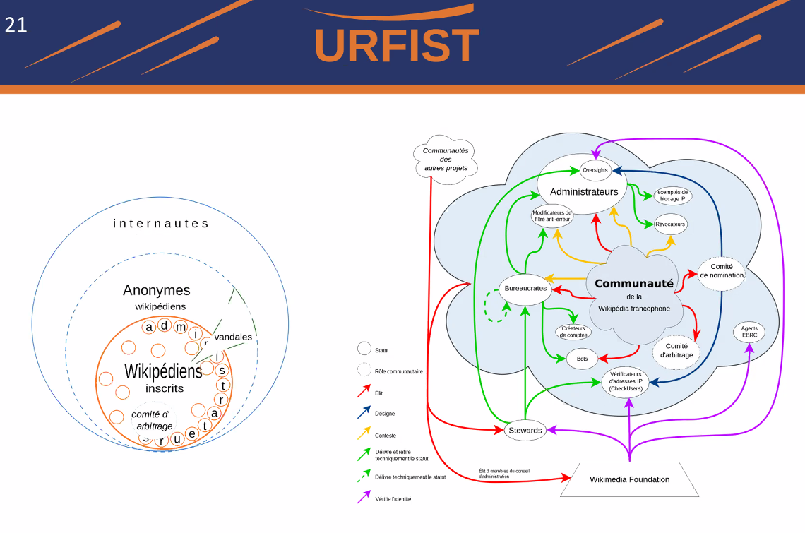
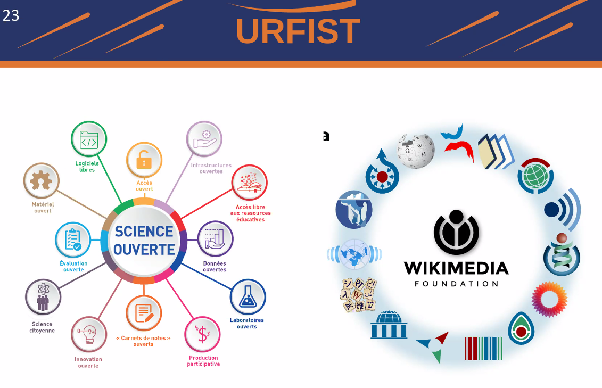
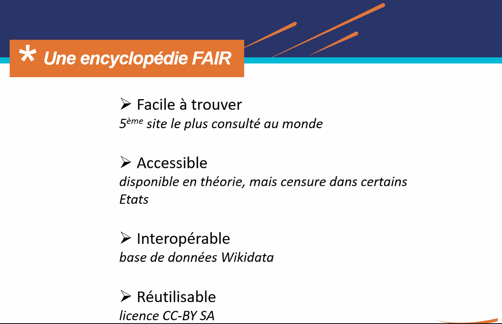

# introduction

que fait un wikipédien en résidence. Juliette Halimi plutôt novice comme wikipédienne (plutôt bibliothécaire). 
définition de Wikimédia : édite les projets wikimédia et qui va accepter de travailler au sein d'une institution de recherche afin de faciliter l'avancée des projets, pour développer les relations entre l'institution et la communauté wikimédia (WM) et d'encourager à la production de documents libres. 
en résidence jusqu'en février 2014. Egalement Pierre-Yves Beaudoin en résidence à l'Université de Bordeaux.

[Wikicafés](https://sygefor.reseau-urfist.fr/#/training/10035/11967?from=true) sur Sygefor : format bimensuel destiné à toute la France. Moments d'échanges et de rendez-vous informels pour discuter d'actu autour de Wikimédia et la recherche. 

# Enjeux d'ouverture communs : ouvrir la connaissance, un enjeu de société

## Wikipédia reflète les crises qui traversent la société

Wikipédia est un miroir des mutations de la société, résiste bien aux Fake News. Expérience sociale assez fascinante qui en théorie ne devrait pas fonctionner. WP mise sur le fait que les gens bienveillants sont plus nombreux que les gens malveillants. 
Cela ne va pas sans un mode de gouvernance qui permette de placer sa confiance de façon raisonnée. 
Enjeux d'inclusivité : reflète une vision masculine et occidentalo-centrée. 80% de contributeurs et 20% de contributrices. 
a des effets sur l'application des critères d'admissibilité. 
Moins de 20% des biographies sur WP concernent des femmes en raison de ces critères (pas assez de sources mobilisables)

## définitions préliminaires

mouvement des sciences ouvertes plus larges que les projets wikimediens.

### Science Ouverte

Date fondatrice de la SO : 2002, déclaration de Budapest (open access pour commencer)
Diffusion sans entraves des publications et des données de la recherche (PNSO 1, 2018) devient diffusion sans entraves des méthodes, des résultats et des produits de la recherche (PNSO 2, 2021) : comporte les protocoles et les logiciels en plus des publis et des données.
accès libre > FAIR (pas seulement accès mais réutilisation et interopérabilité)

### Wikipédia

Wikipédia : encyclopédie libre multilingue gérée par ses contributeurs, se base techniquement sur MediaWiki. 
Naissance de Wikipédia en anglais :  janvier 2001, 
Wikipédia en fr : mai 2021.
Rappel des principes fondateurs :
- encyclopédie
- neutralité (équilibre des PV)
- licence libre
- savoir-vivre
- pas d'autres règles fixes (évolutivité des règles et flexibilité du projet - permet la créativité des contributeurs)

### rédaction encyclopédique

sujet délimité
gestion des points de vue (équilibre des points de vue)
granularité : on peut avoir des articles très pointus à condition qu'il y ait des sources mobilisables sur ce sujet. 
17 000 contributeurs actifs (une contribution par mois)
350 langues disponibles (7% de l'ensemble linguistique mondial)

Wikipédia réponse à une crise des années 90  : émergence des articles à péages dans un monde d'abondance (cf. vidéo de Datagueule sur ce sujet)

[bibliothèque wikipédienne](https://wikipedialibrary.wmflabs.org/) : accord avec des éditeurs privés pour permettre à des éditeurs particulièrement actifs d'accéder à des sources manquantes.

parallèlisme entre la Science Ouverte et le processus de création développé par Wikimédia : 

Science Ouverte et [[sciences participative]] : inclure des personnes qui sont présentes dans la ruralité (là où se trouvent des wikipédiens également). Wikipédiens de village = militants forts de l'open access. 

### critères d'admissibilité

notoriété et pérennité. 
Notoriété : Le sujet doit avoir été traité dans des sources issues de la recherche ou de la presse nationale. 
Pérennité : contre le phénomène de mode. 

protection contre les conflits d'intérêt : si on veut écrire sur son entreprise il faut que certaines règles de transparence soient respectées.

### notion de fiabilité

pas de réponse facile. WP est la cible de campagnes de désinformation.
réf. sondage UK en 2014 : Wikipédia devançait les journalistes de la BBC en termes de confiance (64% vs 61%)

Enjeux politiques autour de WP : 
page de la révolution égyptienne de 2011 créée la veille de l'événement. 

WP croate : un groupe de contributeurs s'est organisé pour faire de l'entrisme dans WP et désinformer pour servir l'extrême droite dans leur pays.

semi-protection des sujets polémiques, guerres d'édition. WP interpellé directement. L'Obs a publié une tribune sur le traitement des personnes trans (mégenrages, et utilisation de dead names pour les bios). Arrestation de bénévoles en Biélorussie, en Arabie Saoudite et récemment en Russie. 

Questions d'historiographie relevées par des historiens notamment sur l'Holocauste (cf. [Grabowski et Klein](https://www.tandfonline.com/doi/full/10.1080/25785648.2023.2168939)

# Quels liens avec la SO

Prévalence des articles en libre-accès cités sur le COVID : permet à tout le monde de se rendre compte

régime de légitimité de WP : repose sur les sources et les "publications de qualité". Principe : le lecteur doit pouvoir se rendre compte par lui-même (promotion des sources ouvertes ou en tout cas trouvables en magasin ou en bibliothèque)

Wikipédia : outil de sciences citoyennes ? 

Sur WP on ne produite pas de connaissance mais on assemble des connaissances pré-existantes, cet assemblage ressemble à de la curation faite par des experts, mais aussi des profanes, des régulateurs et des robots. 

2022 : 67% des sources citées dans WP sont libres

Wikipédia : outil de médiation scientifique ?

- Atelier de contribution. 
- apport de contenus par des bibliothécaires (#1Lib1Ref)
- utilisation de contenus de plateformes pour des projets de recherche ou au contraire alimenter ces plateformes à partir de données de recherche.

Incitations à enrichir WM par les institutions de recherche (cf. discours de F. Vidal de 2018)
Loi de programmation de la recherche en 2021 : la relation science et société peut être médiatisée par WP. 
label SAPS, médaille du CNRS pour la médiation. 
Prise en compte de la médiation dans la carrière des chercheurs. 
Rédaction d'artices WP est cité comme éligible par le réglement financier de l'ANR de 2019. 

Chercheurs incités à ajouter le lien vers leur revue de littérature dans l'article correspondant. 
Différences entre le style encyclopédique et le style académique : le résultat doit être accessible à tous. 

Projets de recherche mobilisant Wikimedia

DETECT-Country Noir (romans noirs sur des thèmes ruraux)
TCVPyr 2017-2020 (thermalisme dans le massif pyrénéen : publication de données géo-référencées dans Wikidata)

[[ChatGPT]] est partiellement entraîné par la ressource textuelle de Wikipédia (entre 1 et 3 % du contenu sur lequel on a entraîné GPT-3)

[WIKIF](https://sms.univ-tlse2.fr/accueil-sms/la-recherche/operations-structurantes/wikif-wikipedia-et-les-femmes-scientifiques) : Wikipédia et les femmes scientifiques : comprendre dans quelle mesure WP peut mettre en place des outils de remédiation au biais de genre. 

Wikipédia utilisé comme corpus pour des études linguistiques. Wikification = ramifier les textes : intéressant comme objet d'étude linguistique. 

# enjeux d'inclusion communs entre la Science Ouverte et Wikipédia

licences libres et accès ouvert
CC:by-SA
pour les publis scientifiques, c'est souvent du CC:by. 

réduction des biais

biais parmi les contributeurs : enquête de Nicolas Julien sur la wikipédia francophone.

raison invoquées (par les femmes consultées) pour expliquer le biais de genre : 

- interface peu conviviale
- crainte du conflit
- manque de temps libre
- manque de confiance en soi pour une parole autoritative
- codes langagiers masculins (tutoiement, goût pour la technique)

Axes de motivation pour la SO et pour Wikipédia

Tous les individus peuvent produire des biens et des services en dehors de toute contrainte. Selon Marie-Noëlle [Doutreix](https://www.theses.fr/2018USPCA147) Cette motivation viendrait de la diversité des actions possibles sur ce commun informationnel. Pas de concurrence, les infos ne sont pas exclusives. Elle note que la gouvervenance de Wikipédia vise à une participation grandissante. 
Etude du labo Marsouin : la nature des premières contributions vont être déterminantes pour la suite du parcours dans Wikipédia

Utiliser Wikispecies pour les [[Plan de gestion des données|plans de gestion des données]] ?: 
ce sont les chercheurs qui y contribuent (pas de traces qu'il les utilisent dans leurs projets de recherche)

règles d'édition dans Wikispecies :

>A good Wikispecies article should contain classification from kingdom to the rank of the taxon addressed in the article, the proper name of the taxon, and the authority for that name (its author or authors). Additionally, a reference should be provided.

