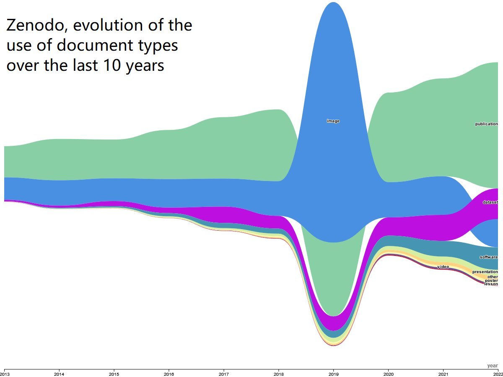

infrastructure européenne pour la mise en ligne de contenu scientifique : 
- cours, ateliers
- présentations
- données
- articles (post-prints ou pré-prints)

Aujourd'hui, Zenodo contient majoritairement des articles : 

