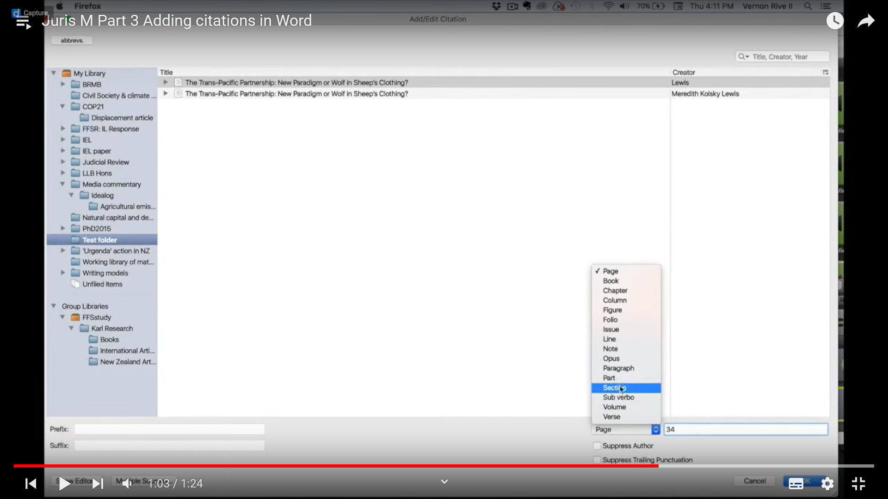

---
title: Zotero
subtitle:
id: 202210181914_Zotero
author: Damien Belvèze
date: 18-10-2022
link_citations: true
bibliography: mylibrary.bib
biblio_style: csl\ieee.csl
aliases: [zotero, Juris-M, jurism]
tags: [écriture_scientifique]
---

Gestionnaire de références bibliographiques multiplateforme libre et gratuit. 
Fonctionne avec des [[styles CSL]]

# installer Zotero sur un poste sous GNU/Linux

documentation (comportant les lignes de commande) sur le [forum Ubuntu](https://doc.ubuntu-fr.org/zotero)

# Zotero pour les juristes

## Utiliser Juris-M

[Juris-M](https://juris-m.github.io/), fork de Zotero (peut également servir en langues O : possibilité d'afficher le titre dans l'écriture originelle et en translittéré)
Gestion des abréviations : https://juris-m.readthedocs.io/en/latest/abbrevs.html
Cass ~plen > Cour de cassassion séance plénière

## Trouver un style biblio pour Zotero dans le domaine du droit

Guide de citation de Cujas (= guide Ref-lex) : 
https://biu-cujas.univ-paris1.fr/fr/node/1024

[Guide de citation de l'URFIST et de l'Ecole Doctorale de droit de Bordeaux](https://www.zotero.org/styles/universite-de-bordeaux-ecole-doctorale-de-droit)

# Rendre un site opérant avec Zotero

# ma première note

  

# Envoyer une copie du document dans une archive du web

Memento > Robustify 
alternative au snapshot (alléger sa KB)

# Modifier un style

[Diaporama](https://docs.google.com/presentation/d/1upzyvIhP6f3twI7IaBMjrZuIadiOIEm9-RDODf2FXLU/edit?usp=sharing) pour présenter la structure d'un style CSL
Possibilité de trouver des exercices pratiques dans le [billet d'Hypothèses](https://zotero.hypotheses.org/3746) sur les "petites modifications de style"

# Importer des références

## Depuis un document Word, ODT ou PDF

[RefExtractor](https://rintze.zelle.me/ref-extractor/): limites importantes de l'outil, à l'origine les réf à extraire doivent avoir été créées avec Zotero ou Mendeley. Pas de traitement des PDF

[Cermine](http://cermine.ceon.pl/cermine): traite les PDF

[Anystyle](https://anystyle.io/): copier-coller des bibliographies
Essai avec [[Floridi.pdf]]

