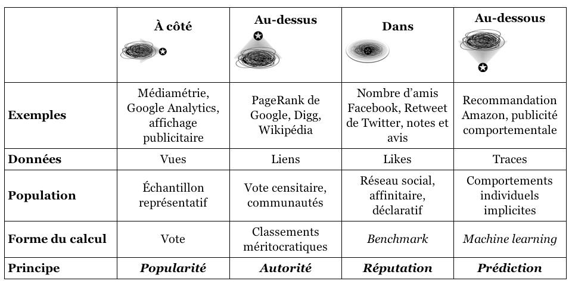

# expansion de l'algorithme à partir de la statistique

Les algorithmes n'ont pas attendu Google pour projeter leur puissance sur nos existences d'après Olivier Le Deuff[[@LeDeuffRipostedigitalePour2021]]

>Seulement, considérer que nos existences sont régies par des algorithmes et des calculs depuis l’arrivée des GAFA témoigne d’une méconnaissance historique flagrante. La mise en calcul s’est opérée progressivement et les travaux de Vauban sont déjà une première étape du développement des systèmes d’information. De même, plusieurs travaux vont tenter la mise en mathématique du monde comme ceux de Leibniz. Les États ont intégré progressivement les logiques comptables, ce qui a donné le nom d’ailleurs aux statistiques. Les travaux de Michel Foucault montrent ces logiques de contrôle des corps et des esprits. Antoinette Rouvroy évoque même une gouvermentalité algorithmique

# biais algorithmique

## Casilli : il n'y a pas d'algorithme, seulement la décision de quelqu'un

Un algorithme c'est la décision de quelqu'un d'autre, écrivait Antonio Casilli pour battre en brèche le mythe de la [[neutralité des algorithmes]][[@casilli2017a]]. 

> L’algorithme n’existe pas, parce qu’il n’est  que  le  prétexte  pour  un  ensemble  de  décisions  directes  des  acteurs  des  plateformes  ciblant  les communautés  des  usagers.  Dissimulés  derrière  un  apparat  de  bases  de  données  et  de  modèles mathématiques, on retrouve le choix humain effectué par les concepteurs des [[interface|interfaces]], la règle de fonctionnement  établie  par  les  ingénieurs,  la  norme  implémentée  par  les  services  de  sécurité,  et  le référentiel de tarifs adopté par les commerciaux de chaque plateforme.

## Zuboff : les algorithmes reproduisent les discriminations présentes dans la société

Les algorithmes ont toujours des biais et relèvent toujours de la décision d'autrui mais parfois cette décision est inconsciente et reflètent les préjugés de leurs concepteurs. 
Les algorithmes de Google reflètent en partie les opinions et sensibilités des ingénieurs (hommes en majorité blancs) qui les ont conçus. 
cf. Ouvrage de Soshanna Zuboff, algortihmes d'oppression

## algorithmes et bullshit scientifique

[[Bernard Stiegler]] faisait remarquer qu'on ne peut pas créer de la science à partir d'un algorithme dont on n'est plus capable d'expliquer le fonctionnement. 
Cart T. Bergstrom donne l'exemple d'une étude chinoise de 2016 qui prétendait à partir d'un algorithme permettre de discriminer des faciès de criminels des facies de gens ordinaires, donnant en cela un nouveau souffle à la physiognomie de Cesare Lombroso. 
Les sources de l'apprentissage de l'algorithme étaient de deux natures : 1. des photos prises par des gens sur les [[réseaux sociaux]] (pour les gens honnêtes) 2. des photos de prévenus ou gardés à vue prises en commissariat par des policiers. 
Dans les secondes, les personnes évidemment ne sourient pas, ce qui induit un biais en terme de rapprochement bouche-nez et de courbure des commissures des lèvres. Logiquement l'algorithme repérait comme potentiellement criminelle toute personne dont la bouche et le nez reflétaient cette disposition[[@BergstromCallingBullshitArt2020]] : 

![[ia_expression.jpg]]

> The algorithm finds that criminals have shorter distances between the inner corners of the eyes, smaller angles θ between the nose and the corners of the mouth, and higher curvature ρ to the upper lip. Why would this possibly be?

>There’s a glaringly obvious explanation for the nose-mouth angle and the lip curvature. As one smiles, the corners of the mouth spread out and the upper lip straightens. Try it yourself in the mirror.

>If you look at the original research paper, you can see six example images from the training set. The criminals are frowning or scowling. The noncriminals are faintly smiling. Now we have an alternative—and far more plausible—hypothesis for the authors’ findings. There are not important differences in facial structure between criminals and noncriminals. Rather, noncriminals are smiling in their professional headshots, whereas criminals are not smiling in their government ID photographs. It appears that the authors have confused innate facial features with labile facial expressions. If so, their claims about detecting criminality are bullshit. They have not invented a criminality detector; they have invented a smile detector.

# Les quatre familles d'algorithmes

Source : ([[Dominique Cardon, [[@cardonCultureNumerique2019]], p358]])