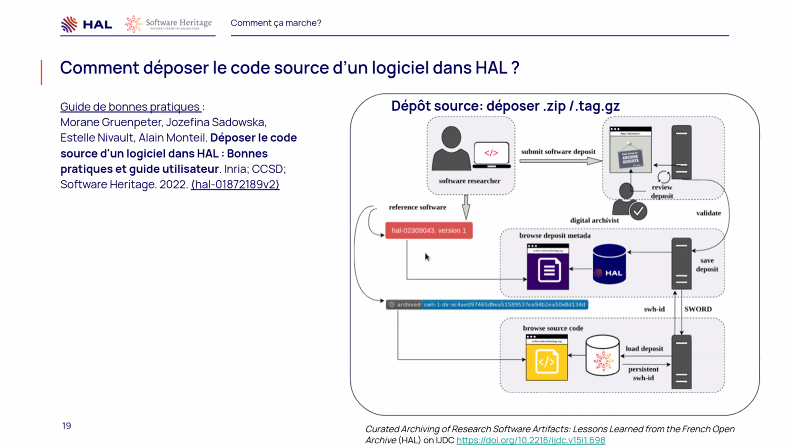

# pilier logiciel de la science ouverte (Roberto di Cosmo)

Pour présenter Software Heritage, Roberto di Cosmo passe des extraits d'une précendente [présentation](https://egc2019.sciencesconf.org/data/pages/Roberto_Di_Cosmo_EGC_2019.pdf)

Sometimes if you don't have the software, you don't have the data (Christine Borgman, Paris, 2018)

compléter l'accès ouvert aux publications avec l'accès ouvert aux données et l'accès oucert aux logiciels

liens pérennes entre ces trois composants

le logiciel peut être un moyen de recherche, un résultat de recherche ou objet de recherche.

> Program must be written for people to read and only incidentally for machines to execute (Harold Abelson, 1985)

exemple: code source d'appollo 11 et de Quake III

> Source code provides a view into the mind of the designer (Len Shustek, computer history museum)

dans le 2ème plan national pour la Science Ouverte, un Axe entier dédié au logiciel, cet axe contient en particulier :

- une charte national du logiciel de recherche

- des instructions sur comment reconnaître le développement de logiciels

- un catalogue national de logiciel de recherche

- l'archivage dans SoftWare Heritage

Remise de prix science ouverte du logiciel libre de la recherche.

Besoins émergents : 

**au niveau des chercheurs**:

- être crédité pour son logiciel

- archiver son logicel

- trouver du logiciel utile à son projet

- reproduire les résultats d'une étude avec le logiciel utilisé par les chercheurs

**au niveau labo**:

savoir ce qui est produit comme logiciel par le labo et l'inclure au rapport d'activité

** au niveau de l'organisme de recherche** : 

- connaître son patrimoine logiciel

- transférer les techno

- mesurer l'impact

4 questions globales :

- Où Archiver
- Comment référencer le logiciel (versionnage)
- Comment le décrire 
- Comment en créditer les concepteurs

Mauvaise pratique initiale : s'appuyer sur les [[forge logicielle|forges]] populaires. Google Code a fermé en 2015 ce qui a coupé l'accès à 1 millions de répertoires
2019 : Bitbucket ferme,  250 000 répertoires perdus
2021 : Gforge de l'INRIA est fermé

*Moralité : ne pas chercher une forge pour archiver mais plutôt une véritable archive*.

vocation de Software Heritage (à but non lucratif ) : référencer le code dans les entrepôts existants (catalogue), archiver les codes sources, permettre l'analyse du code source.

archivage : énorme aspirateur qui va chercher le code-source pour convertir ce code-source dans une unique structure. Il est possible que votre code ait été archivé sans que vous n'ayez rien fait pour cela.
Donner à chaque logiciel un identifiant [[Cryptographie|cryptographique]] pour valider l'intégrité des données (standard aujourd'hui)

Travail sur la description du code : codemeta

créditer : création d'un style bibliographique biblatex-software

Démonstration : présentation de l'archive, recherche d'un code dans l'archive. Identifiant crypto (hachage du code) = SWHID

extraction à travers HAL et Software Heritage de la production de logiciel provenant de tel ou tel labo. 

Aujourd'hui, la bonne pratique consiste à 
- vérifier que votre logiciel est archivé dans Software Herirage (SWH)
- citer avec le SWHID qui convient

Il est possible de répondre à ces besoins avec très peu d'efforts de la part des chercheurs en utilisant SWH

incitation à participer à rejoindre la modération dans HAL pour le code.

# pourquoi partager les codes source
identifier le logiciel au moyen d'un couple d'identifiants : le SWHID (objet logiciel + empreinte digitale d'une version spécifique) et le HALID (notice HAL + métadonnées du code)

rôles:
SWHID : spécifier, reproduire, archiver
HALID : créditer, indexer

Décrire avec le standard Codemeta (mise en oeuvre par le CCSD pour renseigner le logiciel dans HAL)

L'archivage se fait côté plateforme SWH et pas côté HAL

Enjeu de la description : rendre le code trouvable à partir de mots-clé ou à partir d'identifiants (datacite par exemple)

Une bonne qualité de données permet une bonne indexation.
SWH et HAL : cette combinaison permet une bonne description du code.

La licence du code est importante à préciser dans la description pour garantir une réutilisation possible du code.
la modération ne s'exerce pas sur la qualité du code, ni la qualité du logiciel.

Citer : codemeta.json, style biblatex. 
Le fait de pouvoir citer un logiciel va permettre de créer un lien avec des publis et des jeux de données (citations bidirectionnelles)

ce style est repris par l'éditeur ACM et par l'INRIA.

SFW permet d'ajouter à son CV HAL le logiciel qu'on a créé.
Exemple : https://hal.inria.fr/PHARO

# comment ça marche ?
2 possibilités :

**Méthode Source** (Dépôt de l'archive zip/tar.gz): on fait tout sur HAL on télécharge l'archive dans HAL et on ajoute les métadonnées

**Méthode SWID** : on archive dans SWH, on récupère un SWHID et un codemeta.json puis on envoie le SWHID et le codemeta vers HAL. au besoin on complète à la main les références. Avec la méthode SWID on archive aussi l'historique de développement ce qui n'est pas le cas avec la méthode avec le code source.

cela consiste en pratique à cloner le répertoire de github dans SWH, puis à déterminer un tag dans le repo dans SWH pour conserver une version sélectionnée à référencer dans HAL

bonus avec le code meta.json : fichier qui va comporter certaines métadonnées qui vont être récupérées par HAL et vont permettre d'envoyer ces métadonnées dans HAL.

démo : recherche de logiciels dans HAL
possibilité de déposer un logiciel depuis HAL en appuyant sur un bouton. 
La licence est obligatoire, consulter les services de valorisation pour savoir quelle licence fournir (dépend de chaque institution, labo)

renseigner les métadonnées obligatoires et si possibles les métadonnées facultatives

Possibilité de choisir pour chaque auteur une fonction : développement, maintenance, design, déboggage, support et management sont les fonctions disponibles.

Valider le transfert vers SWH.

Cas du dépôt par le SWHID

à partir de gitlab ou github. Vérifier qu'i y a un fichier README, un fichier AUTHORS et un fichier LICENCE (ces fichiers métadonnées sont obligatoires à fournir dans le code pour le versement)
Cohérence vérifiée par le modérateur.

récupération des métadonnées dans HAL depuis codemeta.json

On peut voir que les métadonnées importantes ont été récupérées dans HAL
Ajout des affiliations pour les auteurs, ajout des auteurs éventuellement manquants

Au final on obtient une notice HAL avec le lien SFHID à la fin de la notice.

# Comment la collaboration s'est passée entre Software Heritage et le CCSD

première réunion en 2016, phase de tests pendant un an. 
La collaboration a été contemporaine du développement de Sotware Heritage. 
mars 2018 : phase de test sur HAL-INRIA

nouveau référentiel auteur 2019-2022

nouvelle [[interface]] livrée sur HAL à la rentrée de 2022

contrainte : changer le moins possible le modèle de métadonnées de HAL. Les tests ont principalement été menés par l'INRIA et SWH. 
choix du protocole SWORD (comme pour ArXiv) pour transférer les données entre HAL et SWH. 
a-côtés du projet : discussion sur le format de citation bibliographique

En cours : 
- amélioration des formats d'export

- comment relier un logiciel à un autre qui en fait partie mais a une existence propre ?

- modérer un logiciel c'est plus long que modérer un article. Comment organiser cette modération ? Le CCSD ne peut pas assumer à lui seul la modération de ces logiciels ; comment la communauté va pouvoir s'approprier la modération de ces logiciels ?

# questions et réponses

Q: quelles licences choisir
R: Roberto di Cosmo : une licence ouverte, il y en a bcp, demander à son service de valorisation laquelle lui semble la meilleure.

Q: le logiciel archivé est-il vraiment réutilisé par d'autres chercheurs ?
R: pas de statistiques à ce sujet, mais le logiciel est surtout réutilisé à partir de la forge. SWH est là pour archiver à la place de la forge.

Q: format standardisé pour le fichier authors ?
R: pas de format stable pour le fichier authors : le chercheur choisit comment présenter les auteurs.

Q: les contributions à un logiciel peuvent être très ténues, si un chercheur estime que cette contribution n'est pas assez significative, il va être gêné par le fait d'être cité comme auteur dans son CV-HAL
R: en effet, nécessité de mieux définir les registres d'autorité

