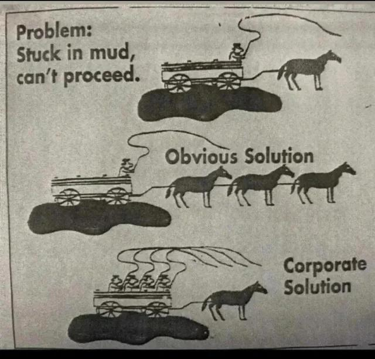

armée dans laquelle (historiquement ?), les officiers sont plus nombreux que les soldats. 

Forme de management qui prétend résoudre des problèmes en associant plus de managers au lieu d'associer plus de techniciens (typiquement dans le développement web)

# bibliographie

