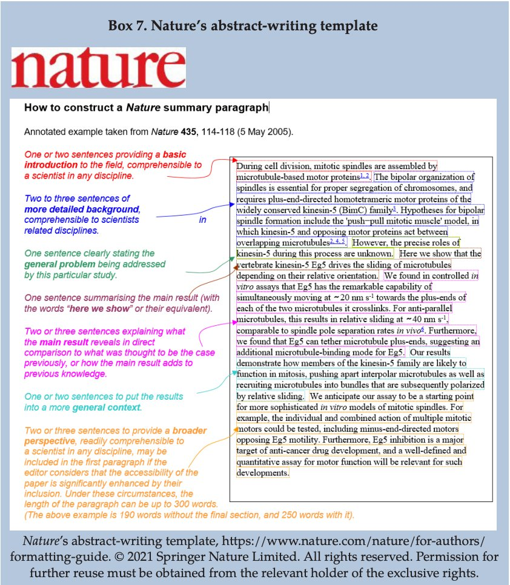

# Types d'articles

## revues de littérature

La [[revue de littérature]] conditionne l'ensemble des procédés qui vont permettre d'aboutir à l'article. C'est ce que présente le document ci-dessous diffusé par le compte Twitter @WriteThatPhD

Source : https://twitter.com/WriteThatPhD/status/1382631067069382658

# Normes d'édition

## Normes d'édition généralistes

Liste des points typographiques auxquels il faut veiller quelque soit le type de document rédigé. Voir mémo de Jacques-André ([[@andrePetitesLeconsTypographie]])

## Normes d'édition scientifiques

### titre

[choisir un titre significatif](https://blogs.lse.ac.uk/impactofsocialsciences/2014/02/05/academics-choose-useless-titles/)

### mots-clé

### auteurs et affiliations

### introduction

### protocole et méthodes

### paragraphes

### syntaxe et vocabulaire

### résultats

### discussion

### conclusion

### Bibliographie

## annexes et accès aux données
