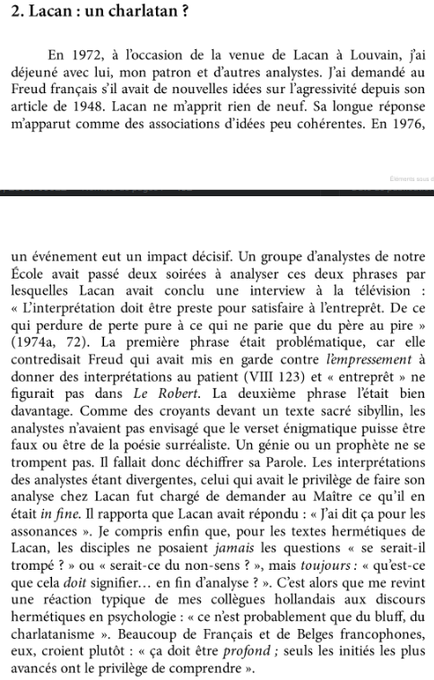

Répétition d'une moyenne voyelle dans une phrase ou à la fin de deux phrases (cf. rimes). Allitération = équivalent pour les consonnes.

A propos des langages obscurs ([[esotérisme]], ces derniers peuvent séduire par leurs assonances plutôt que par leur signification et les gourous le savent bien. 
Cf. Cette anecdote à propos de [[Jacques Lacan]]

