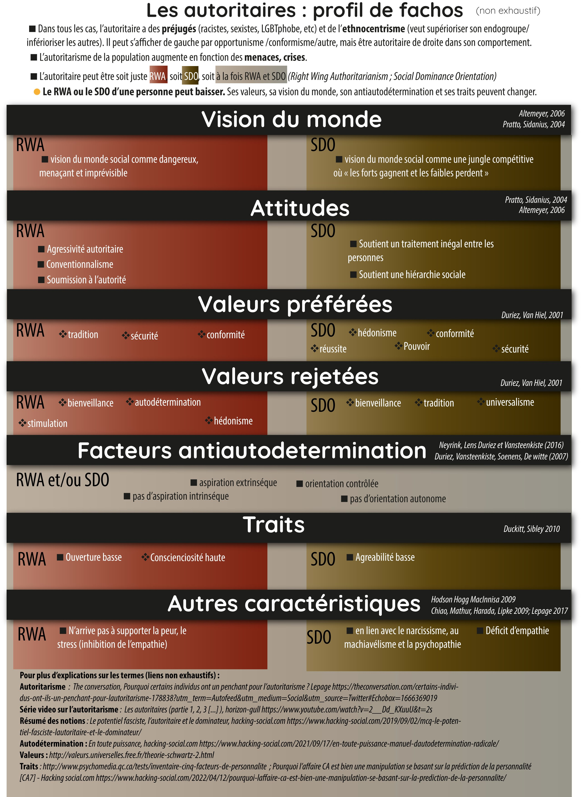

# Personnalités autoritaires

L'autoritarisme est plus complexe qu'il n'y paraît à première vue et fait l'objet de plusieurs études récentes en psychologie sociale motivées par la question : peut-on faire changer de comportement à une personne autoritaire et en utilisant quel levier.

Dans le fond autoritaire, certaines chercheurs identifients deux orientations différents : l'autoritarisme de droite, ethniciste, masculiniste et l'autoritarisme de la domination sociale qui est conciliable avec un comportement non agressif et un haut degré de narcissisme

Source : https://twitter.com/HViciss/status/1584907412061970438

# Régimes autoritaires

Les régimes autoritaires ne sont pas forcément dictatoriaux, dans la mesure où ils n'enfreignent pas forcément l'Etat de Droit, mais manquant de légitimité populaire, ils vont utiliser tous les moyens légaux de coercition à leur disposition : répression des manifestations, limitations du droit de la presse, pressions sur les associations, etc.

> Qu'entend t-on par autoritarisme ? Non pas un pouvoir qui serait dénué de légalité démocratique, mais un pouvoir qui manquant de force par cette seule légalité pour imposer sa volonté, a recours à des excès d'autorité, autrement dit utilise l'ensemble des forces que cette légalité lui donne pour briser les oppositions[[@godinGuerreSocialeFrance2022]].

> ...C'est un abus d'autorité sanctionné par la loi et donc parfaitement légal

Romaric Godin, auteur du passage ci-dessus, fait remonter ce style de gouvernement au XIXème siècle, lorsque Cavaignac réprime dans le sang l'insurrection de juin 1848 et Thiers la Commune au nom de la continuité de l'ordre républicain.

Au XXIème sicèle, parmi les signes de ce durcissement des forces de l'ordre, on peu noter le nouvel arsenal de la [[répression des manifestations]] :

- empêcher les manifestants de rejoindre le lieu de la manifestation (même quand celle-ci est autorisée)
- arrêter préventivement les manifestants, puis les relâcher faute de preuves incriminantes
- envoyer les gaz et les charges de CRS avant  même les débordements pour créer le désordre qui est censé déclencher l'intervention
- confisquer aux manifestants du matériel de protection (collyres, casques, trousses de médicaments)
- frapper des journalistes dans l'exercice de leur profession et les obliger à quitter le terrain
- nier dans ce contexte la réalité des violences policières

Pour Romaric Godin, l'autoritarisme passe aussi par la marginalisation des lieux où s'expriment des opinions diverses et opposées à celles du gouvernement, typiquement l'assemblée nationale. 
Elle passe également par une personnalisation du pouvoir et une héroïsation du chef, une théatralisation de sa parole comme dans le Grand Débat où la parole de Macron, face à des citoyens ou des intellectuels invités a largement été mise en scène.

# bibliographie

