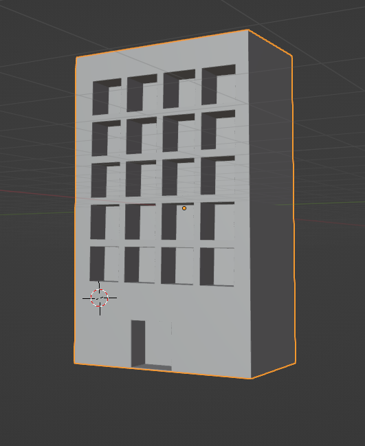
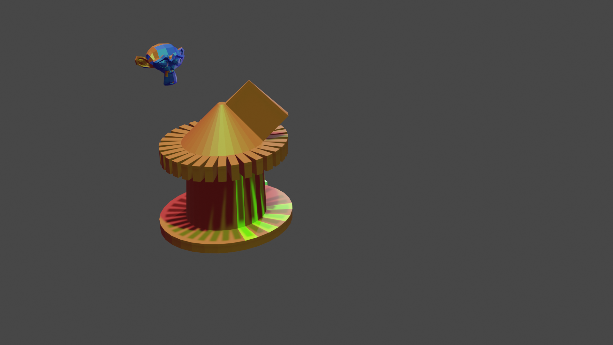
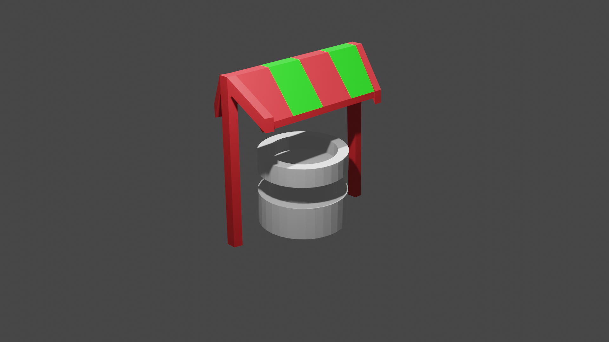
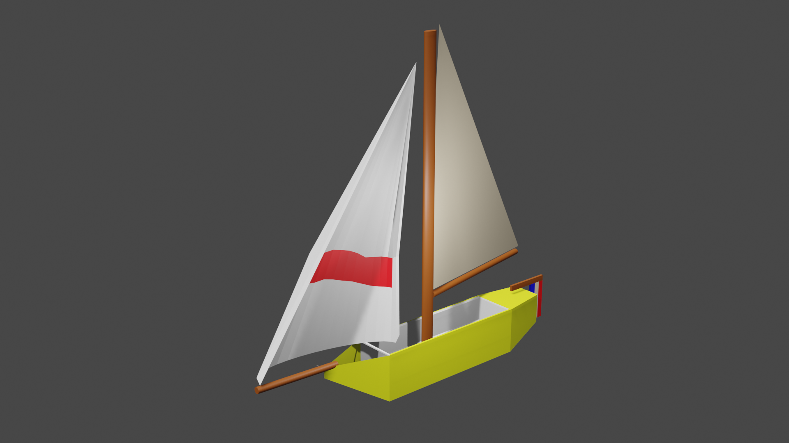

formation URFIST, bibliothèque de Droit, campus du Tertre (Nantes)
27-28 mars 2023
formateur : Eden Gailly-Gemy

# formes

]

Raccourcis clavier :

G : mouvement de la forme
R : rotation
S : changer l'échelle

L : sélectionner en mode objet

alt + clic : sélectionner un groupe de faces identiques

P > separate : séparer deux objets (à faire en edit mode : )

S + shift + Z : changer l'échelle pour tous les axes sauf Z : permet de mettre une forme à l'échelle sauf dans le sens de la hauteur (voir S + shift + X ou S + shift + Y)
shift + D : dupliquer
T : rotation et transformation en même temps

L: sélectionner les éléments séparés
A : sélectionner tous les points d'un élément.

tab : éditer un objet
sélectionner un point 

en mode édit sélectionner plusieurs arrêtes / faces : 
alt + cliquer sur une arrêt ou une face. 
sélectionner plusieurs arrêtes, faces continues : 
Ctrl sélectionner la première, Ctrl sélectionner la seconde

faire un symétrique d'une figure : 

faire tourner une arrête. 

E : extruder
Alt E > extrude individual faces : extruder chaque face sélectionnée individuellement.

extruder une face. Par défaut, l'extrusion se fait dans l'axe de la face. l'extrusion peut être caractérisée dans les différents sens X, Y et Z.

annuler la duplication et l'extrusion : escape + ctrl Z

look cut : créer la coupure sur le tour d'un objet. 

en mode edit, outil knife : coupure à la main.

Ctrl I : créer une face dans la face.

mesh : maillage (à ne pas confondre avec MeSH)

bevel : ctrl B permet de créer des arrondis

spin (en mode edit)

aimanter le déplacement par rapport à la grille : shift + tab (aimanter par rapport à des points > vertex)

shift + R = répéter la dernière action effectuée.

sélectionner plusieurs surfaces : shitf + alt

édition proportionnelle : o (bien penser à la désactiver quand on ne s'en sert plus)

pour sélectionner des surfaces identiques : Ctrl sur la première, ctrl sur la dernière.

fermer une surface : sélectionner le contour et cliquer sur F

symétriser : 

sélectionner l'objet > mesh > symetrize > +x to -x

activer la vue wireframe : z + wireframe

Modficateurs

mirror : symétrie de la figure par rapport au point d'origine de la figure (clipping : rattaquement de l'image à la forme originale)

array : dupliquer à l'infini

subdivision surface : créer de nouvelles faces

booléen : permet de garder l'intersection, l'union ou la différence entre deux volumes.

# textures, couleurs

changer la vue : en haut à droite changer l'icone sphere (couleurs, pré-rendu)

les normales : orientation d'une surface dans l'espace. 
Une table à une surface orientée vers le haut, un écran d'ordinateur a une orientation différente (plus verticale)

ajouter une caméra, la placer dans le bon ordre de vue (touche N), faire un *render* de la vue

textures : workspace shading

# animation

