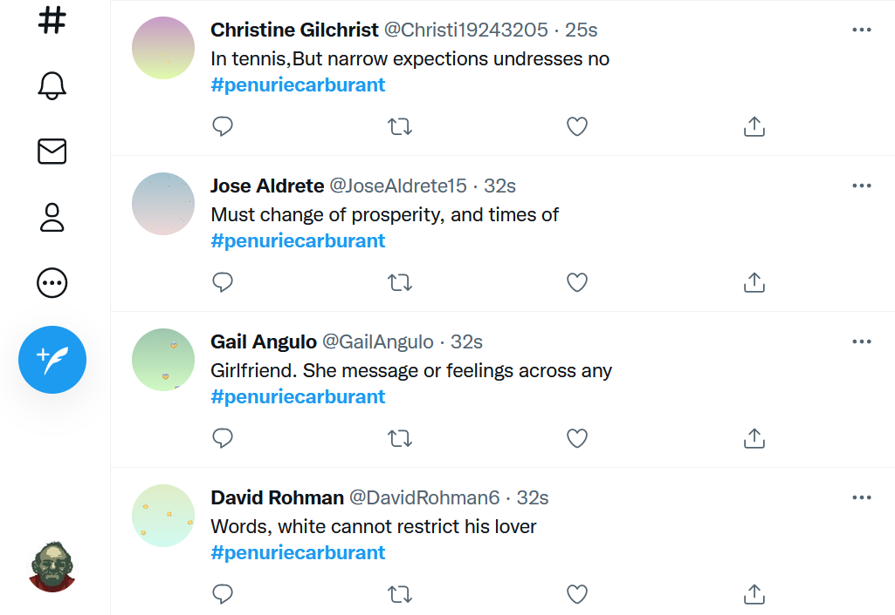
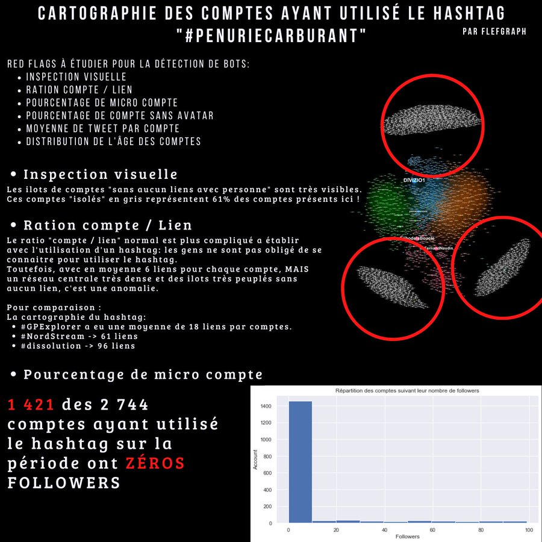

Les bots sont des comptes créés sur les [[réseaux sociaux]] qui peuvent être opérés de  manière automatique ou semi-automatique pour poster, liker, faire écho ou partager automatiquement de l'information sur un réseau social.
Les bots ont particulièrement pour but d'amplifier de façon artificielle certaines informations diffusées sur le web. 
Ils représentent un moyen particulièrement efficace de faire de l'[[Astroturfing]]

[Une étude de 2017](https://arxiv.org/pdf/1703.03107.pdf, estiment l'importance des bots sur le réseau Twitter à une fourchette comprise entre 9 et 15% du total des comptes créés. 

en 2018, Facebook a du supprimer près de 2 milliards de faux-comptes 

>By 2018, Facebook had over two billion legitimate users—but in the same year deleted even more fake accounts: nearly three billion. Some bots act as information providers, pushing out their messages, usually for advertising purposes but occasionally in service of propaganda aims. Others emulate information consumers

(Carl Bergstrom [[@BergstromCallingBullshitArt2020]])

génération de bots spontanés dans le cadre des tensions sur les carburants du début d'octobre 2022

Ces bots ont été créés à la va-vite avec du texte de remplissage et sans être lié aucun follower, ni following. D'où des nuages de bots qui flottent dans le vide : 

source: https://twitter.com/FlefGraph/status/1579590493448867860

# détection des bots

## botometer

Une mesure permettant d'établir la probabilité qu'un compte soit géré par un bot plutôt que par une personne existe, il s'agit du [botometer](https://botometer.osome.iu.edu/)
Une façon particulièrement intéressante de repérer une manoeure conduite avec des bots est de retrouver des similitudes entre un grand nombre de messages différents sur la forme mais identiques sur le fond envoyés exactement au même moment : 

Bergstrom et West à titre d'exemple mentionnent l'envoi massif de [[mails]] au FCC en 2017 qui souhaitait proposer la fin de la neutralité du net et interroger les internautes à ce sujet. Une grande partie des mails reçus avaient été envoyés par des bots. Le 19 juillet 2017, un bot a envoyé en moins d'une seconde près d'un million de commentaires en faveur de la fin de la [[neutralité du net]]. Ces commentaires étaient les mêmes sur le fonds mais utilisaient des synonymes (déternminés de façon automatisée) pour paraître singuliers. 

## CMT

L'amplification vise la plupart du temps à obtenir que le hashtag souhaité s'affiche assez longtemps dans les Twitter trends. 

Coefficient de manipulation du trafic (CMT) - combinaison de plusieurs métriques :

Pour un nombre de tweets comportant le même hashtag

- pourcentage de retweets  

- nombre moyen de tweets par utilisateur  

- proportion du trafic généré par les 50 utilisateurs les plus actifs  

(source [[@marangeGuerresInformationEre2021]], p101)

flux naturel : CMT = 12
hashtag en faveur de la campagne de Marine Le Pen en 2017 : CMT entre 38 et 53

Choix d'utiliser un petit nombre de comptes pour publier à un ryhme très accéléré ou recours à un très grand nombre de comptes qui twittent de façon moins régulière pour passer inaperçu. 

Utilisation de *spamouflage* pour déjouer la surveillance des modérateurs de Twitter : exemple des phrases d'un roman de Jane Austen s'intercalaient entre des posts comportant de la lingerie fine avec un lien vers un site pornographique. 

# les bots personnifiés

Récupération de vieux comptes abandonnés par leurs utilisateurs (vieux comptes piratés en ligne sur le web, à vendre pour les "directeurs de campagne"). Les possesseurs véritables de ces comptes laissés en jachère sont peu conscients de la réutilisation de ces comptes. 

> Il existe un marché noir sur Internet de ces comptes dits "âgés"ou "matures"

(source : Ben Nimmo[[@marangeGuerresInformationEre2021]], p94)

Création automatique de comptes. Possible sur Twitter. 

bots personnifiés : [Jenna Abrams](https://www.theguardian.com/technology/shortcuts/2017/nov/03/jenna-abrams-the-trump-loving-twitter-star-who-never-really-existed, influenceuse inexistante mais l'un des chevaux de Troie du Kremlin aux USA
la capacité de personnifiier des bots avec des photos pour les rendre plus crédibles n'a fait qu'augmenter ces dernières années avec des sites comme [thispersondoesnotexist.com](https://thispersondoesnotexist.com/)
Pour s'entraîner à les reconnaître, on peut se tester sur https://www.whichfaceisreal.com
Quels trucs permettent d'identifier une photo de profil issue de ThisPersonDoesNotExist : https://twitter.com/_Le_Nain_/status/1491471922114220036

Le visage est toujours : 

- en plan serré  

- de face  

- sans aucun élément qui le cache (pas de main sur la joue, de foulard, de masque...)  

- arrière-plan flou ou neutre  

- Un truc assez peu connu c'est que le générateur met toujours les yeux au même endroit. Exemple ici avec encore des fausses photos (les ronds rouges ne bougent pas)  

 
 Les yeux sont toujours strictement alignés de façon horizontale
 
-  les accessoires, lunettes, boucles d'oreille... sont rarement symétriques  
-  l'arrière-plan est souvent raté, surtout s'il y a un deuxième visage.  
- lunettes asymétriques  
- horizon pas cohérent à gauche et à droite, terrain dans une texture cheloue, épaules bizarres, ligne inidentifiable à gauche  

# Les chatbots

intelligence conversationnelle, [[ChatGPT]]

# bibliographie

