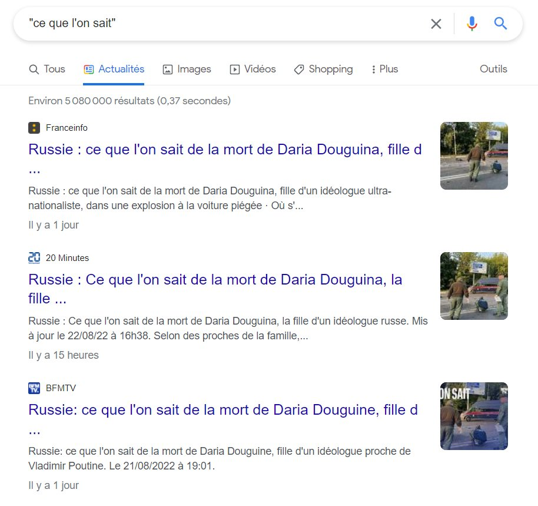

procédé consistant pour un média à reprendre le texte d'une dépêche (AFP, Reuters) et à en faire un article signé par un journaliste de ce média avec une plus-value minime (ajout d'une phrase pour relier deux paragraphes, changement de quelques mots par des synonymes, etc.)

(voir [le cas des Echos](https://reflets.info/articles/batonnage-de-depeches-les-echos-au-top) d'après Reflets.info)

Le bâtonnage de dépêches permet pour un éditeur en ligne d'augmenter artificiellement le nombre de ses publications, un critère qui est stratégique pour être correctement indexé dans Google News, d'après [Nikos Smyrnaios interrogé sur RFI](https://www.rfi.fr/fr/podcasts/atelier-des-m%C3%A9dias/20210918-l-impact-du-11-septembre-sur-la-diffusion-de-l-information-en-ligne)
Cela se fait au détriment de l'originalité et la diversité des sources qui était le premier objectif de [[Google News]]

La seule valeur ajoutée est bien souvent le titre, de préférence racoleur pour générer du trafic aux annonceurs.

Dans une étude de 2013, Julia Cagé, Nicolas Hervé et Marie-Luce Viaud ont mesuré que 64% du texte disponible sur les médias en ligne était issu de copier-collers ([[@cardonCultureNumerique2019]], p254). 

# bibliographie

