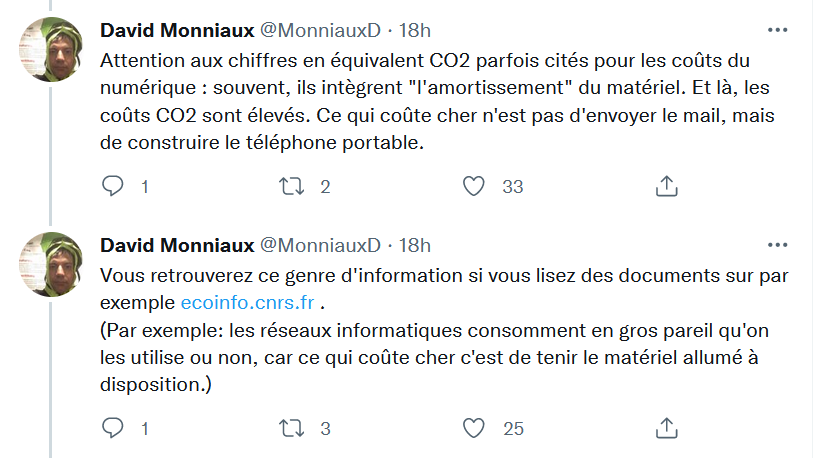

Article de Stéphane Bortzmeyer

## Indiquer la consommation énergétique par requête a-t-il un sens ?

Première rédaction de cet article le 9 octobre 2021  

---

Dans les débats sur l'empreinte environnementale du numérique, on voit souvent citer des coûts énergétiques par opération élémentaire, du genre « un **[message](https://fr.wikipedia.org/wiki/Courrier%20%20%20%C3%A9lectronique "Consultez l'article "Courrier   électronique" de l'encyclopédie libre Wikipedia")** consomme X **[joules](https://fr.wikipedia.org/wiki/joules "Consultez l'article "joules" de l'encyclopédie libre Wikipedia")** » ou bien « une recherche Google brûle autant de charbon que faire chauffer N tasses de café ». Ces chiffres sont trompeurs, et voici pourquoi.

Lorsqu'ils sont cités, ces chiffres sont souvent accompagnés d'injonctions à la [[sobriété numérique]]. « N'envoyez pas ce courrier que vous étiez en train d'écrire et vous sauverez un arbre. » En effet, annoncer des coûts environnementaux par requête donne à penser que, si on s'abstient d'une action, le coût diminuera d'autant. Mais ce n'est pas ainsi que les choses se passent. Ces chiffres « par opération » sont obtenus (normalement…) en divisant la consommation énergétique totale par le nombre d'opérations. C'est classique, c'est le calcul de la **[moyenne](https://fr.wikipedia.org/wiki/moyenne "Consultez l'article "moyenne" de l'encyclopédie libre Wikipedia")**. Si on connait la consommation d'essence de toutes les voitures en France, et le nombre de voitures, calculer la consommation moyenne de chaque voiture est simple. Certes, il faudrait tenir compte du fait qu'une petite voiture consomme moins qu'un **[SUV](https://fr.wikipedia.org/wiki/Sport%20utility%20vehicle "Consultez l'article "Sport utility vehicle" de l'encyclopédie libre Wikipedia")** mais, en première approximation, cela a du sens de dire « chaque voiture dévore N litres d'essence par an ». Et il est raisonnable d'en déduire que de mettre des voitures supplémentaires sur la route augmentera cette consommation, de façon proportionnelle à l'augmentation du nombre de véhicules. La proportionnalité s'applique également à la consommation d'essence rapportée au nombre de kilomètres : la quantité de carburant brûlé est à peu près proportionnelle à ce nombre de kilomètres. Si je roule deux fois moins, je consomme deux fois moins d'essence, et ça diminuera le relâchement de **[gaz à effet de serre](https://fr.wikipedia.org/wiki/Gaz%20%C3%A0%20effet%20de%20serre "Consultez l'article "Gaz à effet de serre" de l'encyclopédie libre Wikipedia")**. Dans tous ces cas, la **[moyenne](https://fr.wikipedia.org/wiki/moyenne "Consultez l'article "moyenne" de l'encyclopédie libre Wikipedia")** est un concept mathématique parfaitement valable.

Mais tout ne fonctionne pas ainsi : la consommation électrique des équipements réseau, par exemple, n'est pas **[linéaire](https://fr.wikipedia.org/wiki/Lin%C3%A9arit%C3%A9 "Consultez l'article "Linéarité" de l'encyclopédie libre Wikipedia")**, elle est même souvent constante (cela dépend des équipements ; il y un coût constant et un variable, ce dernier étant en général plus faible que le coût constant). Que le **[routeur](https://fr.wikipedia.org/wiki/routeur "Consultez l'article "routeur" de l'encyclopédie libre Wikipedia")** passe des **[paquets](https://fr.wikipedia.org/wiki/Paquet%20(r%C3%A9seau) "Consultez l'article "Paquet (réseau)" de l'encyclopédie libre Wikipedia")** ou pas, il consommera la même quantité d'énergie. Envoyer deux fois moins de courriers ne diminuera donc pas la consommation énergétique de votre _**[box](https://fr.wikipedia.org/wiki/Box%20(Internet) "Consultez l'article "Box (Internet)" de l'encyclopédie libre Wikipedia")**_, ou du reste de l'**[Internet](https://fr.wikipedia.org/wiki/Internet "Consultez l'article "Internet" de l'encyclopédie libre Wikipedia")**. Ainsi, le tweet de **[France Culture](https://fr.wikipedia.org/wiki/France%20Culture "Consultez l'article "France Culture" de l'encyclopédie libre Wikipedia")** « [Savez-vous que chaque mail envoyé, chaque vidéo regardée, émet des gaz à effet de serre ?](https://twitter.com/franceculture/status/1400011378258284544) » est faux et trompeur. Si vous renoncez à votre soirée devant **[Netflix](https://fr.wikipedia.org/wiki/Netflix "Consultez l'article "Netflix" de l'encyclopédie libre Wikipedia")**, la consommation électrique des routeurs, serveurs et autres équipements ne changera pas forcément, et calculer une moyenne par film ou série visionné n'a donc pas beaucoup de sens. **La moyenne n'est légitime que si** la dépendance est à peu près **[linéaire](https://fr.wikipedia.org/wiki/Lin%C3%A9arit%C3%A9 "Consultez l'article "Linéarité" de l'encyclopédie libre Wikipedia")**.

(source: https://twitter.com/MonniauxD/status/1565063829649752066)

Bon, OK mais, même si la moyenne n'a pas de sens et que les déclarations sensationnalistes « envoyer un courrier, c'est relâcher X grammes de **[dioxyde de carbone](https://fr.wikipedia.org/wiki/Dioxyde%20de%20carbone "Consultez l'article "Dioxyde de carbone" de l'encyclopédie libre Wikipedia")** dans l'atmosphère » sont [à côté de la plaque](https://twitter.com/pbeyssac/status/1338814678189879297), il n'en reste pas moins que le numérique a une empreinte environnementale, non ? Oui, la construction et l'exploitation des réseaux informatiques a un coût (y compris environnemental). Ce n'est pas un coût à l'utilisation, d'accord. Mais si les gens augmentent leur activité en ligne, par exemple si ce blog double son nombre de visiteurs, il faudra déployer davantage de matériels (dont la construction est le principal facteur d'empreinte environnementale du numérique) et il y aura donc bien un résultat (néfaste…) sur l'environnement. (Le matériel nouveau sera plus efficace : un routeur capable de 100 Gb/s ne consommera pas dix fois qu'un routeur capable de 10 Gb/s. Mais sa fabrication, on l'a vu, a un fort coût environnemental.) Bref, chaque requête individuelle ne pèse rien, mais leur augmentation va mener à une empreinte accrue sur l'environnement. (En sens inverse, on pourrait se dire que, si les gens arrêtent de regarder Netflix, cette société va éteindre certains équipements et que cela diminuera la consommation d'électricité. Mais c'est moins certain et, rappelez-vous, c'est surtout la fabrication qui coûte. Une fois le serveur installé dans l'**[armoire](https://fr.wikipedia.org/wiki/Baie%20(centre%20de%20donn%C3%A9es) "Consultez l'article "Baie ([[centre de données]])" de l'encyclopédie libre Wikipedia")**, il a déjà imprimé l'essentiel de sa marque sur l'environnement.)

Ce raisonnement (comme quoi l'effet attendu de la sobriété n'est pas de diminuer la consommation énérgétique aujourd'hui, mais de limiter les dépenses de matériel demain) est correct et justifie donc qu'on porte attention aux conséquences écologiques du numérique. La frugalité est donc une bonne chose mais attention à ne pas la justifier par des arguments faux, comme ces coûts par requête.

Est-ce qu'à défaut d'être scientifiquement pertinent, les arguments fondés sur une moyenne sont au moins efficaces pour la [[communication]], sensibilisant les utilisatrices et utilisateurs à l'importance de l'empreinte environnementale du numérique ? Même si c'était le cas, ce ne serait pas à mon avis (mon avis de rationaliste convaincu) une raison suffisante pour l'utiliser. Tromper les gens n'est pas une bonne idée. Mais, en plus, je ne suis même pas sûr que l'argument soit efficace : la plupart des gens le comprendront de travers, croyant que tel ou tel geste d'extinction va vraiment diminuer tout de suite l'empreinte environnementale.

Le point essentiel de cet article était que **la moyenne n'est pas forcément pertinente**. Mais, sinon, que peut-on faire pour que l'empreinte environnementale cesse d'augmenter ou en tout cas que cette augmentation ralentisse ? Le discours médiatique dominant est plein de conseils absurdes et évite soigneusement de s'attaquer à des usages sacrés. On a vu ainsi un politicien qui dénonçait l'utilisation de l'[[internet]] pour regarder du « porno dans l'ascenseur » mais qui se prenait en photo regardant un match de foot depuis sa voiture. (Le sport-spectacle est intouchable, quand on est un politicien ambitieux, pas question de le critiquer.)

Donc, voici ma liste de quelques « gisements d'économie énergétique » importants qui ne sont pas toujours mentionnés :

-   La **[publicité](https://fr.wikipedia.org/wiki/publicit%C3%A9 "Consultez l'article "publicité" de l'encyclopédie libre Wikipedia")** est une source importante de dégâts environnementaux, par l'encouragement à la consommation mais aussi par un effet plus direct, l'importance des infrastructures qui sont dédiées à son fonctionnement en ligne. Il est grinçant de voir sur le Web des articles critiquant vertueusement l'« enfer numérique » mais qui contiennent des publicités. Pour l'utilisateur·rice final·e, installer un bloqueur de publicité est une bien meilleure action écologique que renoncer à envoyer un message. Mais les médias n'en parleront pas (la publicité est également sacrée).
-   La surveillance de masse est également très coûteuse du point de vue environnemental, car elle aussi dépend d'infrastructures complexes et consommatrices (par exemple pour la vidéo-surveillance, et c'est encore pire avec la **[reconnaissance faciale](https://fr.wikipedia.org/wiki/Syst%C3%A8me%20de%20reconnaissance%20faciale "Consultez l'article "Système de reconnaissance faciale" de l'encyclopédie libre Wikipedia")**). De même qu'on voit des articles anti-Internet (lui reprochant sa consommation électrique) qui sont hébergés sur des sites Web avec des publicités, il est fréquent de trouver des traqueurs comme ceux de **[Google Analytics](https://fr.wikipedia.org/wiki/Google%20Analytics "Consultez l'article "Google Analytics" de l'encyclopédie libre Wikipedia")** [sur ces sites](https://twitter.com/Shnoulle/status/1445008372428836866). Lutter contre le **[capitalisme de surveillance](https://fr.wikipedia.org/wiki/%C3%89conomie%20de%20la%20surveillance "Consultez l'article "Économie de la surveillance" de l'encyclopédie libre Wikipedia")** est plus écologique que de ne pas envoyer le courrier que vous venez d'écrire.
-   La fabrication du matériel est très coûteuse du point de vue environnemental. Changer moins souvent de matériel est donc également une action utile.
-   Question frugalité, il est important de promouvoir les techniques qui imposent le moins de contraintes sur le réseau et sur les machines : LEDBAT ([[[RFC]] 6297](https://www.bortzmeyer.org/6297.html "Consultez l'analyse du RFC 6297")) comme algorithme de **[transport](https://fr.wikipedia.org/wiki/Couche%204 "Consultez l'article "Couche 4" de l'encyclopédie libre Wikipedia")** ou [Gemini](https://www.bortzmeyer.org/gemini.html "Consultez ce blog à propos de "gemini"") côté **[application](https://fr.wikipedia.org/wiki/Couche%20%20%20%20%207 "Consultez l'article "Couche     7" de l'encyclopédie libre Wikipedia")**.
-   En moins disruptif, on peut noter que les applications et sites Web d'aujourd'hui sont loin d'être des modèles de frugalité. Leur consommation importante de ressources (notamment de temps de processeur) pousse rapidement les machines les plus anciennes dans la catégorie « vieux trucs à jeter ». Si vous êtes développeur ou développeuse, une des choses les plus importantes que vous pouvez faire pour le climat est de développer des applications et sites plus frugaux. (Et d'envoyer promener le marketeux qui dira « c'est moche, c'est trop austère, le client ne va pas aimer ».) C'est ce que prône par exemple le courant _[small Web](https://benhoyt.com/writings/the-small-web-is-beautiful/)_ ou _slow Web_. (On peut aussi citer l'intéressant _[Low-tech magazine](https://www.lowtechmagazine.com/)_, pour les bricoleur·ses.)

On trouve en ligne (ou sur papier…) plein de ressources sur l'empreinte environnementale du numérique. Toutes ne sont pas sérieuses, loin de là. En voici quelques-unes qui sont utiles (ce qui ne veut pas dire que je suis 100 % d'accord avec leurs auteurs) :

-   Une [réflexion de Pierre Beyssac](https://signal.eu.org/blog/2021/03/09/limpact-environnemental-du-volume-de-donnees-une-arnaque-intellectuelle/).
-   Une [vidéo de M. Bidouille](https://video.monsieurbidouille.fr/w/b9029464-4ac8-4a1c-bf35-777fb19a0707).

voir aussi [[Bilan carbone|bilan carbone]]

voir aussi [[PUE]] des [[datacenter|datacenters]]

# bibliographie

