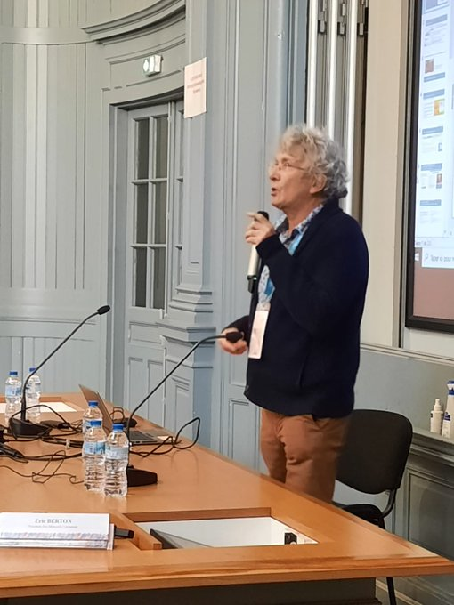
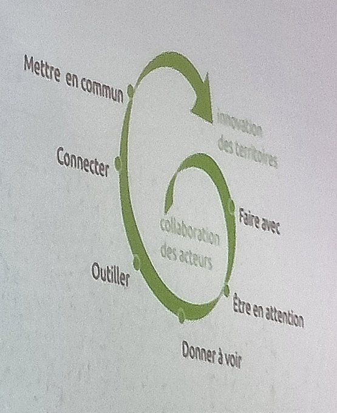

#JNF2023 ([[ADBU]])

créateur du forum coopératif de Brest, fondateur de Doc@Brest. 
Elu Brestois
Membre du CNUM
Paris-Mines, membre du groupe Innovation Pédagogique
Espace numérique lié au COVID : Riposte numérique

Il ne s'agit pas de mettre en avant des outils, mais chacun peut développer des pratiques relevant de la collaboration ouverte ou des [[Communs]]

coopération ouverte : notion associée au [[logiciel libre]]. 
ce que fait ce groupe en coopération est public et peut être récupéré par d'autres -> plateformes ouvertes en lien avec l'innovation sociale. 
cf. Laurence Lessing ([[creative commons]]) : possibilité d'élargir les libertés d'usage. 

La coopération ouverte n'est pas dans nos habitudes : ce qui est difficile c'est d'emmener à partager du contenu. 

enquête conduite par Michel Briant auprès des EC de son université avec l'aide des ingénieurs pédagogiques. 
L'ingénieur pédagogique a aidé à mettre des mots sur des pratiques innovantes inventées par des enseignants.
Donner une visibilité aux projets qui n'ont pas été retenus et qui n'ont pas été financés
Blog innovation pédagogique conduit par MB : publication de deux articles par jour (1500 visiteurs par an)

Communs : une ressource, une gouvernance (des règles), une valeur sociale (solidarité, égalité, durabilité)

cop des Communs : organisation en coopératives de livreurs à vélo.  
**compostabilité des idées** : on fait en sorte que les objets soient recyclés, pourquoi n'en fait-on pas autant pour des projets et des idées pédagogiques des professeurs qui partent à la retraite 
Maintenir l'archive des groupes de travail accessible
remixer les services culturels : biblioremix, museoremix

Coopération ouverte : agréable de partager mais on remarque aussi que les idées s'enchaînent les unes aux autres. Mise en place d'une monnaie-temps (échange de services entre différentes collectivités des services de l'Etat ou entre différents services d'une municipalité)
Bilan de trois mandats  : cercle vertueux de l'innovation par la coopération

- faire avec les gens : points d'accès à Internet. Il a fallu 10 pour que le dernier équipement de la ville devienne un lieu d'accès à Internet. 
- être en attention : repérer les promoteurs d'initiatives intéressantes, nécessité d'un site qui donne à voir toutes les innovations émanant des bibliothèques. susciter l'envie des gens de s'impliquer dans un projet. Mise en place d'un appel à projets- où tous les projets seront retenus (à condition que la demande respecte la forme prescrite et soit suffisamment détaillée). Contre-exemple : opacité d'un appel à projet de l'Etat pour la création des fablabs.
- donner à voir : créer des sites pour synthétiser ces iniatives. 112 sites sur la transition écologique ont accepté de voir leurs contenus reproduits sur un site synthétique ([Transiscope](https://transiscope.org/)). autre exemple dans la pédaogogie : site innovation pédagogique
- outiller les gens : un atelier par semaine pour aider les gens à réaliser leurs projets. Apprendre à coopérer ça s'apprend, c'est une compétence à acquérir et dont on va avoir besoin dans les prochaines années, cet enseignement reste encore marginal dans l'enseignement. 

[[coopération vs collaboration]]

L'état d'esprit collaboratif
Le souci du commun : ce qui pêche un peu dans les projets, c'est que les structures manquent de temps pour documenter (condition pour une)

Freins : 
- non-alignement de l'ambition avec la pratique : contenus fermés du réseau Colibri. Mariage entre les [[chatons]] et les colibris 
- égos sans partage sincère
- non reconnaissance des institutions publiques

Faire un pas de côté par rapport aux problématiques de pouvoir (Benoît Vallauri) : par exemple faire cours dehors (favorise l'attention par rapport à une situation de classe)
Ne pas attendre que l'institution change d'elle-même. 

Coopération face aux crises

Ouverture d'un espace Riposte créative territoriale. ouverture d'un wiki où tout le monde peut écrire. pas de censure, pas d'abus : on est loin d'un réseau social. 
Utilisation d'un formulaire pour aider les usagers à écrire sur leurs pratiques (confection de masques et de visières)

Qu'acceptez-vous de mettre en partage
Quels communs
Contre l'infobésité, expérimenter une gare centrale ?
Quelle co-production formés-formateurs
Un projet à composter
Comment prendre en compte la transition écologique

Communs en communs

Outil wiki utilisé [dans la plupart des cas](https://yeswiki.net/?AccueiL)

Fresque du numérique

contradiction entre le partage des créations intellectuelles sans sélection et la veille publique partagée. 

Réponse de Michel Briand : publier les avis des enseignants en même temps que le mémoire de l'étudiant pour faciliter l'évaluation de ce résultat. 
Michel Briand considère que la sélection se fait de manière émergente et n'a pas besoin d'une action humaine privilège d'un petit nombre. 

