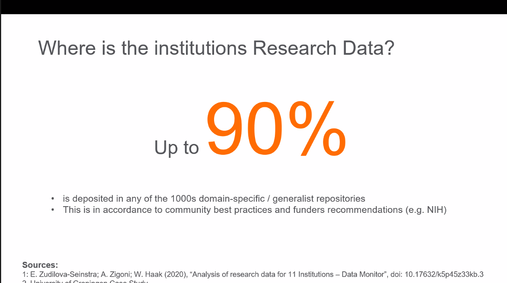
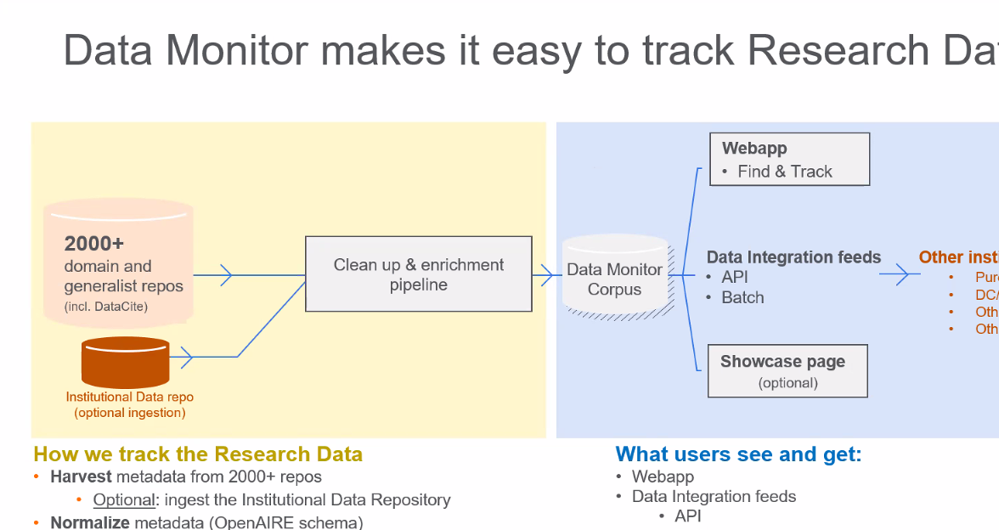

Perspective Rennes 1 : Ouvrir un espace institutionnel du côté de Recherche Data Gouv

Problématique : Comment accéder aux jeux de données des collègues qui sont pertinents pour mon étude. 
Lorsque je mets à disposition mes jeux de données, ma publication sera plus visible, j'augmente mon lectorat et je suis raccord avec le plan Science Ouverte.

Dataverse recherche data gouv, vu par Elsevier : voiture balais qui permet aux universités/laboratoires qui n'ont pas encore d'entrepôt de mettre les datasets de leurs chercheurs à disposition.

Assurance pour la communauté de ne pas perdre ses données
éparpillement des jeux de données : 

Comment on fait pour indexer ces jeux de données, par rapport à leurs publications. 

La difficulté pourle CIRAD a été de retrouver des jeux de données pour pouvoir les mettre dans la collection Recherche Data Gouv. 
Data monitor permet de répondre à cette nécessité. 

cela permet de suivre de façon unifiée les habitudes des labos en termes de dépôt de jeux de données. 

Possibilité de l'utiliser en interne pour chercher des datasets ou bien faire la présentation / promotion des jeux de données.

abonnement : quelques milliers d'euros par an.

On peut mettre en oeuvre cette solution au niveau de l'institution ou d'un groupe d'institutions.

notre valeur ajoutée c'est l'indexation des 3600 entrepôts institutionnels qui sont disponibles sur le web (actuellement 3200 entrepôts sont indexés par DataMonitor)

application web qui montre l'ensemble des jeux de données (exemple avec l'université de Milan) : https://board.unimib.it/research-data/

# bibliographie

