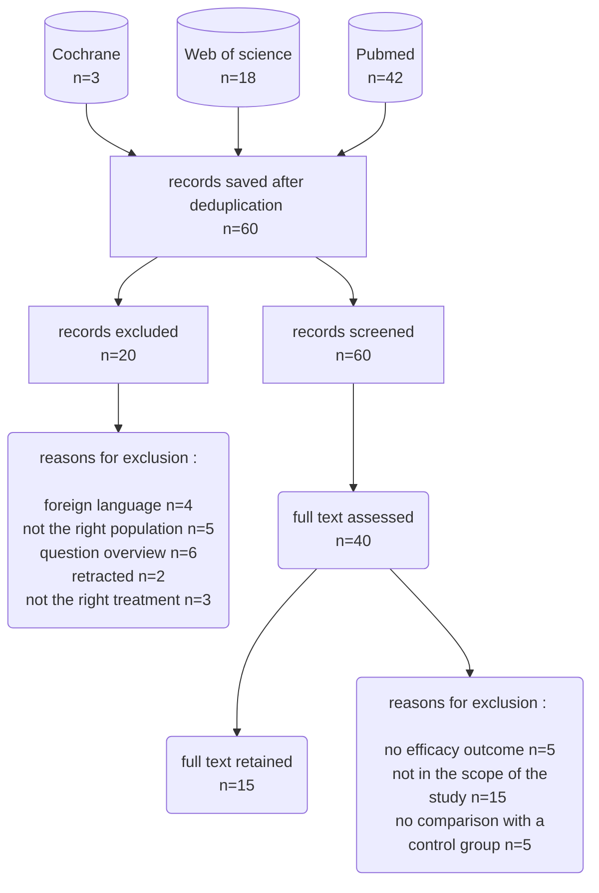

après avoir testé [Buhos](https://www.buhos.org/manual/en/), [Cadima](https://www.cadima.info/) et [Rayyan](rayyan.ai/), je n'ai pas trouvé d'outil qui me paraissait assez fiable pour mener une [revue systématique de littérature](agnotologie.md). 
Notamment, j'ai trouvé difficile de mener de passer l'étape du screening : une fois que le filtrage a été fait, ces outils ne permettent pas facilement de passer à l'étape suivante (éligibilité). Comme tous ces outils reposent de toute façon sur l'usage de Zotero pour importer les corpus à analyser, je me suis demandé s'il serait possible d'utiliser Zotero, son système de tags et de sous-collections, pour mener à bien cette tâche. 
J'ai testé la méthode ci-dessous. 
[[Zotero]] n'est pas un outil conçu pour mener des [[revue de littérature|revues de littérature]] (en dehors de son efficacité en matière de collecte d'information pour lequel il est mentionné par les outils mentionnés ci-dessus comme étant un préliminaire indispensable, on peut néanmoins l'utiliser à cette fin avec son sytème de marqueurs et d'annotations.


- [[Zotero]] permet le travail collaboratif. Il est possible d'utiliser la fonction "groupes de Zotero" pour rendre son travail visible à une autre personne. Cette personne peut agir sur le travail fait par son collaborateur. Il est possible de faire du travail en double aveugle en dupliquant la base des articles à revoir à l'intérieur du groupe et en identifiant chaque collection par le nom du collaborateur. 
  En faisant une extraction des deux collections en format tabulé, on peut ensuite repérer les conflits entre les deux approches. Les instructions qui suivent se focalisent sur le travail individuel du chercheur face à la collection d'articles qu'il doit passer en revue.

- Zotero permet de mener une revue de littérature systématique, mais en aucun cas une méta-analyse. Pour cette dernière, des outils plus complets, permettant une extraction et une compilation des données, ainsi qu'une visualisation de ces données sous la forme de graphiques (forest, tests d'asymétrie & funnel plots par exemple). Pour ces usages, se tourner vers le [[R (logiciel)|logiciel R]] et deux packages de R, Metabin et Metacont. 

# importer les références dans Zotero

créer une collection du nom de la revue systématique

créer des sous-collections, une par base de donnée interrogée ([[Pubmed]], Cochrane, [[Web of Science]], etc.)
Vérrifier que dans les préférences générales, les deux options sont paramétrées de la la manière suivante : 

- ajouter automatiquement aux documents des marqueurs à partir des mot-clés fournis = décoché
- joindre automatiquement les fichiers pdf associés lors de l'enregistrement d'un document = coché


Pour régler l'affichage des marqueurs, cliquer sur le carré multicolore en bas près de la fenêtre des marqueurs : 


maintenir toutes les options décochées. L'idée est de ne voir apparaître que les marqueurs que l'on aura créés pour réaliser cette revue de littérature (verdict d'inclusion ou d'exclusion après les deux principales étapes de sélection : screening (choix à partir de la lecture des résumés) et eligibility (choix à partir de la lecture des articles en entier))
Ce point est important, car le système d'étiquettes (inclus ou exclu à la première étape, inclus ou exclu à la deuxième étape, raisons de l'inclusion ou de l'exclusion...) repose entièrement sur les marqueurs. 
Tous les marqueurs hérités de l'import de références dans [[Zotero]] (mots-clé qualifiant le contenu de l'article) constituent du bruit qui vont gêner l'usage des marqueurs dédiés à la décision à prendre pour chaque article. On verra ci-dessous comment les effacer.

La première méthode pour extraire des références de Pubmed est d'utiliser le connecteur de Zotero. Il faut savoir que ce connecteur ne va conserver que les résultats qui s'affichent sur la première page de résultats. Mais celle-ci peut contenir jusqu'à 200 références. Si notre nombre de références à exporter excède ce nombre, on peut envisager la deuxième solution et faire un export des références en format RIS.

Pour l'export d'un fichier RIS, procéder ainsi dans Pubmed

Au dessus de la liste des résultats, cliquer sur *Send to* et sélectionner *Citation manager*


## import d'un fichier RIS

Comme pour quelques autres bases, il n'y a pas d'import possible dans Zotero au moyen du connecteur depuis la Cochrane Library. Il est nécessaire de faire un export en RIS pour importer la collection dans ce format dans Zotero. 

Comme pour quelques autres bases, il n’y a pas d’import possible dans Zotero au moyen du connecteur depuis la Cochrane Library. Il est nécessaire de faire un export en RIS pour importer la collection dans ce format dans Zotero.

L’export sous forme de fichier RIS ou bibtex risque de générer des tags indésirables dans les étapes suivantes.

Ces tags ou descripteurs seront précédés dans les fichiers exportés par l'étiquette KW (pour Key words). Si on les laisse dans le fichier d'import, Zotero va générer les marqueurs correspondant ce qui va "polluer" la liste close des marqueurs procéduraux que nous avons décidé d'utiliser.

Il faut donc supprimer ces lignes de manière automatisée. On propose ici deux manières de faire cette opération :

### Avec Python

Python est un langage de programmation très utile. Le programme qui permet de l'utiliser est fourni par défaut dans les distributions de Linux. Il faut en revanche installer ce programme sur Windows à partir de ce site.

Si Python est installé sur votre machine, dans votre bloc-notes, copiez-collez les lignes suivantes en remplaçant input.txt par le nom de votre fichier de références exporté de la base.

```python

with open('input.txt', 'r') as inp, open('output.txt', 'w') as out:
    for line in inp:
        if 'KW  -' not in line:
            out.write(line)
```

sauvegardez ce fichier avec l'extension py (par exemple script.py) dans le même répertoire que l'endroit où vous avez téléchargé le fichier d'exporté. double-cliquez sur l'icone du fichier py. cela devrait générer un fichier de sortie output.txt que vous allez pouvoir importer dans Zotero car il contient les mêmes données que le fichier source à l'exception des lignes comportant "KW   -" qui ont été supprimées.

(voir également [[Python#supprimer des lignes qui contiennent une suite de caractères]])

### Avec  Notepad++

...en utilisant la fonction recherche par expression régulière dans cet éditeur de texte qu'est Notepad++ 

-ouvrez le fichier RIS / les lignes à supprimer comportent KW (=keywords). Ce sont ces lignes qui dans Zotero génèrent des marqueurs indésirables dans notre cas. 
- menu rechercher > marquer > marquer les lignes. texte à entrer KW suivi de deux espaces (pour ne pas marquer les noms d'auteur qui commmencent par KW comme dans le document ci-dessous, ligne 12)


Une fois que ces lignes sont marquées, il ne reste plus qu'à les supprimer :

recherche > signets > supprimer les lignes marquées.

(voir démo sur [ce tuto](https://www.youtube.com/watch?v=SiPLZzRqEwM))

L'import en format RIS ne comporte pas les PDF associés. 

Pour récupérer les PDF relatifs à ces références, une fois qu'elles ont été chargées. Mettre en surbrillance les références, clic droit puis sélectionner "trouver des PDF disponibles". Si certains PDF ne sont pas importés, c'est peut-être parce qu'ils sont sous embargo et que le proxy paramétré dans Zotero ne fonctionne pas de manière optimale ou bien parce que l'article n'est pas disponible dans les abonnements pris par la bibliothèque. 

Si on est sur un réseau qui ne censure pas sci-hub (celui de l'université ou bien connecté par VPN), on peut utiliser le plugin [zotero-scihub](https://opensourcelibs.com/lib/zotero-scihub) pour récupérer les PDF manquants. Sci-Hub bloque lorsqu'on souhaite réaliser l'opération sur un grand nombre de références, y aller titre à titre. cela peut prendre un certain temps, mais il n'y a guère d'autre solution. 


## conservation des requêtes et de leurs résultat

Dans chaque collection, enregistrer une note indépendante avec les informations suivantes : 

- requête + filtres utilisés (vérifier que l'équation comporte les filtres, sinon les ajouter à la main)
- date et auteur de la requête (l'auteur est nécessaire si la revue de littérature est faite à plusieurs)
- nombre de résultats trouvés (permet de retrouver le nombre de résultats initial avant le dédoublonnage)

## dédoublonnage

il n'y a pas de fonction de dédoublonnage propre à la collection. Il faut utiliser le dédoublonnage au niveau de la bibliothèque. 
Des doublons peuvent être repérés par Zotero et pour autant ne seront pas proposés à la fusion parce que leur type est différent (par exemple une référence va se présenter comme un chapitre de livre, et une autre comme un article de revue). Il faut aligner ces types dans les deux références avant de pouvoir les fusionner. 
Au terme du processus de dédoublonnage, noter les références qui restent dans chaque sous-collection relative à chaque source d'information. 


 # Vérifier la complétude des données

Avec la recherche interne à Zotero, repérez les références qui n'ont pas de date ou d'auteur

Dans la collection "revue de littérature", chercher les items qui répondent aux conditions suivantes : 
Collection de Zotero contient *nom de la collection*
Créateur ne contient pas %


Ajouter les noms là où ils manquent. 
Pour repérer les dates manquantes, voir [cette discussion](https://forums.zotero.org/discussion/comment/353243/)
La démarche consiste à sauvegarder la recherche suivante (appelons-la **last1000**) : 

Collection is \[nom de  la collection\] AND date is in the last 1000 years

Puis à exclure les résultats de cette recherche dans l'ensemble de la collection

Collection is \[nom de  la collection\]  AND collection *is not* **last1000**


# se fixer des critères d'exclusion

- article de synthèse
- pas de résultat
- protocole pas assez détaillé
- mauvaise population
- mauvais traitement
- article indisponible
- article en langue étrangère
- pas le bon type de document
etc.


Il est bien entendu possible également de créer des marqueurs avec des critères d'inclusion.

Créer un document intitulé *raison d'exclusion.** 
Y ajouter toutes ces raisons sous la forme de marqueurs
ajouter également les marqueurs correspondants : 

inclure1 / affecter une couleur et un chiffre (entre 1 et 9)
exclure1 / affecter une couleur et un chiffre (entre 1 et 9)

inclure2 / affecter une couleur et un chiffre (entre 1 et 9)
exclure2/ affecter une couleur et un chiffre (entre 1 et 9)

# Appliquer ces marqueurs aux articles à réviser

Pour chaque article procéder de la manière suivante. 

- Lire le résumé
- Décider si l'article vérifie les critères d'inclusion (ou ne vérifie pas les critères d'exclusion)
     si l'article vérifie les critères d'exclusion, appliquer le marqueur *exclure1* et appliquer le marqueur correspondant à la raison de l'exclusion. Au besoin le créer à l'occasion. Il pourra sans doute servir pour d'autres articles.
- Si l'article, à la lecture de son résumé, remplit les critères d'inclusion, ou ne vérifie pas l'un des critères d'exclusion, appliquer le marqueur *inclure1* et éventuellement un marqueur relatif à l'un des critères d'inclusion (si cela a du sens, ce n'est pas forcément le cas)

Pour appliquer un marqueur existant à une référence, glisser-déposer cette référence sur le marqueur en question (c'est contre-intuitif, on aurait plutôt tendance à faire glisser l'étiquette du marqueur sur la référence)


Quand le travail est fait pour l'ensemble des articles, passer à la phase suivante. 

On va créer une recherche pour rassembler tous les articles qui ont reçu le marqueur "inclure1"


Copier coller les résultats de cette recherche dans une autre collection intitulée "inclus après screening" (par exemple)

on va se focaliser sur cette nouvelle collection pour la filtrer, cette fois en passant à l'étape n°2 : la lecture du PDF. 
Rappel : le fait de ne pas parvenir à trouver un article à ce stade est un motif d'exclusion. 

Cette fois, on va mobiliser les deux autres marqueurs de couleur (*inclure2* et *exclure2*)


Dans la figure ci-dessus, on voit deux références d'articles : 
la première n'a pas dépassé le stade du screening : la lecture du résumé laissait penser que l'article n'était pas pertinent compte tenu du sujet. 
la seconde correspond à un article qui a satisfait aux critères d'inclusion, non seulement à la lecture du résumé mais aussi à la lecture de l'article dans son entier. 

Au terme de cette étape, on fait de nouveau une recherche pour sélectionner les références qui ont reçu le marqueur "inclure2", on copie-colle les références obtenues dans une nouvelle collection, par exemple intitulée *positifs au stade de l'éligibilité*

Ce sont ces études qui vont pouvoir constituer la matière de votre revue de littérature. 
Il reste à articuler un texte neutre qui mette chacune de ces études sélectionnées en perspective les unes par rapport aux autres. 

Il reste également à constituer le *flow chart* qui permet de résumer la méthode suivie et présentée et son résultat en termes d'articles inclus / exclus. Pour cela s'inspirer des [modèles fournis par PRISMA](http://www.prisma-statement.org/PRISMAStatement/FlowDiagram.aspx). On peut constituer le diagramme avec des outils libres comme [Dia](http://dia-installer.de/)





