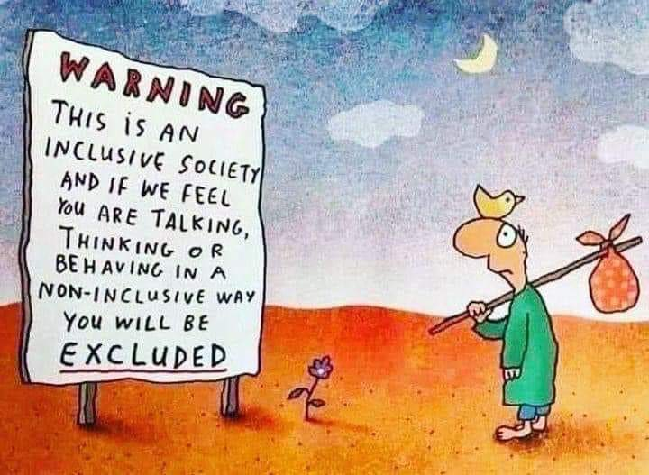

# e-inclusion 

l'e-inclusion n'est pas distincte de l'inclusion, c'est l'inclusion des personnes dans un monde où le numérique conditionne l'ensemble de nos vies : 
La théorie de l'e-inclusion comporte des études sur les formes d'exclusion ou de ségrégation que les technologies socio-numériques provoquent dans la société. Les plans d'e-inclusion luttent contre ces effets d'exclusion et visent à faire reculer la [[fracture numérique]]

# bibliographie

