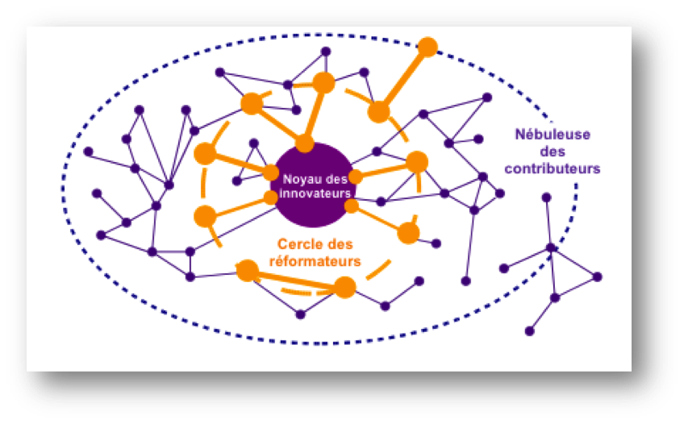

Concept forgé par Eric von Hippel pour montrer la centralité des utilisateurs experts (et non celle du marché) dans l'innovation informatique à partir de la mise en place du web. 
D'autres exemples d'innovation ascendante voient le jour en dehors du monde numérique, comme ces surfeurs qui installent sur leur planche de surf des cales pour les pieds et une voile et inventent la planche à voile ([[@cardonCultureNumerique2019]] p108)

# bibliographie

