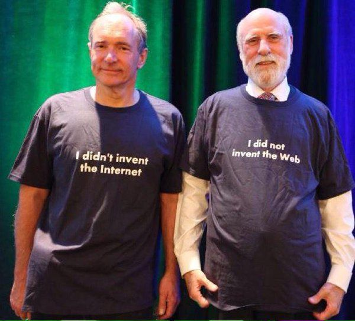

Réseau de réseaux. 

# Les trois protocoles qui font fonctionner Internet aujourd'hui

Internet est un réseau connectant plusieurs réseaux autonomes (AS : autonomous systems) au moyen de trois protocoles : 

## TCP/IP : 
relations entre une machine client et un serveur. Protocole conçu à partir des années 60  et mis au point définitivement par Vint Ceref en 1983 (protocole fixé dans la norme [[RFC]] 1122).

## [[BGP]] :
protocole de communication entre différents réseaux destiné à éviter l'engorgement des noeuds ou la perte de paquets de données

## DNS :
correspondance entre ces adresses IP (TCP/IP) et des [[serveur de noms de domaine|DNS]]

source : [[@marangeGuerresInformationEre2021]], p69

# Distinguer internet et le web

On confond souvent ce protocole avec le web inventé plus récemment par Tim Berners-Lee en 1990

Tim Berners-Lee et Vint Cerf

> En termes informatiques, nous disons que le web est une couche haute qui utilise une couche basse (Internet)

source: [[@cardonCultureNumerique2019]]

# bibliographie

