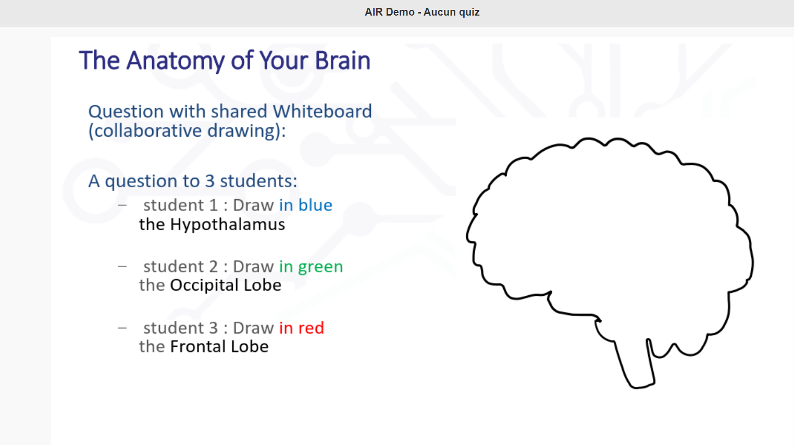
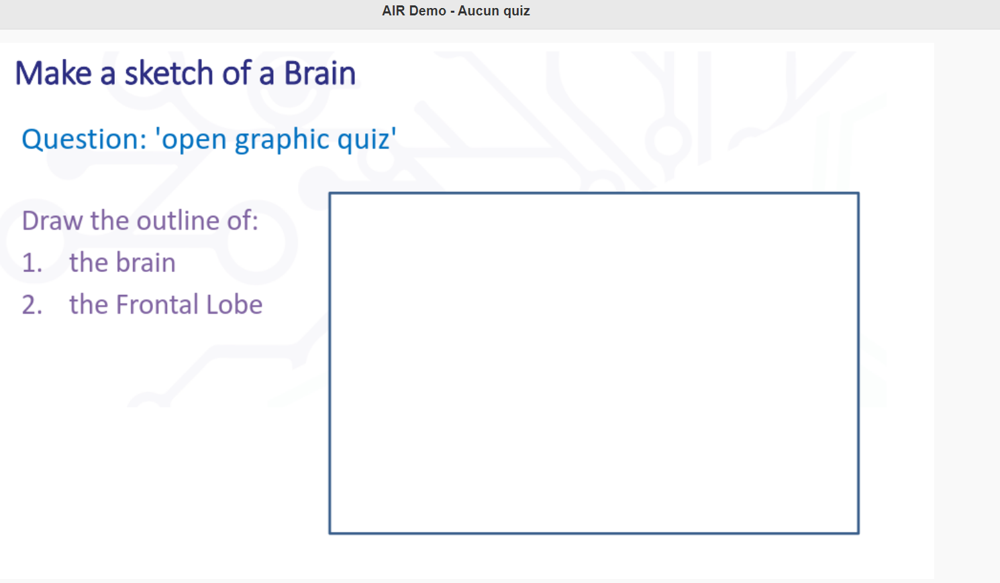

---
title: intuinote
subtitle:
id: 202303211406_intuinote
author: Damien Belvèze
date: 21-03-2023
link_citations: true
bibliography: mylibrary.bib
biblio_style: csl\ieee.csl
aliases: []
tags: [prise_notes, travail_étudiant, OCR]
---

laboratoire spécialisé dans les apprentissages médiatisés par l'ordinateur mais en faisant disparaître autant que possible l'ordinateur. 

Intuidoc : animer des cours  de façon interactive 

possibilité d'annoter manuscritement un document importé dans le logiciel

relation présentiel ou synchrone : comment redonner du sens à des apprentissages massifs en amphi ? 
être actif, c'est écouter, mais aussi prendre des notes en reformulant

barrière qui s'est produite récemment : on donne des supports, on présente des slides et les étudiants deviennent passifs. 
Chimie, physique = prise de notes difficile à faire à l'ordinateur. 
Comment prendre ses notes manuscritement et réutiliser cette formule en numérique. 

Premier levier : permettre l'annotation
Deuxième levier : interagir avec les étudiants, les solliciter (questions) pour maintenir leur attention. habituellement on utilise les quiz avec Klaxoon pour les réveliller. Intuinote intègre le quiz à travers le dispositif pédagogique (diaporama), sans passer pour cela à un autre logiciel. 
troisième levier : comment percevoir l'attention. On met des sondes dans ce logiciel : les étudiants sont-ils en retard ou en avance par rapport au déroulé du diaporama, sont-ils en train de prendre des notes ou pas ? 
possibilité de visualiser un dashboard pour suivre les usages des étudiants en direct. 

Ce qu'on capture, ce ne sont pas les notes (privées) des étudiants mais la quantité de notes prises.

Projet qui a pris naissance à l'INSA Rennes en 2015 et 2016. 
Tests réalisés dans des cours.
Financements ANR et Labex ont aidé le projet à se développer. 

Nécessité de rendre l'outil plus versatile qu'aujourd'hui. 

tablette de l'enseignant et périphériques reliés à un serveur hébergé à l'IRISA. 

Essai de dépasser les [[quiz]] habituels (cases à cocher)

Quiz graphiques (par exemple, entourer une zone du dessin). Par exemple détecter (en entourant) une erreur dans une formule. La réponse et la question peuvent être graphiques. 
Schémas d'architecture, schémas informatiques.

heatmaps (cartes de chaleur) : statistiques sur les cartes de chaleur. 

clustering graphique (rassembler les dessins qui se ressemblent): demander une formule mathématique : le logiciel rassemble les graphiques par formes. C'est une aide qui permet à l'enseignant de faire des feedbacks immédiats. 

Dashboard des analytics : 
- Temps passé sur chaque slide par l'enseignant. 
- Quantité de prises de notes sur chaque slide
- synchronisation : si on est sur le slide 10, combien sont encore sur le slide 9 combien sont déjà au slide 11. 
- synthèse de toutes les questions qui ont été posées dans le cours et les réponses obtenues. 

remise en place d'un serveur en début d'année. Développement en cours d'une application web. http://kassis.irisa.fr:443/

possibilité pour l'enseignant de partager ou pas ses notes sur chaque slide
possibilité d'envoyer la correction aux étudiants. 

Le cours s'enrichit de toutes les questions et de toutes les réponses qui ont été envoyées au cours de la session. 

Les étudiants peuvent envoyer des slides à d'autres étudiants ou au professeur. 

Eric Anquetil considère que lorsqu'on prendre des notes manuscrites on a besoin de retrouver ces notes dans la forme dans laquelle elles ont été prises (c'est à dire manuscrites)
quand un [[OCR]] est dispo pour reconnaître des zones d'écriture manuscrites, il est peu utilisé. 

Possibilité de prendre des notes au clavier sous les schémas. 

matériel : 1000 euros. version étudiants : 500 euros (tablette stylet mais avec moins de puissance)

Il faut que les enseignants s'habituent à poser des questions plus larges que les QCM. 

Objectif : conserver le logiciel gratuit pour les établissements d'enseignement supérieur. 

