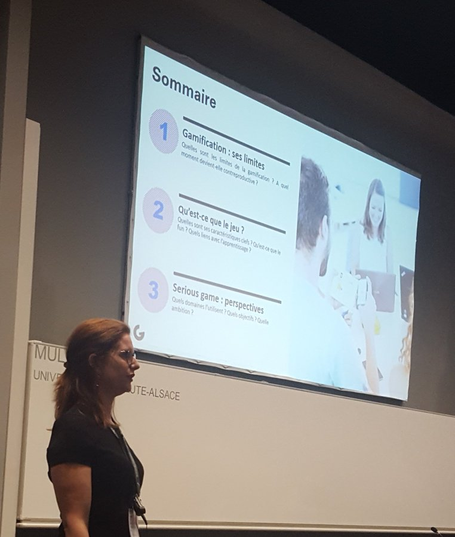
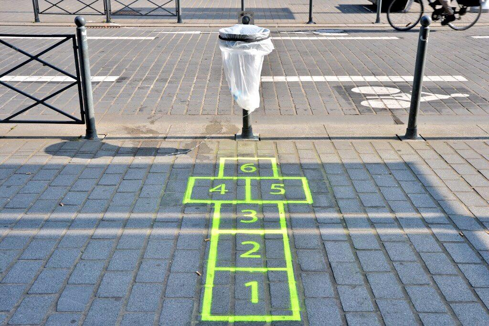

Conférence du Dr. Isabelle Patroix (Ecole de commerce de Grenoble)
]

Présentation du [Playground](https://www.grenoble-em.com/le-playground) à l'école de commerce de Grenoble

# limites de la gamification
Qu'est-ce que ludifier un dispositif ? 
ajouter des mécanismes ludiques dans un contexte qui n'en comporte pas. 

Solliciter une action (exemples de gamification urbaine assortis de nudges (mettre un papier à la poubelle, respecter les limitations de vitesse, suivre un parcours touristique))

La [gamification selon Yu-Kai Chou](https://yukaichou.com/gamification-examples/octalysis-complete-gamification-framework/) comporte plusieurs types de récompenses :

- Points
- badges
- niveaux
- tableaux de comparaison
- défis

certains de ces outils (badges, niveaux) sont très utilisés dans le domaine commercial (pour faciliter le maintien de l'effort) :

- duolingo
- application de running de Nike

Voracy: jeu sérieux qui permet de rééduquer les membres supérieurs

La gamification peut engendrer des effets pervers : l'enjeu (la victoire, les récompenses) l'emportent sur le but du jeu
arsenalisation du jeu pour augmenter la productivité : la gamification a été utilisée pour inciter les chauffeurs d'Uber à faire toujours plus de courses.  

# Qu'est-ce que le jeu
Johan Huizinga (1951) _homo Ludens_
Roger Caillois (1967) _Les jeux et les hommes_

Première caractéristique du jeu : faire entrer le joueur dans un cercle protégé où l'on accepte les règles (un peu comme au cinéma : espace clos, durée inscrite dans le temps, acceptation des codes du film)

grande popularité du morpion et du monopoly mais peu d'intérêt pour ces jeux
Les jeux de stratégie comme Seven Wonders ou Catan sont moins populaires mais suscitent plus d'engouement. 

On s'ennuie au morpion parce que c'est répétitif et les règles sont trop simples, il y a une stratégie gagnante.
Dans le Monopoly c'est un peu plus complexe, mais les stratégies restent tout de même basiques.
Quand on passe à des jeux comme les Colons de Catane ou Alhambra, les règles sont plus complexes et autorisent plus de stratégies différentes. C'est pour cela que ces jeux sont plus appréciés en général que le monopoly.

Les quatre ingrédients essentiels à un jeu:

- cercle protégé
- Créativité : équilibre entre règles et libertés
- Surprise, inattendu. 
- feedback
 
 
Si tout est connu à l'avance (si on connaît la stratégie gagnante), c'est ennuyeux. Un jeu va plaire en famille parce que grâce à cette part d'inattendu, les enfants pourront gagner contre les parents sans que ceux-ci l'aient provoqué.

Cette action toute bête d'envoyer un dé, fait qu'il y a des conséquences sur le développement du jeu et la réaction des joueurs. Le jeu nous envoie des réponses immédiates à chaque action. Action autorisée ou pas, action rémunératrice ou préjudiciable.
Système du feedback : possibilité de faire jouer aussi bien des néophytes et des experts. exemple [foldit](https://fold.it/) simulation de pliage de protéines auquel peuvent participer des non biologistes

## Fun
Les différentes formes de [[fun]] d'après Nicole Lazzaro

- *easy fun* (gag de la peau de banane)
- *people fun* (joies d'être en groupe)
- *hard fun* (réussir un défi, mettre en place une stratégie gagnante)
- *serious fun* (collections, jeux de patience, avoir tous les badges, avoir tout collecté, avoir fini toutes ses tâches)

Un jeu devrait combiner ces différentes formes de fun

Le fun implique aussi le domaine de l'émotion (jeux suscitant l'empathie voir plus bas)

## Fun et apprentissage

> That moment of triumph when we learn something or master a task
in other words, with games, learning is the drug (Ralph Koster, 2013)

# Serious game : perspectives
un bon sérious game, c'est un jeu qui sera autant sérieux que ludique.
Contribution : *citizen games* : contribution à la science (cf. Foldit), [King of trial](https://play.google.com/store/apps/details?id=com.MedicalJam.KingOfTrials), [a game to map the brain](https://eyewire.org/explore)

Développer de l'empathie en incarnant un personnage

[Lie in my heart](https://store.steampowered.com/app/1116490/Lie_In_My_Heart/)
[Enterre-moi mon amour](https://enterremoimonamour.arte.tv/)

# Questions

Q. Comment on relie cette dimension du Fun avec des objectifs pédagogiques ?
R. Définir au départ la problématique. Partenariat avec le CEA : pouvez-vous nous aider à trouver des usages aux nouvelles technologies ?. Rédaction des objectifs pédagogiques et à partir de là voir quelles mécaniques de jeu peuvent permettre de remplir cette objectif (contrainte, combinatoire, collaboration)

Q. Ludicisation : faire entrer du jeu dans une situation ordinaire (Marie Latour). L'intérêt pour le jeu naît de la complexité de ses règles.
Certains jeux sont très simples dans leurs règles et misent sur le fun (jeux apéro comme Dixit). Un bon jeu, c'est aussi un jeu simple où les règles ne sont pas très abondantes ni trop complexes.

La complexité rend libre, elle permet de varier les stratégies.

Se définir par les jeux comme aime. Dis quel jeu tu aimes et je te dirai qui tu es.
insérer dans un portfolio les jeux qu'on a contribué à créer

Q. Jeux qui reposent sur la stratégie ou la chance. 
R. La chance intervient de manière pertinente dans un jeu pour mettre au même niveau des novices et des experts. 

