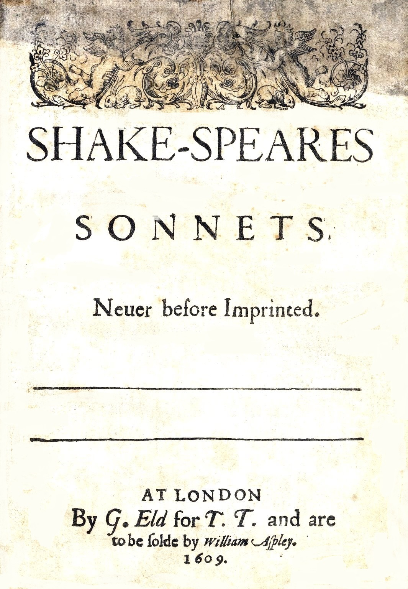
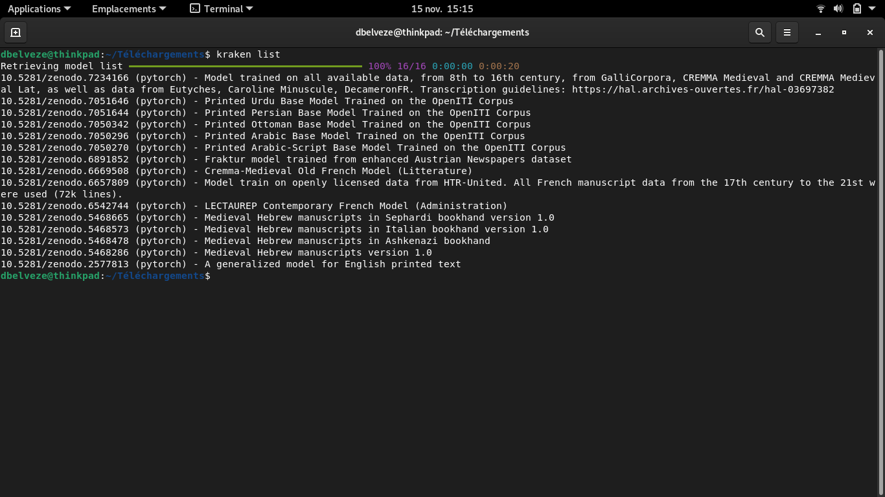

# installation

Kraken est un logiciel libre téléchargeable à l'adresse https://kraken.re

Installation (sur un ordinateur Linux, distribution utilisée Debian Bullseye)
Sous Linux, Python est déjà présent. Version de Python utilisée : 3.9

J'ai ouvert un terminal de commandes (Ctrl+ Alt + T) et j'ai tapé cette ligne de commande :

````python
pip install kraken
````

Bien que je travaille sur des images en png ou jpg, j'ai suivi le conseil du site et ai chargé en plus le programme qui permet de traiter des images en pdf : 

````python
pip install kraken[pdf]
````

Suite au téléchargement, j'ai mis à jour les paquets (facultatif, mode admin nécessaire)

````python
sudo apt update
````

Après j'ai ouvert un terminal (Ctrl+Alt+T), et j'ai essayé d'avoir la liste des modèles permettant de traiter les caractères 

````python
kraken list
`````

Mais le retour c'était que Bash n'arrivait pas à trouver le logiciel kraken parce que le chemin (path) vers le logiciel n'était pas défini. Cela était d'ailleurs précisé en avertissement lors du téléchargement. 

J'ai donc repris l'adresse du dossier dans cet avertissement et l'ai ajouté au path : 

````bash
export PATH=/home/dbelveze/.local/bin:$path
`````

(remplacer dbelveze par le bon nom d'utilisateur)

A partir de ce moment, les commandes entrées dans le terminal commençant par kraken fonctionnent. 

# premier essai

J'ai essayé de transcrire un document assez simple : la couverture d'une édition de 1609 des sonnets de Shakespeare. 



En lisant la documentation, j'ai pris connaissance des trois phases du traitement : 

- binarisation
- segmentation
- océrisation

J'ai utilisé les lignes de commandes proposées dans la documentation pour traiter ce fichier. 

````python
kraken -i sonnets.jpg sonnets.tif binarize
`````
J'ai obtenu un fichier sonnets.tif qui ressemble à l'image originale mais en monochrome

Avant d'aller plus loin, j'ai chargé un modèle de transcription qui pouvait convenir à mon document (édition imprimée anglaise du XVIIème siècle)

Des modèles sont disponibles par défaut avec le logiciel Kraken, il faut juste les charger. 
Pour en avoir la liste, j'ai tapé la commande suivante : 

````python
kraken list
`````

J'ai obtenu la liste suivante : 


Il s'agit de modèles issus d'entraînements de l'OCR au moyen de documents pertinents et homogènes. Je n'ai pas cherché à trouver un modèle très adapté à mon document Shakespearien, j'ai pris le dernier de la liste (a generalization model for English printed )

Pour choisir ce modèle, j'ai tapé la commande suivante (comportant le DOI du modèle qui se trouve dans l'archive [[Zenodo]]) : 

````python
kraken get 10.5281/zenodo.2577813
`````

Le nom du modèle s'affiche suite à son chargement : **en_best.mlmodel**

J'ai combiné dans une même commande les phases de segmentation et d'océrisation (segment pour la segmentation, ocr suivi de l'argument -m et du nom du modèle pour l'océrisation)

````python
kraken -i sonnets.tif sonnets.txt segment ocr -m en_best.mlmodel
````
un fichier sonnets.txt est généré qui comporte les caractères suivants : 

k   
r'I    
I   
I    
9    
e    
N    
-A    
SHAKE-SPEARES    
S O N N E T S.    
Neuer before Imprinted.    
By G.Ed frT. T. and are    
tobe folde by ili e.    

Les premières lettres correspondent à l'illustration du frontispice et constituent du bruit. 
En revanche, le reste est plutôt bien transcrit avec toutefois des scories dans les deux dernières lignes : 

| résultat de la transcription | original |
|:---:|:---:|
| By G.Ed frT. T. and are | By G.Eld for T. T. and are |
| tobe folde by ili e. | to be folde by William Apley. |

William Apley (en italiques) n'a pas été reconnu. La date n'apparaît pas non plus. 
Cela doit s'expliquer par le fait que le modèle choisi pour l'océrisation est trop général, pas assez appliqué aux textes imprimés en Angleterre au XVIIème siècle. 


# Les modèles

Les modèles sont issus de phases d'entraînement de l'[[intelligence artificielle]] de Kraken sur des corpus de textes homgènes. 

Par exemple le modèle [OCR-greek-cursive](https://github.com/pharos-alexandria/ocr-greek_cursive) a été constitué sur des textes issus du Savile et Catena Lispiensis

Pour charger un modèle, charger le modèle dans le même répertoire que celui des images à analyser et lancer la commande : 

````python
kraken -i imagefile -m modelname
`````

(voir réponse de Annette von Stockhausen)