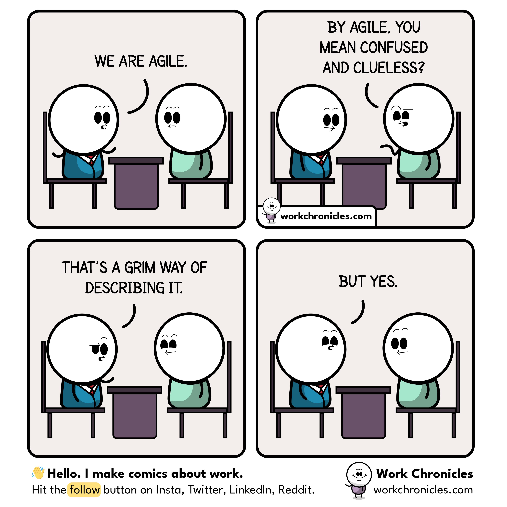

méthodes issues du [[développement logiciel]] et notamment du [Manifeste pour un développement agile (2001)](http://agilemanifesto.org/iso/fr/manifesto.html)

- Les méthodes agiles privilégient la collaboration avec le client plutôt que la négociation contractuelle
- les interactions humaines plutôt que les procédures
- les logiciels opérationnels plutôt que la documentation exhaustive
- l'adaptation au changement plutôt que le plan

Ce qui permet de penser que les méthodes agiles font souvent travailler le client à la place de l'ingénieur, avancent dans un relatif brouillard normatif, négligent la documentation du projet et se perdent souvent dans les méandres d'une demande qui évolue dans le temps. 

