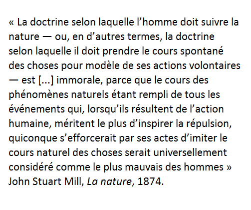

Réduction de phénomènes sociaux à des mécanismes biologiques (par exemple, réduction des comportements de genre au sexe des individus : les hommes font ceci parce qu'ils sont des hommes, les femmes sont comme ça parce qu'elles sont des femmes....)

La [[déconstruction]] vise à dénaturaliser certains phénomènes sociaux. C'est aussi l'oeuvre de la sociologie ("on ne naît pas femme, on le devient")

# discours de naturalisation

voir [[sophisme de l'appel à la nature]]

condamnation du discours naturaliste par John Stuart Mill : 

Cité par Cédric Stolz (https://twitter.com/CedricStolz/status/1644977165375602688)

# naturalisation et évopsy

La théorie dite de l'évolution psychologique ([[evopsy]]) qui vise à expliquer des comportements par des caractéristiques acquises par l'espèce humaine tout au long de son évolution ou bien par des structures de son cerveau héritée de cette évolution est une forme moderne de naturalisation, comme par exemple le fait qu'à cause de l'évolution de cette partie du cerveau appelé le *striatum* l'espèce humaine serait programmée pour vouloir toujours plus et par voie de conséquence épuiser les ressources de la planète et au final la détruire. Ce qui est une incitation, soit à conditionner les humains de façon autoritaire, soit à les reprogrammer ([[transhumanisme]])
Cette théorie est un neuromythe d'après les auteurs d'une tribune parue le 11 juillet 2022 [[@medecinePourquoiDetruitonPlanete2022]]

# bibliographie

