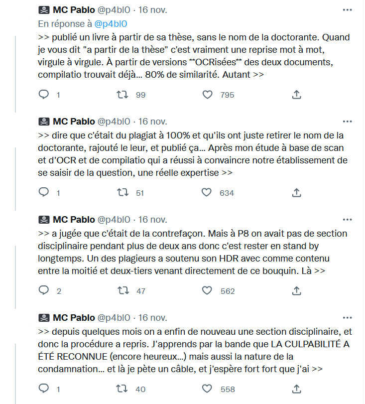

# philosophie et anthropologie du plagiat

## esthétique

Selon Harold Bloom, le plagiat est aussi l'art des poètes qui recyclent les paroles des autres, mais leur expression des idées recyclées est tellement brillante qu'elle supprime le lien avec les idées qui ont été volées[[@AphorismTwitterDistinct2022]].

> Harold Bloom’s [‘anxiety of influence’](https://en.wikipedia.org/wiki/The_Anxiety_of_Influence) thesis captured this mood fifty years ago. Put bluntly, Bloom argued that poets are ‘always already’ plagiarists by virtue of being in the verbal recycling business. They just hope they don’t get caught as the brilliance of their own syntactic arrangements overshadows those from whom they have secretly stolen. This was a radically new spin on the idea of ‘tradition

# Le plagiat à l'université

## causes du plagiat

## plagiat des encadrants

>Dans une enquête sur l’expérience doctorale effectuée auprès de plus de 11 500 doctorants, 15 % des personnes interrogées se disent insatisfaites ou très insatisfaites de la manière dont leur directeur veille à ce que leurs travaux soient bien crédités 

(source: [[@AliceRaybaudPlagiatvolappropriation2022]])

# moyens de prévention et répression

# bibliographie

