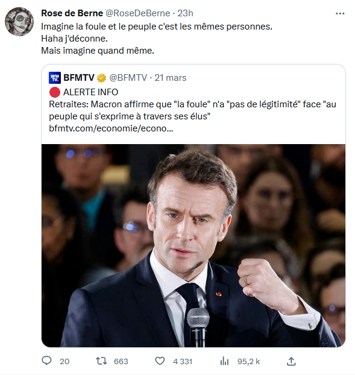

 22 mars 2023, suite aux [[Manifestation|manifestations]] en réaction au déclenchement de l'article 49.3 sur la réforme des retraites : 

>La foule qui manifeste n’a pas de légitimité face au peuple qui s’exprime à travers ses élus

représentation du peuple par ses élus (cf. théorie du contrat originel voir [[Etat#le contrat originel]])

Gérard Bras, là-dessus, s'inscrir en faux contre la théorie de Geoffroy de lLagasnerie : 

> Tout discours qui verrait dans ce mode de gouvernement représentatif une mystification visant à faire prendre les vessies du despotisme pour les lanternes de la démocratie (parlementaire) contribue à l’impuissance politique du peuple, à renvoyer les simples citoyens à l’incompétence au nom de laquelle ils sont confinés dans leur statut de dominés

(source [[@brasFouleContrePeuple2023]])

Le peuple n'est pas une entité consensuel mais un collectif traversé de conflits (cf. Chantal Mouffe[[antagonisme vs agonisme]])

Piur Gérard Bras, le peuple n'est pas seulement l'auteur à travers ses représentants qu'il contrôle tout de même un peu (reddition des comptes) des lois, il veut désormais infléchir directement cette action législative : 

> « peuple » ne nomme pas seulement le principe de la souveraineté, mais aussi cette force matérielle capable de modifier les décisions d’un gouvernement, fût-il légal, de renverser les institutions en place, de jouer un rôle déterminant dans la constitution politique de la nation. Les révoltes populaires pouvaient être destituantes. Les modernes révolutions, les grandes manifestations de rue, où l’on voit des multitudes agir en peuples, prétendent être constituantes. En ce sens ces _peuples acteurs_ ne se laissent pas ramener aux foules plébéiennes en révolte sous l’Ancien Régime.

Face à ce nouveau positionnement du corps politique que sont l'ensemble des citoyens, les politiques élus adoptent la stratégie de faire passer le "peuple dans la rue" pour une foule irrationnelle.

Pour les gouvernants, le populisme est le terme utilisé pour s'attaquer à tout mouvement populaire qui viendrait revendiquer à l'encontre du décret du "peupke souveraine", c'est à dire de la représentation nationale. 

La légitimité d'une assemblée ou d'un gouvernement n'est pas acquise elle se construit : 

> La légitimité démocratique n’est pas définie formellement par le droit constitutionnel. Elle résulte d’une tension, voire d’une contradiction entre ces deux scènes, celle de la représentation parlementaire et celle des manifestations qui la contestent. La légitimité ne se décrète pas, elle n’est pas promue par concept : elle se gagne pratiquement. Elle est relative à l’acceptation par les dominés des décisions des gouvernants

# une conséquence de la disparition du peuple de la scène publique

Bronislaw Geremek disait que 

> le populisme exploite l'absence du peuple sur la scène politique 

(propos cité par Danièle Sallenave[[@sallenaveJojoGiletJaune2019]], p11)

# un terme polysémique

Pierre-André Taguieff a d'abord qualifié le Front National de populiste en 1984 en qualifiant ce parti de "national-populisme". 
Le terme s'applique d'abord pour les dénigrer aux mouvements d'extrême droite mais s'est étendu ensuite aux mouvements d'extrême gauche, selon le lieu commun qui voudrait que les "extrêmes se rejoignent"

A [[Gauche|gauche]], la philosophe [[Chantal Mouffe]] reprend à son compte cette appellation et place au centre du jeu démocratique l'antagonisme entre des démocrates populistes et une élite qui voudrait priver la démocratie de son élément populaire ("la compulsion à se débarrasser du peuple et de la politique" selon Jacques Rancière, voir également le concept d'"[[agoraphobie]]" de Francis Dupuis-Déri.

En cela, les mouvements populistes combinent souvent deux orientations, l'une conservatrice : discours autoritaires et xénophobes, l'autre émancipatrice (remettre le peuple au centre du jeu)

Johannes Schulz observe que le populisme comporte fondamentalement deux matériaux ( [[@Corcuffgrandeconfusioncomment2021]], p205 ): 

D'un côté l'[[autoritarisme]], l'homme providentiel, le [[ressentiment]], l'essentialisation du peuple-nation

De l'autre, une demande de dignitité, de [[justice sociale]] et de démocratie

# Bibliographie
