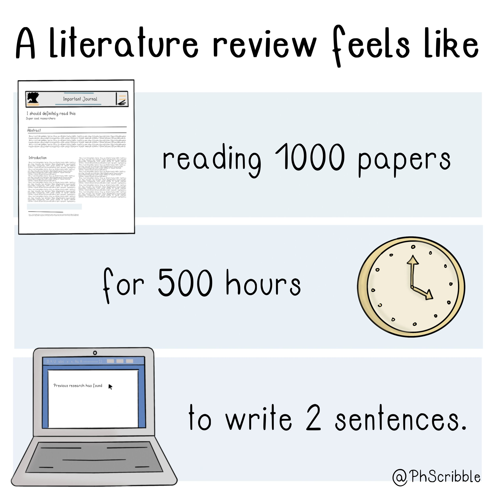

# Qu'est-ce qu'une revue de littérature ? 

Autrement appelée Etat de l'art dans une thèse par exemple, cet exercice académique, parcours presque obligé consiste à faire l'état de la littérature sur une question avant d'aller plus loin. Dans le domaine de la santé, cette revue de littérature peut prendre la forme d'une [[revue narrative]], d'une [[revue systématique]] ou bien si on combine les chiffres des études en plus de leurs principales conclusions une [[méta-analyse]]

# Le processus d'une revue de littérature 
Ensemble des opérations impliquées dans la revue de littérature (détaillées) par [Jeroen Bosman](https://twitter.com/jeroenbosman/status/1485003119184470016) (Université d'Utrecht)

# Les différents types de revue de littérature

## revue narrative
voir [guide de la bibliothèque sur le sujet](https://focus.univ-rennes1.fr/revue_narrative)

### scoping review

On peut considérer la scoping review comme une vaste revue narrative qui pour une part reproduit les méthodes de la revue systématique. 
En tant que revue narrative, elle sera plus facilement appropriable par des  utilisateurs non spécialistes de la question ou non rompus à la technique de la revue systématique. La scoping review fait l'économie de certaines mesures qui caractérisent les méta-analyses (référence à la [[P-value|p-value]], poids statistique des études)

- revue focalisée sur un sujet d'étude, plus que sur les réponses à une question précise[[@PetersonUnderstandingscopingreviews2017]] : 

>Both meta-analyses and scoping reviews begin with a primary question on which inquiry is focused. However, a scoping review allows for a more general question and exploration of the related literature, rather than focusing on providing answers to a more limited question. 

- produit plus de résultats qu'une recherche systématique (plusieurs équations de recherche) parce qu'on va moins dans la profondeur (précision des réponses à une question) et plus dans le balisage du sujet[[@PetersonUnderstandingscopingreviews2017]]. 

> For a systematic review, investigators generally start with a clearly defined question and explore and analyze high-level research studies focused on narrow parameters. Conversely, a scoping review has less depth but a broader conceptual range.

- permet de travailler sur un corpus de textes hétérogènes : 
      - articles de fonds, études cliniques, méta-analyses
      - revu par les pairs ou littérature grise
      - étude quantitative ou qualitative

Ce que ne permettent pas la revue systématique ou la méta-analyse. 

- permet de clarifier les concepts clé du sujet
- permet de repérer des lacunes dans la littérature récupérée
- ne prend pas en compte la qualité des études (contrairement aux méta-analyses qui évaluent la qualité méthodologique des études utilisées). 
- permet de baliser le champ de recherches avant de se lancer dans des revues systématiques. 

## revue systématique

## méta-analyse