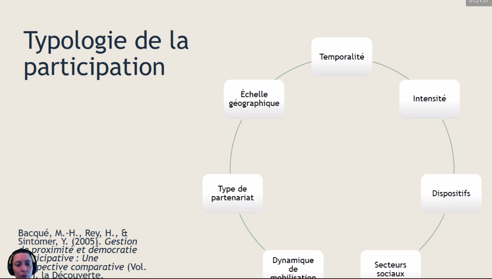
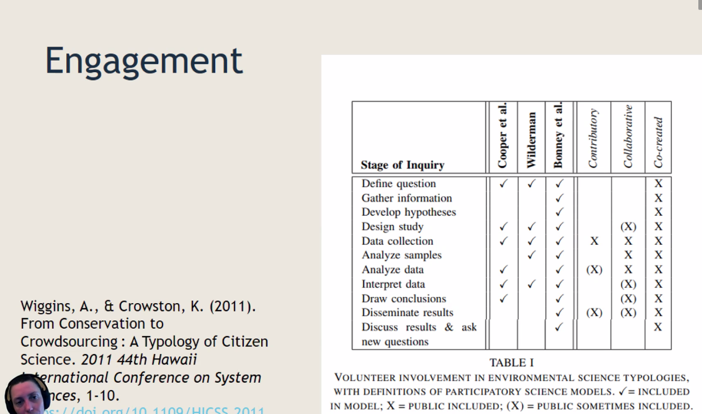

faire participer les patients à la production de données permettant de faire progresser la science
S'appuie sur le mouvement de l'[[Open Science]]

# médecine

participation de malades à la recherche (les malades ont une expertise de leur maladie qu'on peut valoriser dans un cadre scientifique quand ils ont acquis une certaine réflexivité - proposition de la Sorbonne de certifier cette réflexion sur la maladie dans le cadre d'une [Université des Patients](https://universitedespatients-sorbonne.fr/))

# introduction de Raphaëlle Bats 

Raphaëlle Bats (URFIST Bordeaux, doctorat sur la Participation en Bibliothèque)

Plan : 

- 13 raisons pour lesquelles on peut être amené à faire des SRP
- typologies des SRP
- typologies par engagement des publics
- Impacts des SRP

## 13 raisons pour lesquelles on peut être amené à faire des SRP

Certaines raisons sont combinables, certaines paraissent problématiques, toutes ouvrent des questions.

### 1. Raison démocratique

démocratie dialogique ("Agir dans un monde incertain"). La participation va mettre sur la table un certain nombre de [[controverses scientifiques]]. C'est un bon moyen d'inscrire la science dans le processus démocratique

### 2. Raison économique

Les sciences participatives permettent a priori des économies de moyen pour les universités.
Opposition des publics de la BNF à ce principe (au motif que cela permettrait de faire des économies de personnel, voir [[digital labor]]) [[@burgessScienceCitizenScience2017]]

### 3. Raison technique

plus grande accessibilité aux outils, facilite la participation citoyenne

### 4. Raison historique

Ce n'est pas nouveau. Sociétés savantes organisant des collectes, travail des amateurs éclairés. 

### 5. raison sociale

SRP : atténuer la défiance envers la science

### 6. Raison académique

Les financeurs demandent de plus en plus qu'il y ait dans la recherche un volet "Sciences et sociétés)"
SAPS : labellisation de labos Science Avec et Pour la Société

### 7. Raison militante

La science ouverte ce n'est pas que l'open access c'est aussi cette question des rapports entre science et société

### 8. Raison anthropologique

Tous confrontés aux mêmes alarmes (déréglement climatique)

### 9. Raison culturelle

universitaire -> collectifs. 
les savoirs minorisés vont acquérir une nouvelle centralité et visibilité. En finir avec la mono-culture (cf [[savoirs situés]])

### 10. Raison pédagogique

enseigner la science en la faisant. 
Viginature Ecole : projets menés avec des enfants. 

### 11. Raison sociologique

Ouvrir le savoir et la science au plus grand nombre. 
badges SciStarter : rendre les sciences accessibles à des gens qui ne sont pas du tout dans le milieu. Travail avec les bibliothèques municipales. Badges qu'on peut gagner quand on participe, Ces badges permettent d'accéder à des cours en université

### 12. Raison politique

La science nous amène à être sujets de notre propre histoire et à transformer la société pour en finir avec les systèmes d'oppression et les inégalités sociales. 

### 13. Raison géographique

Les SRP donnent accès à des espaces physiques ou conceptuels auxquels nous n'aurions pas accès sans elles
Travailler avec les habitants pour avoir accès à leurs jardins. 

## typologies des SRP

typologie de Wiggins et Crowston (2011)
typologie par objectifs. 
5 types de SRP

### SRP orientés vers l'action

soutenir des agendas civiques
Les chercheurs auront le rôle de consultants (problème de positionnement des chercheurs). Organisation bottom up et très locale. 

Histoire du débat public en France. Textes de loi depuis 1995 : référendums locaux, développement d'une démocratie numérique. 
projets de transformation urbaine > débats environnementaux 
mobilisations bottom-up et top-down
Rencontre entre plusieurs expertises (scientifiques, locales, associatives, gouvernementales) qui vont entrer en dialogue.)

Observatoire du littoral du Morbihan. 
Atelier où les gens viennent raconter ce qu'était le littoral à une époque ancienne. Ces mémoires nourrissent l'enquête. 

Facteurs d'échec et de réussite

risques : instrumentalisation du scientifique sur des projets conflictuels. Risque que le processus scientifique n'ait pas été compris par les populations et par contrecoup défiance des scientifiques sur la légitimité des connaissances venues des citoyens. 

On est dans le registre de la co-construction : déhiérarchisation des régimes de connaissance

Océan I3 : Co-construire des réponses à  problèmes. Situations d'urgence climatique et vulnérabilités locales. Nécessité de travail dans un contexte d [[interdisciplinarité]].
co-construction des bifaces (objets scientifiques répondant à différentes intelligibilités).

Mobilisation des scientifiques de l'INRAE par des citoyens pour résoudre un problème sur la production de blé bio français.

Recherche et société (pour la région Bretagne) développement et financements dans les départements de projets de recherche. 

### Objectifs de conservation

soutenir la gestion des ressources
Management des données : comment s'assurer de la validité des données quand on  a un grand nombre de personnes qui vont participer. 

National Audubon Society. Pratiques participatives dans la conservation. (ornithologie). Les ornithologues amateurs du Massachussets militent contre la chasse des oiseaux en décembre. Lancement du Christmas Bird Count : dynamique forte qui se met en place et qui dépasse les frontières du Massachussets. Le CBC existe toujours. La NAS a documenté à partir des années 60 le déclin de certaines espèces ornithologiques. Programme d'observation des oiseaux dans les jardins à partir de 1998. 

### projet d'investigation

le problème est initié par les scientifiques mais ne peut pas être investifué sans les popiulations

Projets Vigie Nature, porté par le Muséum d'histoire naturelle. 
Spipoll

Enjeu principal : avoir des résultats scientifique, qui vont nécessiter un plus grand nombre de protocoles que les projets de conservation. 

Professionnalisation de la science > déclin des sociétés savantes (qui n'ont pas complètement disparu non plus). Nouveau positionnement des sociétés savantes sur la vulgarisation. 
Quelles compétences cela demande ? 

   - construire des protocoles participatifs (expliquer un protocole sous forme de BD par exemple)
   - gérer les données en intégrant leur diffusion au grand public
   - savoir transmettre les savoirs nécessaires à la participation
   - savoir animer des groupes de participants, animation de groupe
   - savoir diffuser les résultats (visibilité, organisation des savoirs)

### projets virtuels

spotteron : projets d'observation
Coastnap. : programme de recherches sur les côtes en Australie, puis à Bayonne et dans le Morbihan. 

### projets éducatifs

Les scolaires sont des publics captifs
Deux publics : les enfants et les enseignants
au rectorat : des chargés de mission médiation scientifique pour les scolaires
SciStarter 

## exemples de SRP

Birdlab (Saclay et Vigie Nature): observer le comportement des oiseaux dans les mangeoires (voir si les oiseaux collaborent)
But : collecte des données. Les bénéfices envisagés : compréhension de la complexité de la science 

Increase (Saclay et partenaires européens): préserver la biodiversité des légumineuses alimentaires. 
Participation au choix de la méthode, nécessité de comprendre l'anglais. 

Placed Project : Lyon1, ENSSIB, Collègues des pays scandinaves (Aarhus et Chalmers)
Participation à des ateliers de co-construction de services. 
Participants : professionnels des bibliothèques. 

Spine : laboratoire en ligne de neurosciences participatives.
entraîner des intelligences artificielles à repérer des anomalies liées aux neurosciences. 

Transcrire. Faire de la recherche sur des documents patrimoniaux : on demande aux gens de venir transcrire des lettres (Crowd Sourcing). 

Derrière Transcrire, il y a des projets de recherche et de conservation de patrimoine. Voir aussi les projets liés à [[kraken]] On participe à la correction de l'océrisation. 
New-York Library Lab : numérisation d'un corpus et ouverture à la participation du grand public : reconstruction du cadastre qui avait été abîmé

Distinction entre des participations et des sciences participatives

## Typologie par engagements

Il y a beaucoup de manières de s'engager dans un projet SRP

- collecte des données, analyse des données et dissimination des données = science contributive
- science collaborative = collecte et analyse avec parfois un travail sur le protocole et un travail sur l'interprétation et les résultats
- participation co-créative : définition du problème > diffusion et contribution au protcole. 

Echelle de Sherry Arnstein : étude sur les émeutes des années 68-69 dans les quartiers Afro-Américains. 
Echelle de la participation : pourquoi les gens ne sont pas si contents de leur participation. 

- premier niveau = [[crowdsourcing]]
- deuxième niveau = intelligence distribuée : penser ce que le participant voit
- troisième niveau = science participative (contribution au protocole)
- quatrième niveau = extreme participation science. Science collaborative : définition du problème, de la méthide, du protocole et de l'interprétation. 

La base ça reste la collecte de [[données de recherche]]

### co-construction des problèmes

Comment on co-construit un problème de SRP ?
Qui participe, comment avoir recruter un [[échantillon vs population|échantillon]] représentatif. 

Reconnaître que le scientifique n'est pas le meilleur connaisseur du domaine observé. 

[[Objets bi-face]]

Communication, dissémination
Des chercheurs ont analysé sur ce qu'il passe dans Spoteron en terme de flux de communication

Mégacampagnes sur le [[blob]] ([[@dussutourDerriereBlobRecherche2021]])
10000 personnes recrutées, beaucoup plus de demandes suite à cette campagne.

kits de sciences participatives dans les bibliothèques

90% des inscrits ne participent pas, 9% contribuent de manière régulière, 1% seulement contribuent de façon active et régulière. 

## Données des SRP

obtenir des données de qualité, réutilisables (par les publiants du projet, par les participants, par d'autres chercheurs) et diffusables (enjeux relatifs à la gestion des données en général). 
Sciences contributives = données souvent massives
Sciences participatives = enjeux de restitution large qui impliquent que les données soient réutilisables et diffusables. 

Problématique de droit à l'image et de confidentialité. 

Les [[Plan de gestion des données|plans de gestion des données]] sont absolument nécessaires

Citizen science Liber [[@ukeofDataManagementPlanning2020]]

### publier des SRP

- publications scientifiques 
- publications scientifiques non académiques (BD, théâtre)
- publications non-scientifiques

[[co-autorat]]
on est plusieurs à écrire scientifiques et non scientifiques : comment cette polyphonie va s'exprimer dans les textes. Est-ce qu'on a laissé la place à cette polyphonie). 

article de Sarna-Wojinski [[@sarna-wojcickiWhereAreMissing2017]]

Les participants sont-ils auteurs et signataires d'un article, est-ce qu'ils sont signataires en tant qu'individus ou groupe. 
10 000 participants ne peuvent pas donner à 10 000 co-auteurs. 
Réunir les participants sous une entité signataire. 

Vancouver, et APA : on signe ce qu'on a écrit par ce à quoi on a participé. 
Responsabilité scientifique liée à l'autorat : peut-on faire porter cette responsabilité à des participants. 

inquiétudes sur le fait d'écrire ensemble : 
- possibilité réduite d'accéder à un poste ou à une promotion
- réduction de la liberté des scientifiques
- volonté des participants de devenir auteurs souvent absente

Les productions des SRP non scientifiques sont également des résultats de SRP
mobilisation de la radio permettant la collecte de données. 

Les groupes de participants sont souvent nommés dans les remerciements

## restitution

enjeux de reconnaissance
Au Canada, les [[données de recherche]] appartiennent aux premières nations

Quitter le terrain quand on est scientifique. Exemple de Rochefort. C'est au moment de faire le restitution qu'apparaissent les conflits bien souvent [[@d.briand@sudouest.frRochefortEchangesNourris2022]]

# bibliographie

