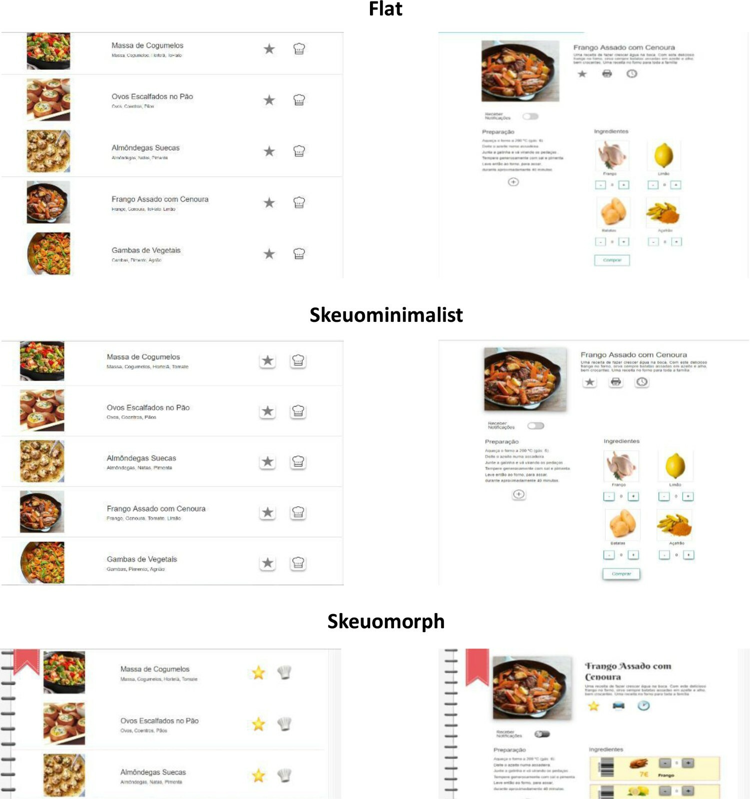

Le skeuomorphisme consiste à représenter- un objet de façon réaliste pour fournir une icone sur une [[interface]] graphique. Par exemple, l'icone téléphone sera mise à jour pour représenter des modèles très contemporains de téléphone. 
Le [[flat design]] remet en cause le skeuomorphisme en avançant que les icones doivent être reconnues dans leur fonction mais n'ont pas intérêt à représenter fidèlement les objets dont elles sont les signes. 

L'abandon du skeuomorphisme propre au flat design met en valeur d'autres vertus du design que les vertus utilitaires : l'esthétique et le ludique. 
Les jeunes générations sont plutôt amateures de skeuominimalisme ou de flat style, tandis que les utilisateurs âgés préfèrent des représentations réalistes des objets du monde analogique et privilégient le skeuomorphisme[[@urbanoSkeuomorphismFlatDesign2022]].

