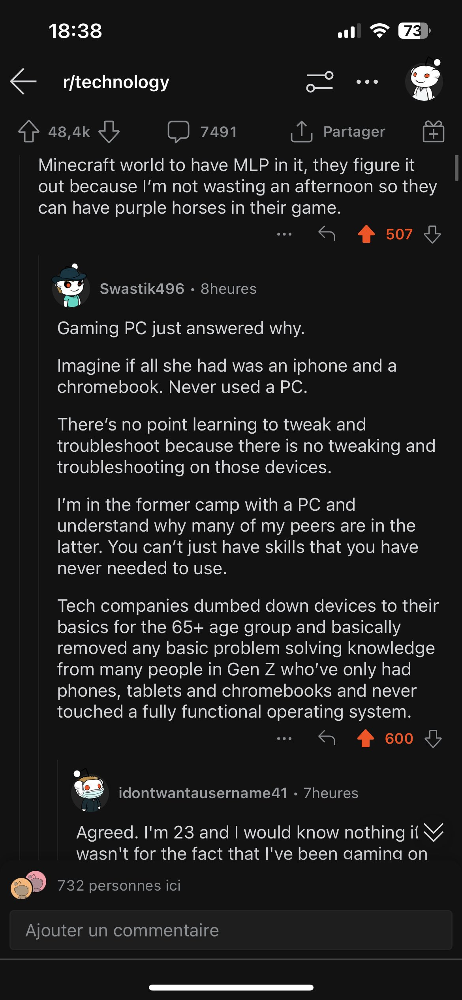

Présentation des apps sur un smartphone ou une tablette. toucher une icone démarre une application. Fonctionnement tout à fait différent des PC (où le système d'exploitation gère des fichiers qu'il faut ensuite exécuter, parfois en lignes de commande)

Effet du surface computing sur la génération Z : 

[[@chinStudentsWhoGrew2021a]]

Voir aussi sur [Twitter](https://twitter.com/MenicaFolden/status/1619830226707693568) 

voir [[prolétarisaton]]

