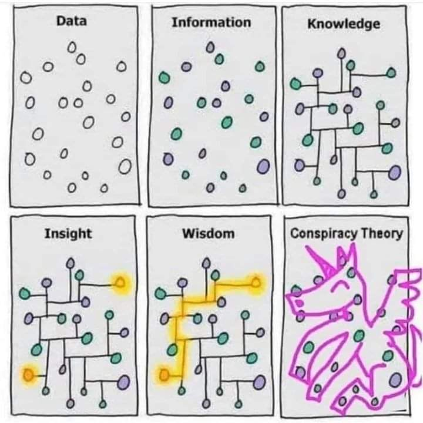

Terme forgé en 1948 par Karl Popper pour désigner une tendance à attribuer la cause de phénomènes sociaux ou politiques à *certains individus ou groupes puissants* (Sages de Sion, impérialistes, [[Capitalisme|capitalistes]]), ce qui dénote selon Popper une incapacité à percevoir dans la réalité une multiplicité de phénomènes agissant de manière interdépendante

Les caractéristiques du discours conspirationniste comporte les caractéristiques suivantes : 

- **un discours sensationnaliste**

- **un discours réducteur sur les causes** (la volonté occulte de quelques individus fait disparaître les contraintes liées aux structures sociales), une cause simple, une catégorie d'individus est responsable de tous les maux.

- **un discours qui se prétend une alternative à une vérité officielle** (déconsidérée en tant qu'officielle). "En même temps la vérité officielle est tellement factice qu'il n'est pas difficile à une personne commune de découvrir la vérité sur Internet en faisant quelques recherches"

- **un discours qui présente un fort [[biais d'intentionnalité]]** et néglige la part de hasard ou d'enchaînements non maîtrisés ou qui dépassent les volontés des agents individuels (cf [[Frédéric Lordon]] : "il y a bien un système mais pas d'ingénieur-système ([source](https://www.youtube.com/watch?v=xDjKjxQpsuo))"). Dans le même ordre d'idées, Mark Andrejevic parle d'une subjectivation des structures[[@andrejevicInfoglutHowToo2013]] : 

> The displacement of accounts of systemic or structural forms of conflict with tales of deliberate, intentional machinations (what might be described as  the "subjectivization" of structure)

D'après Richard Hofstadter (1964), la mentalité conspirationiste ne se définit pas par une croyance à tel ou tel complot mais à la vision de l'Histoire comme étant essentiellement menée sous la forme d'un complot

> ce qui caractérise l’esprit paranoïaque n’est pas seulement la croyance dans telle ou telle théorie du complot, mais le fait de considérer l’histoire elle-même comme une vaste conspiration

Hofstadter cité par Nicolas Guilhot [[@Guilhotchamanautretheories]]

# Les théories du complot sont-elles bien des théories ?

## ambiguité du terme théorie

en anglais theory dans un usage non-scientifique qualifie, souvent de façon négative, une idée postulée sans preuves "come on, it's just a theory"
Conspirationism theory est doublement péjoratif. 

Dans les langues européennes et notamment en français et en italien, la teoria ou théorie est une activité valorisée par l'idéalisme philosophique pregnant dans ces deux cultures.

En anglais conspiracy theorists pourrait se traduire par "mystificateurs", mais en français par "théoriciens du complot", ce qui implique un engagement plus important et une pratique plus raffinée que la simple affabulation. 

(source : [[@wuming1CommeQomplotComment2022]], p122)

## théories infalsifiables

Si on considère que les théories doivent être [[falsifiables]], ce n'est pas le cas des théories conspirationnistes. En effet, les preuves qui devraient mettre fin à ces théories ne sont jamais suffisantes pour ceux qui les propagent. 
La présentation du certificat de naissance de Barack Obama qui lui a servi tout au long de sa vie ne parviendra jamais à satisfaire les "birthers", les photos de la terre rond prises par les agences spaciales ne seront jamais pris en compte par les "flatters".
toute preuve allant à l'encontre de la théorie ne fait qu'illustrer la profondeur du complot et le pouvoir de ceux qui le servent et qui ont le moyen de créer des preuves aussi vraisemblables[[@andrejevicInfoglutHowToo2013]].

> The fact that there were published announcements of Barack Obama's birth  
>in Hawaiian newspapers, for example, serves only to illustrate how far back in time the
>tentacles of conspiracy can reach: either by creating fake articles (can anyone prove  that the copies in the library are authentic?) or by tracing  its roots to a well-thought-out, long-term plan to eventualy place a recently born baby in the White House

# complotisme et figures de l'alterité

## le complotisme comme pilier de la construction identitaire

esprit [[contrarien]] : opposition précoce à l'autorité et au discours d'autorité. la recherche de la vérité ne passerait que par une confrontation avec la "vérité officielle".
l'adhésion à des thèses complotistes renforce le narcissisme et le sentiment de sécurité de la personne. Le conspirationnisme leur permet d'aller mieux ([[@audureauDansTeteComplotistes2021]], p74)

Les Contrariens (ennemis de la vérité diffusée par des autorités sur un sujet) conçoivent de la fierté pour leur aptitude à traiter des données et des informations. Ce n'est pas tout à fait injustifié, dans la mesure où ces personnes passent beaucoup plus de temps à amasser des preuves pour soutenir leur point de vue que ceux qui acceptent la version fournie par les autorités (et sont pourtant dans la majorité des cas plus proches du savoir que les autres)[[@levyYourOwnResearch2022]]

## L'élimination de l'autre malfaisant

D'après Mark Andrejevicz, certaintes théories complotistes pourraient factuellement être prouvées qu'elles n'en demeureraient pas moins complotistes, car motivées non pas par un désir de connaître la vérité cachée, mais par un profond désir d'éliminer l'autre accusé de mener ce complot. Les faits n'ont pas donné raison aux "birthers", au contraire, plus les faits démentaient cette théorie conspirationniste, et plus celle-ci se renforçait (caractère d'infalsifiabilité), mais de fait, les tenants de cette théorie ne cherchent pas la vérité sur la citoyenneté américaine de Barack Obama, mais à éliminer Obama l'Africain et à par delà tous les maux qui lui sont attribués, non seulement à lui mais à la population afro-américaine. Les complotistes se figurent toujours que les auteurs supposés de complots représentent une altérité radicale. C'est cette altérité qu'il veulent éliminer. 

>In ideological terms, conspiracy theory does the work of projecting pathologies inherent to the system and enacted by those who operate within it upon the figure of the corrupting interloper, the "outside agitator," the secretcabal. In so doing, they paper over social contradictions and tensions with the promise that these would evaporate if only the nefarious interference could be eliminated. In the absence of the outside agitator - the implacable and inscrutable other - the system itself could run smoothly and in the best interests of all concerned (save the outside "others" who do not count). Structural conflicts and antagonisms would disappear because they do not really exist -they are simply the ideological ruses fomented by outsiders to divide an otherwise harmonious (once purified) whole. For the conspiracy theory-inclined portion of the populace, Barack Obama figures as the paradigmatic outsider responsible for fomenting class warfare, promulgating racial and class tensions where there really ought to be none.

# Critique de la psychologisation des théories du complot. 

Les théories du complot naissent et prospèrent dans certains contextes sociologiques ou politiques particuliers, et depuis l'analyse de la Rumeur d'Orléans par Edgar Morin (1969), en dépit de la naissance d'Internet, on remarque une certaine stabilité dans les cibles (magasins appartenant à des jufs) et dans les thèmes (enlèvement de femmes ou d'enfants), réseaux souterrains urbains servant à dissimuler les victimes (cf. Qanon)

Edgar Morin a montré que la rumeur d'Orléans s'était battie sur un changement sociologique majeure (Orléans absorbée dans l'orbite de Paris), et à un moment politique particulier. 

Aujourd'hui, nous faisons des réseaux sociaux, non seulement des vecteurs influents des théories conspirationnistes, mais également des supports de production de ces théories. 
Par ailleurs, nous analysons le problème en parlant d'une mentalité complotiste et en faisant référence aux théories relatives aux [[biais cognitifs]], (cf. [[Gérald Bronner]] qui remplace des catégories sociologiques par des théories cognitivistes [[@boullierBiaisBronnerOu2021]])
Cette réduction du complotisme à des faillites psychologiques de l'individu n'aide pas à comprendre à quel moment historique correspond la prolifération des théories complotistes ni dans quelle dynamique sociale cette production s'enracine[[@guilhotChamanAutreTheories]] : 

>Ce qui est remarquable, cinquante ans plus tard, c’est à quel point ce monde réel a disparu de nos réflexions sur les théories du complot. Nous avons remplacé les conditions sociales et économiques par des biais cognitifs, les mythologies politiques et religieuses par des erreurs étiologiques [...] Il y a là un quiétisme implicite : ce qui est en cause, ce n’est pas le monde, mais les esprits individuels qui semblent ne pas le voir pour ce qu’il est

Selon Nicolas Guilhot, le conspirationnisme apocalyptique est un récit qui permet aux individus de ne pas sombrer dans un état paranoïaque. Il se nourrit de l'absence de réaction des politiques devant la dégradation visible et constatable par tous de notre environnement. Le conspirationnisme se nourrit de l'absence de vision politique ou de l'incapacité des politiques à nous proposer un avenir à la fois désirable et possible. 

> La seule et véritable alternative consiste à retrouver une capacité politique, à jeter des ponts par-delà un présent cataclysmique, à reconstruire la vision d’un monde commun et d’un avenir inclusif pour tous ceux qui sont en train de perdre le leur.

(Nicolas Guilhot [[@guilhotChamanAutreTheories]])

# Controverse sur la réalité d'une recrudescence du complotisme à l'âge d'internet. 

Cette théorie d'une déferlante complotiste suscitée par Internet et en particulier par les réseaux sociaux est sujete à caution. 
Ces détracteurs, par ailleurs souvent pointus dans le domaine de la sociologie des [[croyances]] (Alessio Motta) ou bien sur la question des [[algorithme|algorithmes]] de partage ([[Dominique Cardon]]) font valoir à l'encontre de cette théorie que : 

- On n'a pas de recul sur les temps qui ont précédé Internet ou les attentats du World Trade Center. Des phénomènes très médiatiques, comme la mise en scène de l'autopsie de la créature de Roswell par la télévision ou bien deux décennies plus tôt la rumeur d'Orléans, étudiée par [[Edgar Morin]], montrent que ces rumeurs ont également été largement propagées dans la société française et semblent indiquer une certain permanence du phénomène. Ce qui a changé, c'est la traçabilité de la rumeur qui est devenue beaucoup plus quantifiable grâce aux réseaux sociaux numériques. Ce qui a changé également, c'est qu'on explique aujourd'hui le succès de ces théories complotistes par les failles de cerveaux individuels (les biais cognitifs considérés sans discernement comme des failles) dans une perspective individualiste alors que dans les années 60 (cf. La rumeur d'Orléans) les explications apportées étaient d'ordre sociologique et interrogeait la circulation de la rumeur dans un contexte donné. 
- Le besoin de croire à une déferlante complotiste est issu du besoin de reconnaissance du journaliste. Ce dernier aura du mal à insérer dans son journal une théorie qui relativise le phénomène alors qu'il est beaucoup plus vendeur de s'adresser à des experts de plateaux, à la lisière du champ scientifique comme [[Rudy Reichstadt ]](Conspiracy Watch) ou bien [[Gérald Bronner]] pour dramatiser un phénomène social comme le complotisme. Dénoncer le complotisme en ligne, en tant que journaliste, expert (ou bibliothécaire ?) revient aussi à justifier l'importance de son travail aux yeux de la société.
- Les enquêtes dont on se sert pour manifester l'ampleur du phénomène sont biaisées : 
     * elles mettent sur le même plan des théories simplistes et des théories beaucoup plus controversées
     * elles ne permettent pas au répondant d'indiquer qu'il ou elle ne connaît pas la théorie du complot
     * elles n'essaient pas de mesurer le sérieux avec lequel l'enquête est faite  ([[@Mottadeferlantecomplotisteou2021]]): 
     > Elles étaient présentées sous la forme d’une assez longue série, telle qu’il était difficile – c’est un biais fréquemment observé dans les recherches sur les sondages d’opinions – de répondre constamment « pas d’accord ». Telle aussi qu’il ne faut pas négliger la part de celles et ceux qui n’ont pas pris le sondage au sérieux et se sont amusés à répondre des absurdités. Ces mêmes sondés étaient aussi obligés de se prononcer sur des théories qu’ils ne connaissaient pas. On ne leur proposait pas « ne se prononce pas »
        
		
	Certaines analyses convergent pour pointer du doigt à travers cette adhésion aux thèses complotistes les classes moyennes inférieures ou populaires (cf. Gilets jaunes) tout en omettant que les classes plus aisées sans y adhérer moins savent davantage évoquer ces théories avec un discours plus convenable, savent s'[[auto-censure|auto-censurer]] quand il le fait, connaissant les effets que suscitent l'énoncé de telle ou telle théorie auprès de tel ou tel public. 
	Alessio Motta remet en cause l'existence même d'une mentalité complotiste homogène : 
	
	>Or, les entretiens approfondis existant sur la question montrent que le terme « complotisme » couvre des réalités extrêmement diverses : [[croyances]] multiples profondément ancrées, curiosité sporadique sur une question d’actualité, implication réelle ou dérision.

Par ailleurs, comme Dominique Cardon (et Sylvain Delouvée[[@DelouveeRepeterestpas2015]]), Alessio Motta montre qu'une grande partie des mentions faites aux *Illuminati* et aux platisme sont faites sur les réseaux sociaux par des comptes qui se moquent ouvertement de ces théories (voir chapitre suivant). Cette absence de distinction entre les adhésions réelles et les citations sceptiques ou moqueuses entrave la production de chiffres fiables sur l'adhésion aux thèses complotistes.

Quant à la quantification du phénomène sur les réseaux sociaux, les grands chiffres annoncés sont à mettre en perspective avec l'ampleur prise par l'usage d'Internet dans nos vies. 

>Sur Facebook, les vingt infox les plus partagées lors de la campagne électorale qui a élu Donald Trump, l’ont été 8 711 000 fois, alerte [Buzzfeed](https://www.buzzfeednews.com/article/craigsilverman/viral-fake-election-news-outperformed-real-news-on-facebook)**.** [Le chiffre impressionne, mais il correspond à 0.006% des informations partagées sur Facebook aux États-Unis pendant la même période](https://www.cjr.org/analysis/fake-news-media-election-trump.php) !

(Dominique Cardon [[@CardonPourquoiavonsnoussi2019]])

L'égalitarisme de façade des réseaux sociaux (ce sont surtout les personnes les plus mobilisées sur le plan politique qui y sont actives) et l'effet de masse que l'on ressent quand on y passe du temps survalorise, aux yeux de la presse, la pregnance de certaines opinions et de certains messages de désinformation : 

>Alimentée par les métriques qui de toute part quantifient les centaines de reprises d’un tweet, les milliers de vues d’une vidéo YouTube, combinée avec l’égalitarisme apparent de plateformes où chacun est libre de s’exprimer, cette impression conduit de nombreux journalistes et commentateurs médiatiques à traiter l’espace public numérique comme une vue aérienne du corps social français, quand il n’en est en réalité qu’un zoom particulièrement spécifique. C’est ce qui rend délicate toute prédiction électorale basée sur l’expression en ligne 

pour autant, bcp de rédactions se servent des *trending topics* sur Twitter (désinformation comprise) pour prioriser les informations qu'ils vont servir à leur public

Si en nombre de visites, l'augmentation de l'audience des sites de désinformation a augmenté, c'est le cas aussi des sites web qui diffusent de l'information fiable. Par ailleurs l'étude de Grinberg, Joseph et Friedland montrent que 1% seulement des comptes Twitter ont été exposés pendant la campagne présidentielle américaine de 2016 à 80% des tweets publiés et pouvant être classés comme complotistes[[@GrinbergFakenewsTwitter2019]].  

## Répéter n'est pas croire

### effet d'exposition à une fausse information

Une expérience a montré que lorsqu'on exposait à deux groupes (groupe A et groupe B) dans un cas une brochure expliquant l'avantage de la vaccination et les risques de la non-vaccination (groupe A) et dans l'autre groupe un exposé des vérités relatives à la vaccination et en regard des mythes qui circulent à son sujet (Groupe B), le groupe A avait tendance à opter plus facilement pour le vaccin que le groupe B. L'exposition à des théories présentées comme fausses peut avoir un effet contraire à celui qui était escompté. [[@MAZETAutodefenseintellectuelle2020]](p194)

Cela rejoint le concept de [[biais d'exposition]]

### Difficulté à distinguer les types de citation de la théorie complotiste

A ce titre elles attirent même lorsqu'elles n'entraînent pas la conviction. On peut partager une [[théorie complotiste|théorie du complot]], non pas parce qu'on y croit mais parce qu'on la trouve originale, amusante, ou représentative de son époque. 

Les analystes des fausses théories contribuent d'ailleurs à les faire proliférer sur le web en les mentionnant seulement. Cela ne veut pas dire que ces théories gagnent de nouveaux adeptes, juste qu'il en est davantage question. Il n'est pas rare d'apprendre à un public donné l'existence d'une théorie conspirationniste comme les [[chemtrails]] et de renforcer ainsi sa visibilité sur les réseaux sociaux (voir travaux de Sylvain Delouvée à ce sujet) De même qu'on peut adhérer à une théorie conspirationniste sans la transmettre, de même on peut la transmettre sans y adhérer. 

Le web n'est pas pour la plupart des gens d'abord un lieu où on s'informe, mais plutôt un outil avec lequel on se divertit. Le mix, mashup, [[mèmes]] à partir de ces théories fait partie de la créativité qu'on voit à l'oeuvre sur les réseaux. 

Répéter n'est donc pas forcément croire. 

>Rien ne permet de le dire et il est plus que probable que la réalité des réceptions numériques est tout sauf « forte ». Dans un univers aussi saturé d’informations, marqué par le déclin de la confiance envers les médias et une augmentation du [[capital culturel]], les mondes de la réception ne cessent avec le numérique de se complexifier en multipliant les niveaux lectures, les régimes interprétatifs et les formes d’appropriation. **Tout ceci rend le questionnement _il y croit/il n’y croit pas_ particulièrement simpliste, désuet et paternaliste.**

>On peut partager des informations « fausses » sans penser pour autant qu’elles soient vraies, parce qu’on veut les dénoncer, parce que « je sais bien, mais quand même… », parce que la mise en conversation d’informations surprenantes, choquantes ou polémiques autorise toutes formes d’usages sociaux et apporte des gratifications multiples (faire rire, provoquer, animer le débat, etc.). Plus que jamais**,** [comme y invite depuis longtemps la sociologie des croyances](https://www.editionstextuel.com/livre/le-vertige-des-faits-alternatifs), la question est moins de savoir si les gens pensent que les informations sont « vraies » ou « fausses », que d’explorer les usages variés, contextuels, à multiples niveaux d’interprétation, qu’ils peuvent en faire, notamment dans cette forme particulière d’échange qu’est la sociabilité numérique [[@CardonPourquoiavonsnoussi2019]]

# La théorie du complot comme repoussoir

A propos du Coronavirus, tentative d'un scientifique (Peter Daszak) de faire passer pour conspirationnisme toute recherche laissant ouverte l'hypothèse que le virus [[Sars-Cov-2]] pouvait avoir été fabriqué (afin d'anticiper d'éventuelles épidémies) et s'être échappé d'un laboratoire de Wuhan (P2 ou P3) suite à un accident ou une négligene. Dans le cas de [[Peter Daszak]], un [[conflit d'intérêt]] fort existe entre ce chercheur et les recherches entreprises à Wuhan sur les coronavirus.

Plusieurs scientifiques ont réagi à une tribune écartant cette hypothèse en répondant qu'elle n'était pas exclure, dans la mesure où la présence d'un site furine dans le spike de Sars-Cov-2 pouvait tout à fait provenir d'un gain de fonction réalisé en laboratoire (auparavant aucun coronavirus n'avait été découvert avec un tel élément dans sa structure). Voir ouvrage du journaliste Brice Perrier[[@PerrierCovidauxorigines2021]]

De même, critiquer l'influence de cercles de pensée ou de think tanks conservateurs comme la Trilatérale ou Bildeberg sur les législateurs suffit à vous faire passer pour complotiste et à vous discréditer dans certains médias, comme Christophe Deloire, secrétaire général de Reporters Sans Frontières en a fait l'expérience : 

<iframe width="560" height="315" src="https://www.youtube.com/embed/YHNxl8djy5Y?start=3151" title="YouTube video player" frameborder="0" allow="accelerometer; autoplay; clipboard-write; encrypted-media; gyroscope; picture-in-picture" allowfullscreen></iframe>

# Les risques de censure induits par l'accusation de complotisme
 
 toute personne essayant de comprendre l'enchaînement des causes pour expliquer un fait et qui propose de ce fait une autre interprétation que la version officielle peut se voir taxer de complotisme. Et poutant les complots existent, et certaines recherches individuelles ont permis de les mettre à jour : 

>As Coady and Pigden stress, conspiracies are sometimes real (Coady, 2012; Pigden, 2017), and occasionally digging by laypeople uncovers them [[@levyYourOwnResearch2022]]. 

Cf. les Armes de Destruction en Irak
 
 les spécialistes ont des difficultés à échanger sur les théories complotistes sans encourir la [[Censure]] de certaines [[intelligence artificielle]] censées prémunir le public contre les théories complotistes. 
 
 Cf. par exemple [ce qui est arrivé à Mike Caufield](répéter n’est pas-croire sur la transmission des idées conspirationnistes)

# Liens entre théorie du complot et théorie critique

cf. anecdote narrée par Mark Andrejevic dans infoglut : 
Alors qu'il anime un cours sur l'économie des médias, et la manière dont ceux-ci servent certains intérêts au détriment de la plupart, ses étudiants lui proposent de regarder un film complotiste (Zeitgeist). L'auteur s'interroge sur les raisons de cette recommandation, puisque lui s'inscrit dans une perspective critique et suit une méthode rationnelle. Manifestement ses étudiants ne font pas de distinction entre un discours critique qui met en contexte un discours pour montrer en quoi il renforce les catégories dominantes et d'autre part des théories complotistes où des groupuscules tirent les manettes en secret et sont les manoeuvriers conscients d'après tout ce qui survient[[@andrejevicInfoglutHowToo2013]].

## les théories du complot, des narrations de diversion

Les théories du complot prennent souvent comme cibles des figures célèbres du capitalisme (Soros, Bill Gates, ...) mais jamais en accusant le système qu'ils représentent, mais tel ou tel complot dont ils sont soupçonnés d'être les artisans. 

> pour reprendre une phrase d'électricien, le conspirationnisme est la prise terre du capitalisme, il évacue la tension vers le bas et empêche que les personnes soient foudroyées par la conscience que le système devait être changé

source : [[@wuming1CommeQomplotComment2022]], p148

Tout en se proclamant "récits contrariens", les théories du complot renforcent en réalité le discours dominant. 

> This research demonstrates that conspiracy theories—often represented as subversive alternatives to establishment narratives—may bolster, rather than undermine, support for the social status quo when its legitimacy is under threat. A pilot study (_N_ = 98) found a positive relationship between conspiracy belief and satisfaction with the status quo. In Study 1 (_N_ = 120), threatening (vs. affirming) the status quo in British society caused participants to endorse conspiracy theories. In Study 2 (_N_ = 159), exposure to conspiracy theories increased satisfaction with the British social system after this had been experimentally threatened. In Study 3 (_N_ = 109), this effect was mediated by the tendency for participants exposed (vs. not exposed) to conspiracy theories to attribute societal problems relatively more strongly to small groups of people rather than systemic causes. By blaming tragedies, disasters, and social problems on the actions of a malign few, conspiracy theories can divert attention from the inherent limitations of social systems.

source : [[@jolleyBlamingFewBad2018]]

En 2022, les mouvements antivax ont convergé pour dénoncer la propagande antirusse après l'agression de la Russie par l'Ukraine qui a commencé le 24 février 2022. Par ailleurs, les mêmes figures qui se sont "distinguées" dans la lutte contre le passe-sanitaire ont pris ensuite fait et cause pour Marine Le Pen avant même le second tour des élections présidentielles de 2022. 

au niveau individuel, comme au niveau collectif, le conspirationnisme est la corruption de la critique quand celle-ci tombe dans les mains des réactionnaires. Mark Andrejevic, dans Infoglut, prend comme exmple Glenn Beck, conspirationniste notoire et anti-communiste forcené qui tient des chroniques sur deux chaînes de télévision en 2013[[@andrejevicInfoglutHowToo2013]] : 

> If commercial populism in the first decade of  the 20th century aligned itself with the working class and  the labor movement, its 21st-century reincarnation has  made an about-face: for Beck, the labor unions are a mix of  agitators forwarding the interests of the "shadow government" and their unwitting dupes. I draw on the example of  Beck in order to argue that his brand of conspiracy is  symptomatic of the collapse of critique into conspiracy  theory associated with the demise of symbolic efficiency.  The result is far from politically progressive or empowering - what once seemed critical has headed off in a reactionary direction that marks the reinforcement rather than  the undermining of existing power relations.

> conspiracy theory is, in its structure and political import, far from subversive in any  progressive sense of the term. Rather, it tends toward a political quietism tantamount to conservatism.

### complotisme et fantasmes de pureté

Il existe en outre de fortes convergences de vues entre l'irrationalisme de certains mouvements écologiques, leur confusion entre hygiène de vie et pureté et certaines théories empruntées au nazisme (voir [[nazisme#nazisme et conspirationnisme]])

### confusionnisme

voir la présence des [[confusionnisme|confusionnistes]] à gauche du diagramme de L'extracteur. L'[[antisémitisme]] est un également un élément unificateur de ces théories.

## effet démobilisateur et dépolitisant des théories du complot

Les théories complotistes renforcent dans les faits les positions dominantes en faisant croire à une volonté de renverser le système

Mark Andrejevicz explique également dans Infoglut que le conspirationnisme est foncièrement réactionnaire, non pas tant pour les cibles qui sont les siennes (et qui peuvent autant appartenir à la droite et aux classes dominantes, qu'à la gauche libérale), mais par son mode de fonctionnement : 
en axant la critique sur des personnes et jamais sur les structures à l'oeuvre, le conspirationnisme a un pouvoir dépolitisant et démobilisant [[@andrejevicInfoglutHowToo2013]] : 

> Conspirationnism discredits the grounds for collective political action while simultaneously positing the futility of change at the systemic level. Conspiracy theory may sound political, but its implications are politically demobilizing. 

[flux Mastodon du 2 décembre 2022](https://mamot.fr/@dbelveze/109445425577726193) 
Il n'y a pas de diable et assez souvent pas de complot, juste une classe dominante qui cherche n'importe quel moyen de conserver sa position, y compris en croyant à ses propres mensonges.
Les cibles des conspirationnistes sont assez souvent des personnes morales ou réelles qui détiennent un pouvoir effectif, mais les arguments contre ces cibles n'ont pas de sens. On ne peut pas construire de lutte politique contre ces positions dominantes avec les motifs invoqués. Quand les partis/syndicats n'arrivent plus à porter la critique sociale ou économique dans le champ médiatique, ce sont les conspirationnistes qui prospèrent. Un nouveau lumpenproletariat qui croit au diable et qui pense que le système fonctionne grâce à quelques ingénieurs-système. Le système économique règne même sur les individus à qui il profite.
Comment ne pas lier la [[dépolitisation]] de la société et l'augmentation de la fraction de la population qui prend au sérieux ces théories complotistes.
tantôt les complotistes nient toujours la gravité de la pandémie, tantôt ils l'attribuent à un plan concerté d'individus pour prendre le pouvoir.
Macron n'est pas attaqué sur la destruction méthodique des services publics par son gouvernement mais en tant que grand ordonnateur d'un complot mondial impliquant Bill Gates ou Klaus Schwab.
Pfizer qui est une entreprise capitaliste bloquant pour son profit l'ouverture de la formule du vaccin est accusé de manière hallucinante de créer des vaccins destinés à manipuler les populations au lieu de les protéger du COVID
les cibles des conspirationnistes sont souvent les principaux responsables des maux de ce siècle mais les accusations que portent ces conspirationnistes sont complètement à côté de la plaque. Par exemple, Bill Gates, qui étend son empire sur les données personnelles et de santé de la population mondiale est attaqué en tant que propagateur d'épidémies

> En absence de débouché institutionnel et politique aux crispations de l’époque, celles-ci deviennent un matériau instable et facile à récupérer par des influenceurs conspirationnistes. Ainsi, personne ne sera surpris de constater que les poupées vaudoues principales de la bulle conspirationniste du Covid s’appellent Bill Gates (le milliardaire fondateur de Microsoft), Klaus Schwab (le président du conseil d’administration du Forum de Davos), Ursula von der Leyen (la présidente de la Commission Européenne), Emmanuel Macron et la multinationale Pfizer. Soit les avatars respectifs des dysfonctionnements du siècle, sur le numérique, la ploutocratie, la construction européenne, l’industrie pharmaceutique et le néolibéralisme.

Source :  [[@mansuyConspirationnismeCommentFinir2022]]

Les théories du complot sont donc largement repris par les milieux conservateurs, même si le fait d'être à gauche n'empêche pas du tout d'en devenir un adepte. 
Le collectif l'Extracteur a montré ces liens entre sphères complotistes et extrême droite : 

idées rances et argent font-elles le nid des théories complotistes ?([[@schepmanChamanEstMort2022]])

## métaconspirationnisme

tendance à voir dans la propagation d'une théorie complotiste l'oeuvre d'un complot (par exemple, la CIA serait à l'oeuvre dans la propagation des Qdrops de [[Qanon]])
voir à ce sujet Carlo Ginzburg cité par Wu Ming 1 dans [[complot#le complot à tiroirs ou le métaconspirationnisme]]

## hypercriticisme

### conspirationnisme et dérives herméneutiques

### la volonté de quelques uns efface les contraintes structurelles

La théorie du complot substitue aux causalités propres à l'affrontement des classes sociales l'intention d'agents supposés pleinement conscients, intention visant à destabiliser à leur avantage l'ordre de la société ([[@Corcuffgrandeconfusioncomment2021]], p110) : 

> on peut même parler d'un hypercriticisme, suractif, qui court dans tous les sens, mais où l'analyse des contraintes structurelles générées par les rapports sociaux tend à être remplacée par celle de l'action d'intentions individuelles ou collectives malfaisantes.

L'hypercriticisme propre au conspirationnisme est une simplification, car même si des complots existent ils ne suffisent pas en général à expliquer seuls l'avènement de certaines transformations. Les Sciences sociales montrent au contraire comme une transformation est le produit d'une pluralité de causes qui s'enchevètrent. Elles intègrent dans leur schéma explicatif les intentions cachées de certains acteurs mais aussi : 

- le poids des structures sociales de domination
- les [[habitus]]
- les conséquences non intentionnelles de l'action (conséquences imprévisibles des interactions entre miliers ou millions de personnes)

Plutôt que l'oeuvre d'un complot capitaliste orchestré par des hommes d'affaire, des multinationales et des politiques, la société néolibéral est le produit d'un ensemble de dynamiques qui dépassent l'individu (Capital, Préface à la première édition du livre) : 

> Je n'ai pas peint en rose le capitaliste et le propriétaire foncier. Mais il ne s'agit pas ici des personnes qu'autant qu'elles sont la personnification de catégories économiques, les supports d'intérêts et de rapports de classes déterminés. Mon point de vue peut moins que tout autre rendre l'individu responsable de rapports dont il reste socialement la créature quoi qu'il en puisse faire pour s'en dégager. 

### officiel / non officiel

le discours conspirationniste se présente comme un discours non-officiel par rapport à un récit officiel et qui ne fait l'objet d'aucune censure. 

# La théorie du complot comme réaction face à l'isolement collectif et à la dépossession du monde

Pour Eric Sadin, la théorie du complot est une manière de se réapproprier un contrôle sur le monde fût-ce au moyen de théories simplistes et sans rapport avec la réalité : 

> l'essor du complotisme, comme la sensation, illusoire, de reprendre les rênes de sa vie via des récits extravagants. 

En butte à une accusation de conspirer contre les Etats-Unis pendant la [[guerre]] du Viet-Nam, Andy Warhol rappelait que l'étymologie du mot *conspiracy* était *cum-spirare* : respirer ensemble. D'après Peter Szendy, dans la Rome de Cicéron, le verbe conspirare pouvait aussi bien qualifier une aspiration générale (en l'occurrence à une libération collective) qu'une tentative de sédition. L'individu conspirationniste prétend agir pour libérer le collectif, même s'il commence par se désolidariser de collectif[[@SzendyPneumatopolitiqueceque2022]].

L'adhésion aux théories conspirationnistes passe souvent par une désolidarisation d'avec l'entourage proche, accusé d'être aveugle sur la réalité et dogmatique, mais aussi par la constitution d'un réseaux d'inconnus proches par les idées sur Internet. Les confinements qui ont aggravé l'isolement collectif a soudé aussi ce genre de communautés avant même qu'elle puisse se rencontrer effectivement lors de manifestations anti-masques ou anti-vaxx. cf le slogan de [[QAnon]] : "la où va l'un de nous, nous y allons tous ensemble" ([[@audureauDansTeteComplotistes2021]], p109)
La vie de groupe, même à l'état virtuel (pendant les confinements) participe à la radicalisation et à la [[polarisation]] de ses membres.

# Références

